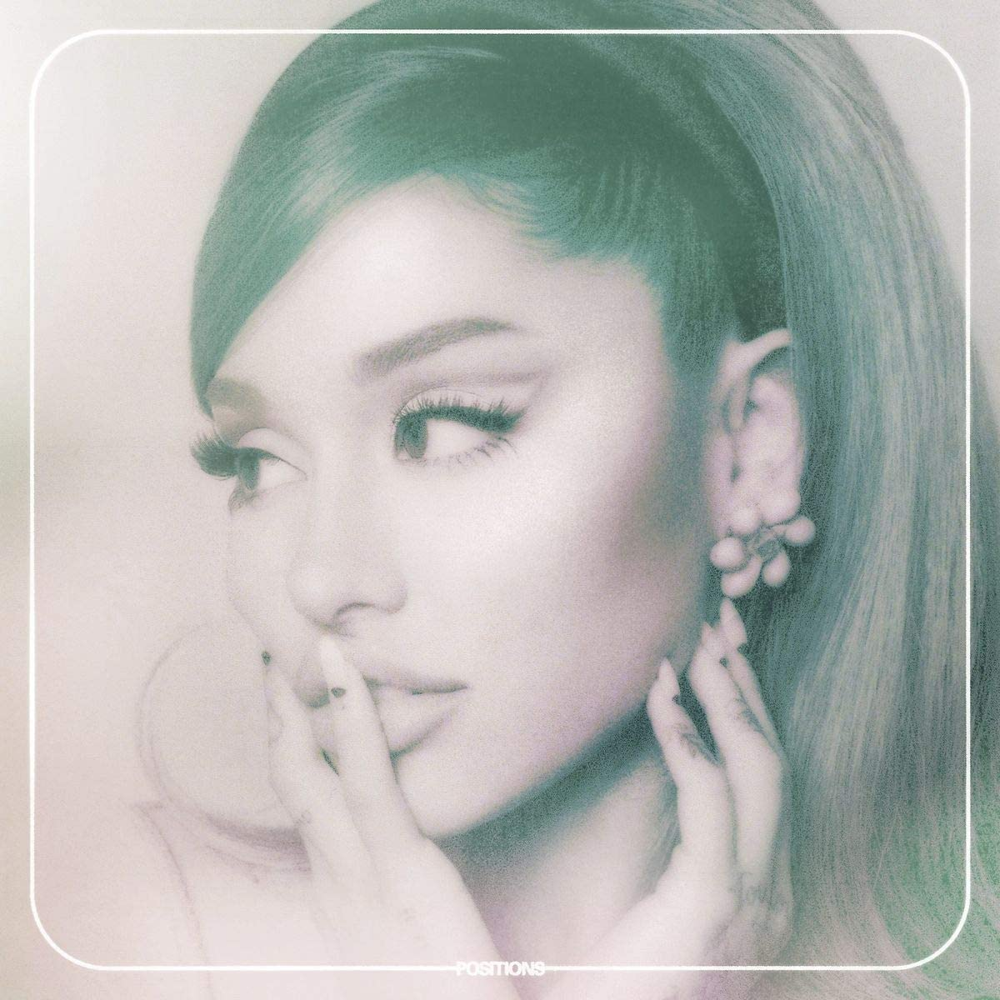

import { Slider, Button } from "@carbon/react";
import { ArrowUpRight } from "@carbon/icons-react";

import SliderJS1 from "../review/slider1";
import SliderJS2 from "../review/slider2";
import SliderJS3 from "../review/slider3";
import SliderJS4 from "../review/slider4";

import Review1 from "../review/arianagrande5.mdx";
import Review2 from "../review/arianagrande4.mdx";

import { Link } from "gatsby";

Album Review

<h1 className="h1--no--margin">{props.pageContext.frontmatter.title}</h1>

  <Link to="/best50/2020/">2020 Black Music Best No.25</Link>

<Row  className="image-card-group">
	<Column colMd={3} colLg={4} noGutterMdLeft="">
       <ImageCard>

</ImageCard>
	</Column>
	<Column colMd={4} colLg={8} noGutterMdLeft="">
	

		Ariana Grandeの6作目。前作から、1年8カ月と少し間が空いた気もするが、それでもデビュー以来、コンスタントにアルバムをリリースできてるのは人気・実力とも得ている故だろう。
		 つらい経験を経ての前2作に比べると、当作は、だいぶ、穏やかな印象のアルバムになっていて、スロー曲が多めではあるが、メディアムなポップの数曲では、やはりArianaらしさが感じられる。
		 Produceはお馴染みのTommy Brownがメインとなっているが、LA在住の日本人DJ, Shintaro YasudaもThe Weekndが参加したスロージャム⑤の制作に加わっている。
		 27歳になったこともあり、少女から大人の女性への成長が一段落したと思える作品である。
	

	

	  <Button className="button-right-mergin"  href="https://amzn.to/3vzIFB4" renderIcon={ArrowUpRight} size='sm' kind='primary'>
      amazon.com
    </Button>
    <Button className="button-right-mergin"  href="https://amzn.to/3u8t7E8" renderIcon={ArrowUpRight} size='sm' kind='secondary'>
      amazon.co.jp
    </Button>
		<Button className="button-right-mergin"  href="https://apple.co/2PDBF70" renderIcon={ArrowUpRight} size='sm' kind='tertiary'>
      apple music
		</Button>
		

	</Column>
</Row>
<Row >
	<Column colMd={4} colLg={4} noGutterMdLeft="">
		

    	<h3>Score card</h3>
			<SliderJS1 value="5" />
    	<SliderJS2 value="1" />
			<SliderJS3 value="1" />
    	<SliderJS4 value="8" />
		

	</Column>
	<Column colMd={4} colLg={8} noGutterMdLeft="">
		

			<h3>Producers</h3>
			

				Tommy Brown(1)
				 Tommy Brown and Mr. Franks(2)
				 Murda Beatz, Tommy Brown and Mr. Franks(3)
				 Tommy Brown, Mr. Franks and Shea Taylor(4)
				 Tommy Brown and Shintaro(5)
				 Tommy Brown, Mr. Franks, Nami and Shea Taylor(6)
				 Tommy Brown and The Rascals(7,9)
				 Tommy Brown and Scott Storch(8)
				 Tommy Brown and Courageous Xavier Herrera(10)
				 Tommy Brown, Tommy Parker and Travis Sayles(11)
				 London On Da Track, Tommy Brown and Mr. Franks(12)
				 Tommy Brown, Mr. Franks and Travis Sayles(13)
				 Tommy Brown, Mr. Franks and Oliver(14)
			

			<h3>Guests</h3>
			

				Doja Cat, The Weeknd, Ty Dolla $ign
			

		

</Column>
</Row>

<h3>Tracks</h3>

| No. | Title           | Composers                                                                                                                              | Performer                         | Time  |
| --- | --------------- | -------------------------------------------------------------------------------------------------------------------------------------- | --------------------------------- | ----- |
| 1   | Shut Up         | Michael Foster / Steven Franks / Ariana Grande / Peter Lee Johnson / Tayla Parx / Travis Sayles / T-Brown                              | Ariana Grande                     | 02:37 |
| 2   | 34 + 35         | Steven Franks / Ariana Grande / Courageous Xavier Herrera / Peter Lee Johnson / Victoria Monét / Scott Nicholson / Tayla Parx / T-Brow | Ariana Grande                     | 02:53 |
| 3   | Motive          | Nija Charles / Amala Zandile Dlamini / Steven Franks / Ariana Grande / Lindstrøm / James McIntyre / Victoria Monét / T-Brown           | Ariana Grande feat. Doja Cat      | 02:47 |
| 4   | Just Like Magic | Steven Franks / Ariana Grande / Priscilla Renea / T-Brown / Shea Taylor                                                                | Ariana Grande                     | 02:29 |
| 5   | Off the Table   | Steven Franks / Ariana Grande / Travis Sayles / T-Brown / Tesfaye / Shintaro Yasuda                                                    | Ariana Grande feat. The Weeknd    | 03:59 |
| 6   | Six Thirty      | Steven Franks / Ariana Grande / Priscilla Renea / T-Brown / Shea Taylor / Dylan Ismael Teixeira                                        | Ariana Grande                     | 03:03 |
| 7   | Safety Net      | Silas Doss / Ariana Grande / Tyrone Griffin / Leon Thomas III / Khristopher Riddick-Tynes / T-Brown                                    | Ariana Grande feat. Ty Dolla $ign | 03:28 |
| 8   | My Hair         | Charles Anderson / Ariana Grande / Anthony M. Jones / Victoria Mon?t / Tayla Parx / Scott Storch / T-Brown                             | Ariana Grande                     | 02:38 |
| 9   | Nasty           | Ariana Grande / Leon Thomas III / Victoria Mon?t / Khristopher Riddick-Tynes / Travis Sayles / T-Brown / Dylan Ismael Teixeira         | Ariana Grande                     | 03:20 |
| 10  | West Side       | Ariana Grande / Courageous Xavier Herrera / Ammar Junedi / Victoria Monét / T-Brown                                                    | Ariana Grande                     | 02:12 |
| 11  | Love Language   | Ariana Grande / Victoria Monét / Kam Parker / Tommy Parker / Tayla Parx / Travis Sayles / T-Brown                                      | Ariana Grande                     | 02:59 |
| 12  | Positions       | Angelina Barrett / Nija Charles / Steven Franks / Ariana Grande / London Holmes / James Jarvis / T-Brown                               | Ariana Grande                     | 02:52 |
| 13  | Obvious         | Nija Charles / Steven Franks / Ariana Grande / Peter Lee Johnson / Travis Sayles / T-Brown / Ryan Tedder                               | Ariana Grande                     | 02:26 |
| 14  | POV             | Steven Franks / Junior Oliver Frid / Ariana Grande / Tayla Parx / T-Brown                                                              | Ariana Grande                     | 03:21 |

<h3>Other Reviews</h3>

<Row>
  <Column colMd={3} colLg={3} noGutterMdLeft>
    <Review1 />
  </Column>
	<Column colMd={3} colLg={3} noGutterMdLeft>
    <Review2 />
  </Column>
</Row>
