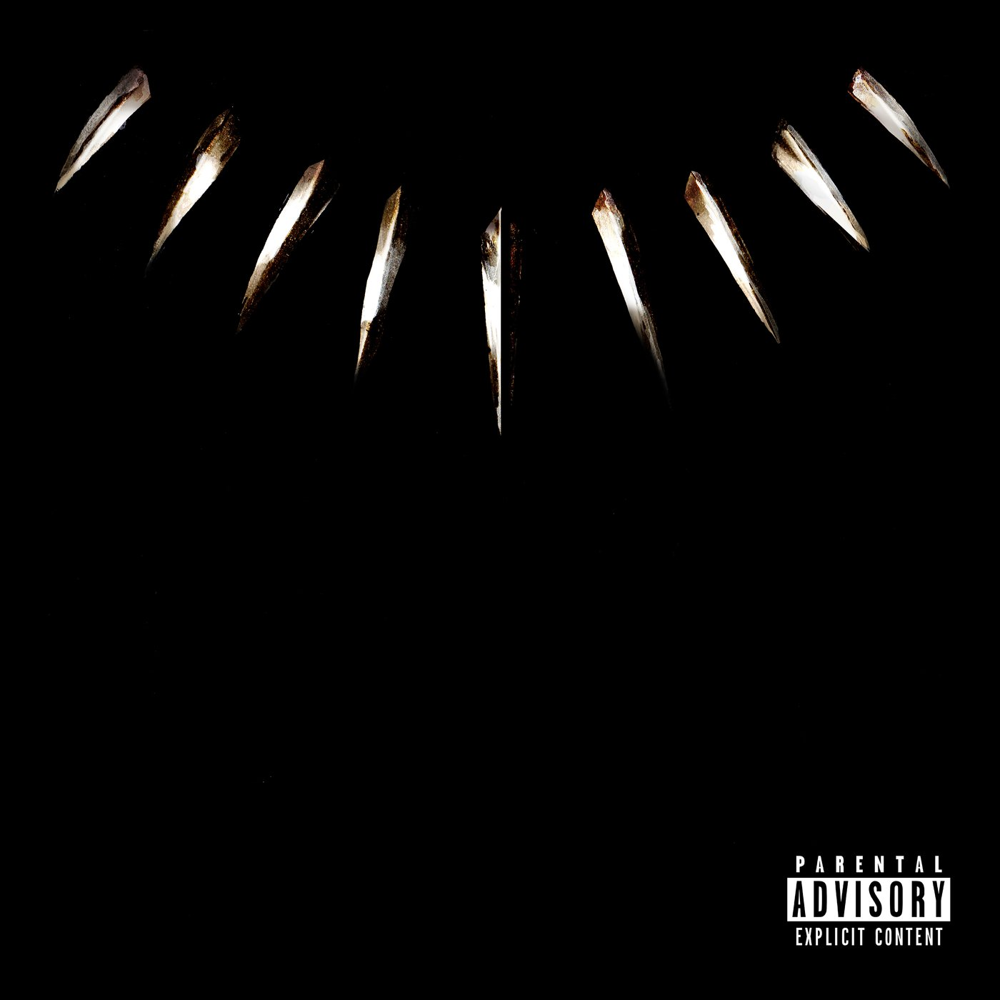

import { Slider, Button } from "@carbon/react";
import { ArrowUpRight } from "@carbon/icons-react";

import SliderJS1 from "../review/slider1";
import SliderJS2 from "../review/slider2";
import SliderJS3 from "../review/slider3";
import SliderJS4 from "../review/slider4";

import { Link } from "gatsby";

import Review1 from "../review/kendricklamar6.mdx";
import Review2 from "../review/kendricklamar5.mdx";
import Review3 from "../review/kendricklamar4.mdx";

Album Review

<h1 className="h1--no--margin">{props.pageContext.frontmatter.title}</h1>

  <Link to="/best50/2018/">2018 Black Music Best No.13</Link>

<Row  className="image-card-group">
	<Column colMd={3} colLg={4} noGutterMdLeft="">
       <ImageCard>

</ImageCard>
	</Column>
	<Column colMd={4} colLg={8} noGutterMdLeft="">
	

	マーベル映画"Black Panther"にインスパイアされたKendrick Lamarが制作したアルバム。ただ、サントラは別にあって、このアルバムからも一部は映画に使われている。ほぼ全曲に関わっているKendrickの新作と言っても良いレベルで、Producer陣もお馴染みの面々だ。映画の舞台であるアフリカの音楽を大きくフィーチャーしているのが特長で、南アフリカのRapper, Singerを4人ゲストに迎えていて、ZuluでのRapも披露している。いつものKendrickのアルバムの雰囲気は薄目で、メローで大らかな曲が多く、バラエティに富んだ構成になっている。特にSZAとの②なんか素晴らしい。
	

	

	  <Button className="button-right-mergin"  href="https://amzn.to/2NyE5PK" renderIcon={ArrowUpRight} size='sm' kind='primary'>
      amazon.com
    </Button>
    <Button className="button-right-mergin"  href="https://amzn.to/2ZaLM3X" renderIcon={ArrowUpRight} size='sm' kind='secondary'>
      amazon.co.jp
    </Button>
	

	
	</Column>
</Row>
<Row >
	<Column colMd={4} colLg={4} noGutterMdLeft="">

  <h3>Score card</h3>
	<SliderJS1 value="2" />
  <SliderJS2 value="3" />
	<SliderJS3 value="1" />
  <SliderJS4 value="8" />

</Column>
<Column colMd={4} colLg={8} noGutterMdLeft="">

<h3>Producers</h3>

	Kendrick Lamar and Sounwave(1,6,8)
	 Sounwave and Al Shux(2)
	 Sounwave(3)
	 Sounwave, Badbadnotgood and Kendrick Lamar(4)
	 Sounwave and Ludwig Goransson(5)
	 Sounwave and Cubeatz(7)
	 Mike Will Made-It and Teddy Walton(9)
	 Hykeem Carter and Kendrick Lamar(10)
	 Teddy Walton , Kurtis Mckanzie and Scribz Riley(11)
	 Sounwave, Kendrick Lamar and Frank Dukes(12)
	 Cardo and Cubeatz(13)
	 Frank Dukes and Doc Mckinney(14)

<h3>Guests</h3>

	Kendrick Lamar, SZA, 2 Chainz, ScHoolboy Q, Saudi, Khalid, Swae Lee, Yugen Blakrok, Vince Staples, Jorja Smith, SOB X RBE, Anderson .Paak, Ab-Soul, James Blake, Future, Jay Rock, Zacari, Babes Wodumo, Mozzy, Reason, Sjava, Travis Scott, The Weeknd

</Column>
</Row>

<h3>Tracks</h3>

| No. | Title                | Composers                                                                                                                                                  | Performer                                                   | Time  |
| --- | -------------------- | ---------------------------------------------------------------------------------------------------------------------------------------------------------- | ----------------------------------------------------------- | ----- |
| 1   | Black Panther        | Kendrick Duckworth / Kevin Gomringer / Tim Gomringer / Matt Schaeffer / Mark Spears                                                                        | Kendrick Lamar                                              | 02:11 |
| 2   | All the Stars        | Kendrick Lamar / Solana Rowe / Alexander Shuckburgh / Mark Spears                                                                                          | Kendrick Lamar feat: SZA                                    | 03:52 |
| 3   | X                    | Kendrick Duckworth / Tauheed Epps / Quincy Hanley / Ramon Ibanga / Anele Mbisha / Mark Spears                                                              | Kendrick Lamar feat: 2 Chainz / ScHoolboy Q / Saudi         | 04:27 |
| 4   | The Ways             | Khalif Brown / Kendrick Duckworth / Chester Hansen / Khalid Robinson / Alexander Sowinski / Mark Spears / Matthew Tavares / Leland Whitty                  | Kendrick Lamar feat: Khalid / Swae Lee                      | 03:59 |
| 5   | Opps                 | Kendrick Duckworth / Ludwig G?ransson / Mark Spears / Vince Staples                                                                                        | Kendrick Lamar feat: Yugen Blakrok / Vince Staples          | 03:01 |
| 6   | I Am                 | Tobias Breuer / Troy Chester / Kendrick Duckworth / Jorja Smith / J Smith / Mark Spears                                                                    | Kendrick Lamar feat: Jorja Smith                            | 03:29 |
| 7   | Paramedic!           | Wayman Barrow / Jabbar Brown / Kendrick Duckworth / Kevin Gomringer / Tim Gomringer / Juwon Lee / Dacoury Natche / Mark Spears                             | Kendrick Lamar feat: SOB X RBE                              | 03:39 |
| 8   | Bloody Waters        | Robin Braun / Kendrick Duckworth / Herbert Anthony Stevens IV / Jimmy Litherland / Mark Spears                                                             | Kendrick Lamar feat: Anderson .Paak / Ab-Soul / James Blake | 04:32 |
| 9   | King's Dead          | James Blake / Samuel Gloade / Antwon Thompson Hicks / Kendrick Lamar / Johnny McKinzie / Mark Spears / Teddy Walton / Nayvadius Wilburn / Michael Williams | Kendrick Lamar feat: James Blake / Future / Jay Rock        | 03:45 |
| 10  | Redemption Interlude | Hykeem Carter / Kendrick Duckworth / Zacari Pacaldo                                                                                                        | Kendrick Lamar feat: Zacari                                 | 01:25 |
| 11  | Redemption           | Kendrick Duckworth / Mandla Maphumulo / Kurtis McKenzie / Zacari Pacaldo / Mikey Riley / Bongekile Simelane / Teddy Walton                                 | Kendrick Lamar feat: Babes Wodumo / Zacari                  | 03:42 |
| 12  | Seasons              | Kendrick Duckworth / Adam Feeney / Robert Gill / Jabulani Hadebe / Timothy Patterson / Mark Spears                                                         | feat: Mozzy / Reason / Sjava                                | 04:02 |
| 13  | Big Shot             | Kendrick Duckworth / Kevin Gomringer / Tim Gomringer / Brock Korsan / Ronald LaTour / Mark Spears / Jacques Webster                                        | Kendrick Lamar feat: Travis Scott                           | 03:42 |
| 14  | Pray for Me          | Kendrick Duckworth / Adam Feeney / Martin McKinney / Abel Tesfaye                                                                                          | Kendrick Lamar feat: The Weeknd                             | 03:31 |

<h3>Other Reviews</h3>

<Row>
	<Column colMd={3} colLg={3} noGutterMdLeft>
    <Review1 />
  </Column>
  <Column colMd={3} colLg={3} noGutterMdLeft>
    <Review2 />
  </Column>
  <Column colMd={3} colLg={3} noGutterMdLeft>
    <Review3 />
  </Column>
</Row>
