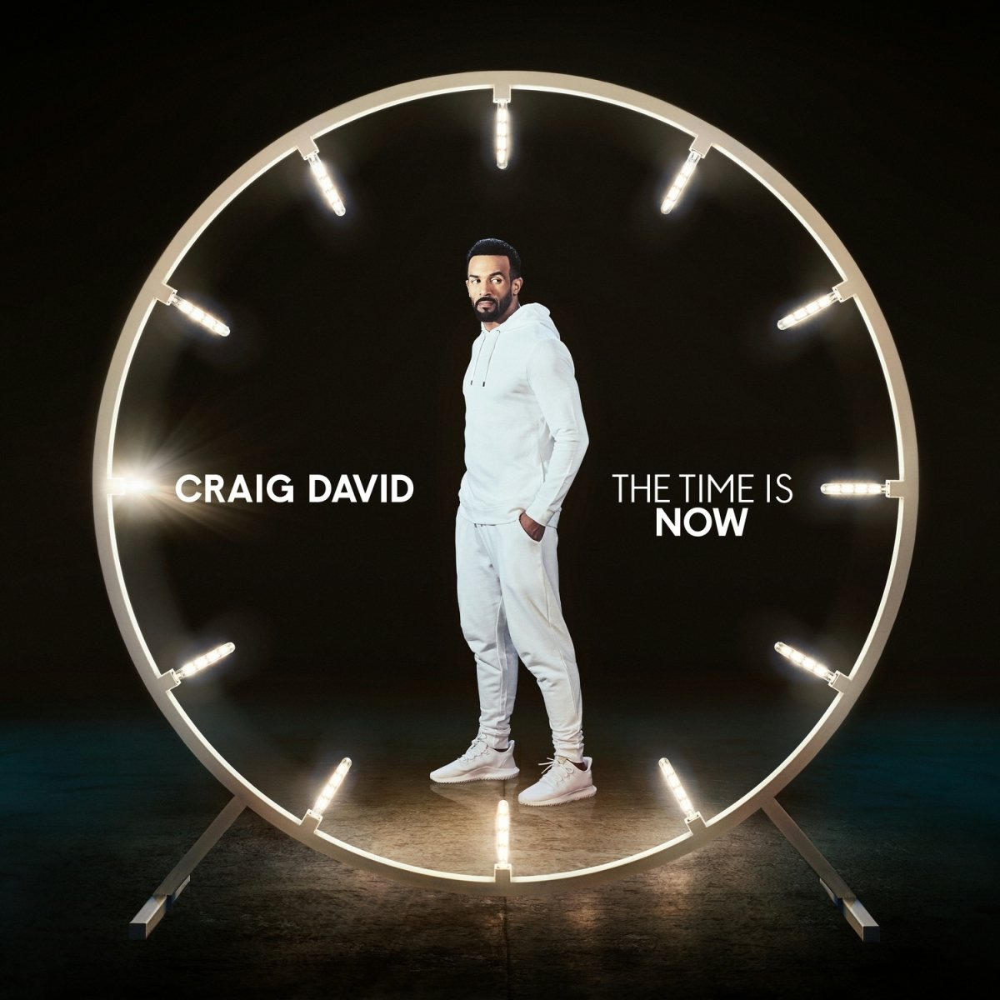

import { Slider, Button } from "@carbon/react";
import { ArrowUpRight } from "@carbon/icons-react";

import SliderJS1 from "../review/slider1";
import SliderJS2 from "../review/slider2";
import SliderJS3 from "../review/slider3";
import SliderJS4 from "../review/slider4";

import { Link } from "gatsby";

import Review1 from "../review/craigdavid2.mdx";

Album Review

<h1 className="h1--no--margin">{props.pageContext.frontmatter.title}</h1>

<Row  className="image-card-group">
	<Column colMd={3} colLg={4} noGutterMdLeft="">
       <ImageCard>

</ImageCard>
	</Column>
	<Column colMd={4} colLg={8} noGutterMdLeft="">
	

	前作がヒットしたCraig Davidの7作目。1年4カ月という短いインターバルでのリリースである。軽快でノリの良いPopを全編で繰り広げている。ClubやEDMを取り入れたアップな曲が多数で、それに哀愁感のあるミディアム～スローも取り混ぜている。3分前後の短めの曲が、どんどん切り替わっていくので、非常に小気味よい。ただ、全体的には同じような印象の曲が少なくいが、逆に統一感がとれてるとも言えるか。30台後半にして、この若々しさはさすが。
	

	

	  <Button className="button-right-mergin"  href="https://amzn.to/2Oc233B" renderIcon={ArrowUpRight} size='sm' kind='primary'>
      amazon.com
    </Button>
    <Button className="button-right-mergin"  href="https://amzn.to/2ZdZC6M" renderIcon={ArrowUpRight} size='sm' kind='secondary'>
      amazon.co.jp
    </Button>
	

	
	</Column>
</Row>
<Row >
	<Column colMd={4} colLg={4} noGutterMdLeft="">

  <h3>Score card</h3>
	<SliderJS1 value="5" />
  <SliderJS2 value="1" />
	<SliderJS3 value="1" />
  <SliderJS4 value="8" />

</Column>
<Column colMd={8} colLg={8} noGutterMdLeft="">

<h3>Producers</h3>

	KTre Jean-Marie(1,7)
	 Jonas Blue(2)
	 Steve Mag(3)
	 Fraser T Smith and 169(4,10,12)
	 Fraser T Smith(5,8)
	 Diztortion(6)
	 Kaytranada(9)
	 Jacob Manson(11)

<h3>Guests</h3>

	JB Coope, Bastille, Goldlink, AJ Tracey

</Column>
</Row>

<h3>Tracks</h3>

| No. | Title                       | Composers                                                                     | Performer                   | Time  |
| --- | --------------------------- | ----------------------------------------------------------------------------- | --------------------------- | ----- |
| 1   | Magic                       | Craig David / Ed Drewett / Tre Jean-Marie                                     | Craig David                 | 02:53 |
| 2   | Heartline                   | Craig David / Guy Robin / Sam Roman                                           | Craig David                 | 03:12 |
| 3   | Brand New                   | Craig David / Steve Mac                                                       | Craig David                 | 02:44 |
| 4   | Going On                    | Craig David / Josiah David Dixon / Ed Drewett / Tyrell Paul / Fraser T. Smith | Craig David                 | 03:24 |
| 5   | Love Me Like It's Yesterday | Craig David / Rachel Furner / Tyrell Paul / Fraser T. Smith                   | Craig David                 | 03:32 |
| 6   | For the Gram                | Raoul Chen / Craig David                                                      | Craig David                 | 03:54 |
| 7   | Get Involved                | John Paul Cooper / Craig David / Tre Jean-Marie                               | Craig David feat. JB Cooper | 03:09 |
| 8   | I Know You                  | Craig David / Carmen Reece / Dan Smith / Fraser T. Smith                      | Craig David feat. Bastille  | 03:34 |
| 9   | Live in the Moment          | D'Anthony Carlos / Louis Kevin Celestin / Craig David / Tre Jean-Marie        | Craig David feat. Goldlink  | 03:06 |
| 10  | Love Will Come Around       | Craig David / Josiah David Dixon / Tyrell Paul / Fraser T. Smith              | Craig David                 | 03:14 |
| 11  | Somebody Like Me            | Craig David / Che Wolton Grant / Jacob Manson                                 | Craig David feat. AJ Tracey | 02:54 |
| 12  | Focus                       | Craig David / Rachel Furner / Tyrell Paul / Fraser T. Smith                   | Craig David                 | 02:58 |

<h3>Other Reviews</h3>

<Row>
  <Column colMd={3} colLg={3} noGutterMdLeft>
    <Review1 />
  </Column>
</Row>
