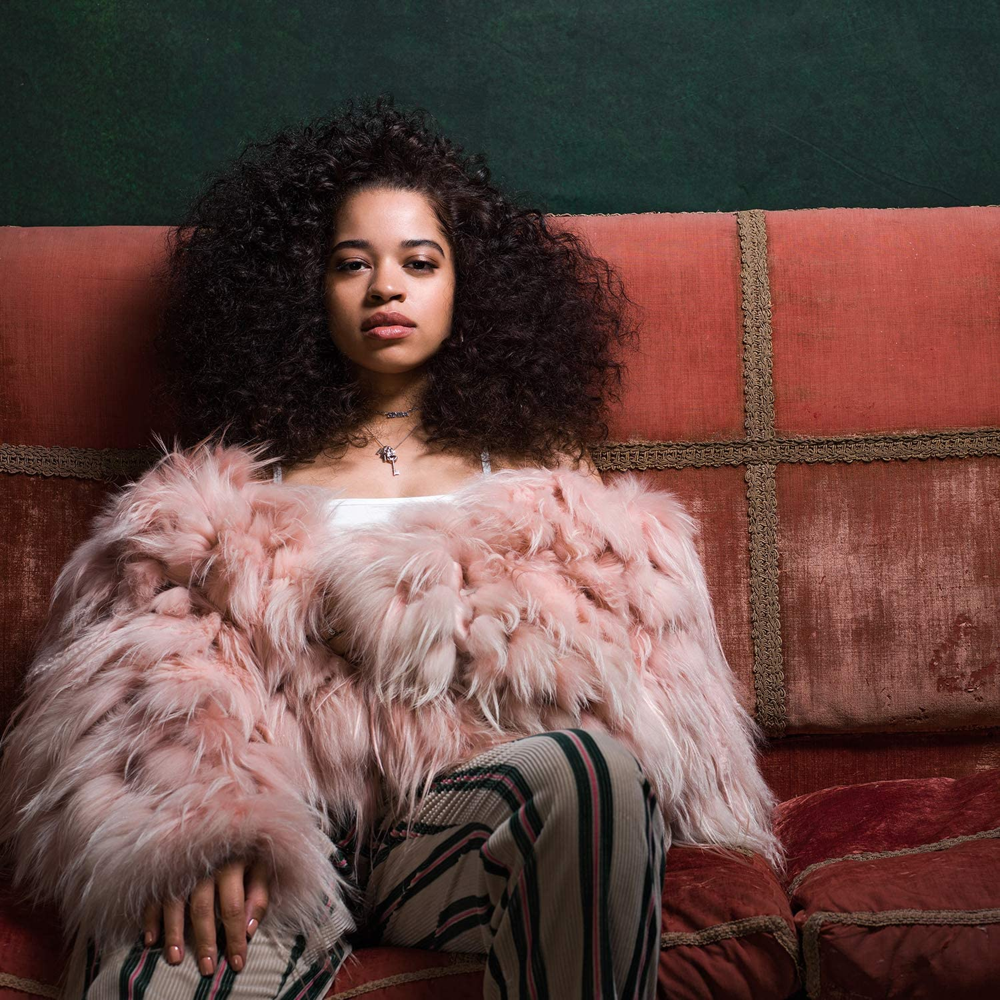

import { Slider, Button } from "@carbon/react";
import { ArrowUpRight } from "@carbon/icons-react";

import SliderJS1 from "../review/slider1";
import SliderJS2 from "../review/slider2";
import SliderJS3 from "../review/slider3";
import SliderJS4 from "../review/slider4";

import { Link } from "gatsby";

Album Review

<h1 className="h1--no--margin">{props.pageContext.frontmatter.title}</h1>

  <Link to="/best50/2018/">2018 Black Music Best No.25</Link>

<Row  className="image-card-group">
	<Column colMd={3} colLg={4} noGutterMdLeft="">
       <ImageCard>

 

</ImageCard>
	</Column>
	<Column colMd={4} colLg={8} noGutterMdLeft="">
	

	southwest London出身で24歳のVocal, Ella Maiのデビューアルバム。⑧でGrammyにもノミネートされ、順調なスタートを切っている。彼女をHookしたDJ Musard中心にProduceされた作品で、90年代のUS R&Bを下敷きにしたようなオーソドックスで耳なじみの良い曲が並んでいる。スローが中心でじっくり聴かせる曲が多く、見た目と違って中低域の落ち着いた声で唄っており、ちょっと若々しさみたいなものは期待しないほうが良いかもしれない。
	

    

	  <Button className="button-right-mergin"  href="https://amzn.to/3ekoIWW" renderIcon={ArrowUpRight} size='sm' kind='primary'>
      amazon.com
    </Button>
    <Button className="button-right-mergin"  href="https://amzn.to/2zOkGqN" renderIcon={ArrowUpRight} size='sm' kind='secondary'>
      amazon.co.jp
    </Button>
	

	
	</Column>
</Row>
<Row >
	<Column colMd={4} colLg={4} noGutterMdLeft="">

  <h3>Score card</h3>
	<SliderJS1 value="5" />
  <SliderJS2 value="1" />
	<SliderJS3 value="1" />
  <SliderJS4 value="8" />

</Column>
<Column colMd={8} colLg={8} noGutterMdLeft="">

<h3>Producers</h3>

	Nana Rogues(2)
	 Bryan Michael Cox(3)
	 Mustard(4,5,7,8,1112,13,14
	 Harmony Samuels(6)
	 Rush HR(9)
	 Marcos "Kosine" Palacios and Miykal snoddy(10)
	 Lido(15)

<h3>Guests</h3>

	Chris Brown, John Legend, H.E.R.

</Column>
</Row>

<h3>Tracks</h3>

| No. | Title           | Composers                                                                                                                                                        | Performer                  | Time  |
| --- | --------------- | ---------------------------------------------------------------------------------------------------------------------------------------------------------------- | -------------------------- | ----- |
| 1   | Emotion         |                                                                                                                                                                  | Ella Mai                   | 00:11 |
| 2   | Good Bad        | Ella Mai / Nana Rogues / Nathaniel Warner                                                                                                                        | Ella Mai                   | 03:49 |
| 3   | Dangerous       | Prince Charles / Bryan-Michael Cox / Ella Mai                                                                                                                    | Ella Mai                   | 04:39 |
| 4   | Sauce           | Quintin Gulledge / Ella Mai / Dijon McFarlane / Varren Wade                                                                                                      | Ella Mai                   | 03:04 |
| 5   | Whatchamacallit | Chris Brown / Jordan Holt / Sam Hook / Ella Mai / Dijon McFarlane                                                                                                | Ella Mai feat. Chris Brown | 02:59 |
| 6   | Cheap Shot      | Shawn Butler / Ella Mai / Harmony Samuels / Varren Wade                                                                                                          | Ella Mai                   | 04:01 |
| 7   | Shot Clock      | Jahron Brathwaite / Benjamin Bush / Stephen Garrett / Aubrey Graham / Micah John / Ella Mai / Dijon McFarlane / Timothy Mosley                                   | Ella Mai                   | 03:21 |
| 8   | Boo'd Up        | Larrance Dopson / Joelle James / Ella Mai / Dijon McFarlane                                                                                                      | Ella Mai                   | 03:59 |
| 9   | Everything      | Dayyon Alexander / Quintin Gulledge / Ella Mai / Dijon McFarlane / Jeff Shum                                                                                     | Ella Ma feat. John Legendi | 03:01 |
| 10  | Own It          | Lucky Dave / Jamie Foxx / Ella Mai / Billy Moss / Marcos Palacios / Miykal Snoddy                                                                                | Ella Mai                   | 04:11 |
| 11  | Run My Mouth    | Ray Harlowe / Ella Mai / Dijon McFarlane                                                                                                                         | Ella Mai                   | 02:35 |
| 12  | Gut Feeling     | Caroline Ailin / Trey Campbell / Quintin Gulledge / H.E.R. / Ella Mai / Dijon McFarlane                                                                          | Ella Mai feat. H.E.R.      | 03:56 |
| 13  | Trip            | Quintin Gulledge / Ella Mai / Dijon McFarlane / Varren Wade                                                                                                      | Ella Mai                   | 03:34 |
| 14  | Close           | Quintin Gulledge / Ella Mai / Dijon McFarlane / Varren Wade                                                                                                      | Ella Mai                   | 04:12 |
| 15  | Easy            | Richard Brown / Prince Charles / Michael Conroy / Robbie Grey / Quintin Gulledge / Peder Losneg?rd / Ella Mai / Gary McDowell / Dijon McFarlane / Stephen Walker | Ella Mai                   | 04:32 |
