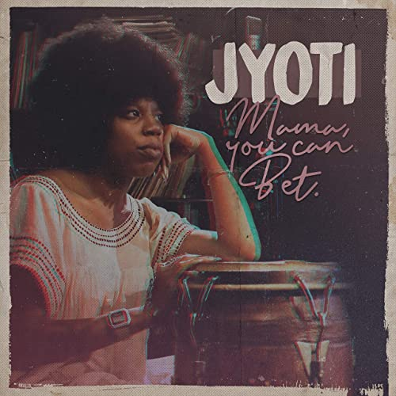

import { Slider, Button } from "@carbon/react";
import { ArrowUpRight } from "@carbon/icons-react";

import SliderJS1 from "../review/slider1";
import SliderJS2 from "../review/slider2";
import SliderJS3 from "../review/slider3";
import SliderJS4 from "../review/slider4";

import { Link } from "gatsby";

import Review1 from "../review/georgiaannemuldrow1.mdx";

Album Review

<h1 className="h1--no--margin">{props.pageContext.frontmatter.title}</h1>

  <Link to="/best50/2020/">2020 Black Music Best No.45</Link>

<Row  className="image-card-group">
	<Column colMd={3} colLg={4} noGutterMdLeft="">
       <ImageCard>

</ImageCard>
	</Column>
	<Column colMd={4} colLg={8} noGutterMdLeft="">
	

    Georgia Anne Muldrowの変名プロジェクト、JyotiのJazz作。Jyotiの命名はAlice Coltraneとのこと。母であるJazz VocalistのRickie Byarsへのトリビュートアルバムになっている。
     本名での作品のようなSoul, Funk志向は抑え気味で、全編アバンギャルドでスピリチュアルなアコースティックJazzが中心であり、Vocal量も少なく、インストロメンタルがメインになっている。
     また、Charles Mingus, Sun Ra, Duke Ellingtonなどへのオマージュ曲もあったりする。曲調は様々で、彼女らしい世界が広がっている。こっち方面の才能もあったのかと、感心する。
  

	

	  <Button className="button-right-mergin"  href="https://amzn.to/33a9sIq" renderIcon={ArrowUpRight} size='sm' kind='primary'>
      amazon.com
    </Button>
    <Button className="button-right-mergin"  href="https://amzn.to/35Qmz3j" renderIcon={ArrowUpRight} size='sm' kind='secondary'>
      amazon.co.jp
    </Button>
    <Button className="button-right-mergin"  href="https://apple.co/2KoBY2w" renderIcon={ArrowUpRight} size='sm' kind='tertiary'>
      apple music
    </Button>
	

	</Column>
</Row>
<Row >
	<Column colMd={4} colLg={4} noGutterMdLeft="">
    

      <h3>Score card</h3>
	    <SliderJS1 value="5" />
      <SliderJS2 value="3" />
	    <SliderJS3 value="2" />
      <SliderJS4 value="8" />
    

  </Column>
  <Column colMd={8} colLg={8} noGutterMdLeft="">
    

      <h3>Producers</h3>
      

        Georgia Anne Muldrow(all)
      

      <h3>Guests</h3>
      

	      Lakecia Benjamin
      

    

  </Column>
</Row>

<h3>Tracks</h3>

| No. | Title                   | Composers            | Performer                    | Time  |
| --- | ----------------------- | -------------------- | ---------------------------- | ----- |
| 1   | Mama, You Can Bet!      | Georgia Anne Muldrow | Jyoti                        | 03:11 |
| 2   | Bop for Aneho           | Georgia Anne Muldrow | Jyoti                        | 02:04 |
| 3   | Zane, The Scribe        | Georgia Anne Muldrow | Jyoti                        | 02:43 |
| 4   | Our Joy (Mercedes)      | Georgia Anne Muldrow | Jyoti                        | 01:44 |
| 5   | Ra's Noise (Thukumbado) | Georgia Anne Muldrow | Jyoti feat. Lakecia Benjamin | 03:22 |
| 6   | Bemoanable Lady Geemix  | Georgia Anne Muldrow | Jyoti                        | 03:33 |
| 7   | Orgone                  | Georgia Anne Muldrow | Jyoti                        | 03:06 |
| 8   | Skippin and Trippin     | Georgia Anne Muldrow | Jyoti                        | 01:12 |
| 9   | Swing Kirikou, Swing!   | Georgia Anne Muldrow | Jyoti                        | 02:08 |
| 10  | Quarrys, Queries        | Georgia Anne Muldrow | Jyoti                        | 03:06 |
| 11  | Ancestral Duckets       | Georgia Anne Muldrow | Jyoti                        | 04:04 |
| 12  | Hard Bap Duke           | Georgia Anne Muldrow | Jyoti                        | 02:55 |
| 13  | This Walk               | Georgia Anne Muldrow | Jyoti                        | 02:34 |
| 14  | Fabus Foo Geemix        | Georgia Anne Muldrow | Jyoti                        | 04:50 |
| 15  | The Cowrie Waltz        | Georgia Anne Muldrow | Jyoti                        | 03:55 |

<Row>
  <Column colMd={3} colLg={3} noGutterMdLeft>
    <Review1 />
  </Column>
</Row>
