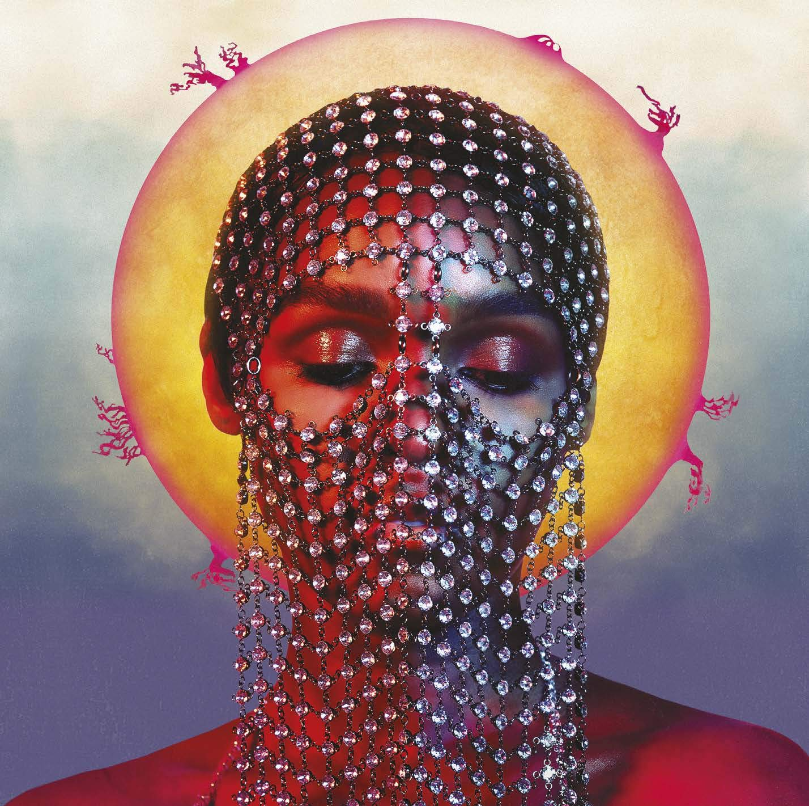

import { Slider, Button } from "@carbon/react";
import { ArrowUpRight } from "@carbon/icons-react";

import SliderJS1 from "../review/slider1";
import SliderJS2 from "../review/slider2";
import SliderJS3 from "../review/slider3";
import SliderJS4 from "../review/slider4";

import { Link } from "gatsby";

Album Review

<h1 className="h1--no--margin">{props.pageContext.frontmatter.title}</h1>

  <Link to="/best50/2018/">2018 Black Music Best No.1</Link>

<Row  className="image-card-group">
	<Column colMd={3} colLg={4} noGutterMdLeft="">
       <ImageCard>

</ImageCard>
	</Column>
	<Column colMd={4} colLg={8} noGutterMdLeft="">
	

		女優業も好調なJanelle Monaeの4年半ぶり3作目。前作までの組曲作品と違い、新しいコンセプトでの作品。制作陣は引き続きWondaland ファミリーの盟友Nate "Rocket" WonderとChuck Lightningが中心となっており、豊饒なサウンドを紡ぎだしている。
		 晩年のPrinceと交流があったとのことで、⑧⑭あたりがPrinceっぽい曲になっている。他にもPopでFunkでノリの良い曲が多く、それだけでも単純に楽しめるが、Lyricのメッセージ性は強い。
		 また、なんとBrian WilsonがOpening曲でビーチボーイズっぽいコーラスを聴かせてくれている。
	

	

	  <Button className="button-right-mergin"  href="https://amzn.to/2MVqv8E" renderIcon={ArrowUpRight} size='sm' kind='primary'>
      amazon.com
    </Button>
    <Button className="button-right-mergin"  href="https://amzn.to/2B6mtHM" renderIcon={ArrowUpRight} size='sm' kind='secondary'>
      amazon.co.jp
    </Button>
	

	
	</Column>
</Row>
<Row >
	<Column colMd={4} colLg={4} noGutterMdLeft="">

  <h3>Score card</h3>
	<SliderJS1 value="4" />
  <SliderJS2 value="1" />
	<SliderJS3 value="1" />
  <SliderJS4 value="9" />

</Column>
<Column colMd={8} colLg={8} noGutterMdLeft="">

<h3>Producers</h3>

	Nate "Rocket" Wonder(1,2,3,5,9,12,13,14)
	 Jon Brion Oneric(4)
	 Nana Kwabena(6)
	 Winne Benette, Chuck Lightning and Nate "Rocket" Wonder(7)
	 Mattman and Robin(8)
	 Organized Nize(10)
	 Nate "Rocket" Wonder, Janelle Monae and Roman GianArthur(11)

<h3>Guests</h3>

	Brian Wilson, Zoe Kravitz, Grimes, Pharrell Williams

</Column>
</Row>

<h3>Tracks</h3>

| No. | Title                | Composers                                                                                                                                   | Performer                             | Time  |
| --- | -------------------- | ------------------------------------------------------------------------------------------------------------------------------------------- | ------------------------------------- | ----- |
| 1   | Dirty Computer       | Dr. Nathaniel Irvin III / Janelle Monae Robinson / Nate "Rocket" Wonder                                                                     | Janelle Monae feat, Brian Wilson      | 01:59 |
| 2   | Crazy, Classic, Life | Charles Joseph II / Dr. Nathaniel Irvin III / Janelle Monae Robinson / Nate "Rocket" Wonder                                                 | Janelle Monae                         | 04:46 |
| 3   | Take a Byte          | Dr. Nathaniel Irvin III / John Webb Jr. / Janelle Monae Robinson / Nana Kwabena Tuffuor / Nate "Rocket" Wonder                              | Janelle Monae                         | 04:07 |
| 4   | Jane's Dream         | Jon Brion                                                                                                                                   | Janelle Monae                         | 00:18 |
| 5   | Screwed              | Roman GianArthur / Charles Joseph II / Dr. Nathaniel Irvin III / Benjamin Hudson McIldowie / Janelle Monae Robinson                         | Janelle Monae feat. Zoe Kravitz       | 05:02 |
| 6   | Django Jane          | Dr. Nathaniel Irvin III / Janelle Monae Robinson / Nana Kwabena Tuffuor                                                                     | Janelle Monae                         | 03:10 |
| 7   | PYNK                 | Wynne Bennett / Charles Joseph II / Dr. Nathaniel Irvin III / Taylor Parks / Janelle Monae Robinson                                         | Janelle Monae feat. Grimes            | 04:00 |
| 8   | Make Me Feel         | Robin Fredriksson / Matt Friedman / Julia Michaels / Janelle Monae Robinson / Justin Tranter                                                | Janelle Monae                         | 03:14 |
| 9   | I Got the Juice      | Joshua Dean / Roman GianArthur / Dr. Nathaniel Irvin III / Taylor Parks / Janelle Monae Robinson / Nana Kwabena Tuffuor / Pharrell Williams | Janelle Monae feat, Pharrell Williams | 03:46 |
| 10  | I Like That          | Patrick Brown / Dr. Nathaniel Irvin III / Ray Murray / Taylor Parks / Janelle Monae Robinson / Rico Wade                                    | Janelle Monae                         | 03:20 |
| 11  | Stevie's Dream       | Roman GianArthur / Dr. Nathaniel Irvin III                                                                                                  | Janelle Monae                         | 06:03 |
| 12  | Don't Judge Me       | Joshua Dean / Roman GianArthur / Dr. Nathaniel Irvin III / Taylor Parks / Janelle Monae Robinson                                            | Janelle Monae                         | 00:46 |
| 13  | So Afraid            | Dr. Nathaniel Irvin III / Janelle Monae Robinson                                                                                            | Janelle Monae                         | 04:04 |
| 14  | Americans            | Charles Joseph II / Dr. Nathaniel Irvin III / John Webb Jr. / Janelle Monae Robinson                                                        | Janelle Monae                         | 04:06 |
