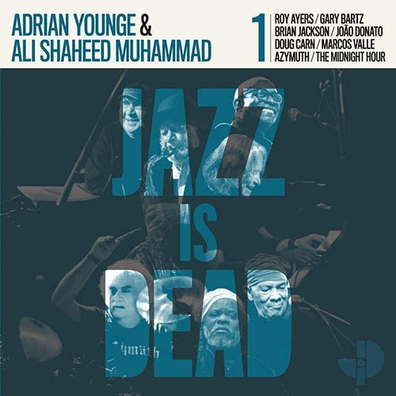

import { Slider, Button } from "@carbon/react";
import { ArrowUpRight } from "@carbon/icons-react";

import SliderJS1 from "../review/slider1";
import SliderJS2 from "../review/slider2";
import SliderJS3 from "../review/slider3";
import SliderJS4 from "../review/slider4";

import { Link } from "gatsby";

Album Review

<h1 className="h1--no--margin">{props.pageContext.frontmatter.title}</h1>

<Row  className="image-card-group">
	<Column colMd={3} colLg={4} noGutterMdLeft="">
       <ImageCard>

</ImageCard>
	</Column>
	<Column colMd={4} colLg={8} noGutterMdLeft="">
	

	Ali Shaheed MuhammadとAdrian Youngeのよるレーベルによるシリーズ作、Jazz Is Daedの第一弾。2020/10現在、たて続けに003までリリースされている。
   過激なタイトルではあるが、内容は100% Jazz。エレキギターやエレピが使われており、ラテン/ファンクフレーバーな曲も多く、バップやモードの後の70年代あたりを彷彿させる。
   お馴染みRoy Ayersをはじめとする、著名なGuestが曲ごとに参加しており、Vocal曲も2曲あって、Jazzとしては聴きやすい気がする。
  

  

	  <Button className="button-right-mergin"  href="https://amzn.to/31gxl0e" renderIcon={ArrowUpRight} size='sm' kind='primary'>
      amazon.com
    </Button>
    <Button className="button-right-mergin"  href="https://amzn.to/3o044QS" renderIcon={ArrowUpRight} size='sm' kind='secondary'>
      amazon.co.jp
    </Button>
    <Button className="button-right-mergin"  href="https://apple.co/3jZXg3s" renderIcon={ArrowUpRight} size='sm' kind='tertiary'>
      apple music
    </Button>
	

  </Column>
</Row>
<Row >
  <Column colMd={4} colLg={4} noGutterMdLeft="">
    

      <h3>Score card</h3>
	    <SliderJS1 value="5" />
      <SliderJS2 value="2" />
	    <SliderJS3 value="2" />
      <SliderJS4 value="8" />
    

  </Column>
  <Column colMd={4} colLg={8} noGutterMdLeft="">
    

      <h3>Producers</h3>
      

      Ali Shaheed Muhammad and Adrian Younge(all)
      

      <h3>Guests</h3>
      

        Roy Ayers, Gary Bartz, Brian Jackson, João Donato ,Doug Cam, Marcos Valle
      

    

  </Column>
</Row>

<h3>Tracks</h3>

| No. | Title           | Composers                                                                           | Performer                                                    | Time  |
| --- | --------------- | ----------------------------------------------------------------------------------- | ------------------------------------------------------------ | ----- |
| 1   | Hey Lover       | Roy Ayers / Anitra Castleberry / Elgin Clark / Ali Shaheed Muhammad / Adrian Younge | Ali Shaheed Muhammad / Adrian Younge feat. Roy Ayers         | 02:25 |
| 2   | Distant Mode    | Gary Bartz / Ali Shaheed Muhammad / Adrian Younge                                   | Ali Shaheed Muhammad / Adrian Younge feat. Gary Bartz        | 03:04 |
| 3   | Nancy Wilson    | Brian Jackson / Ali Shaheed Muhammad / Adrian Younge                                | Ali Shaheed Muhammad / Adrian Younge feat. Brian Jackson     | 02:42 |
| 4   | Conexão         | João Donato / Ali Shaheed Muhammad / Adrian Younge                                  | Ali Shaheed Muhammad / Adrian Younge feat. João Donato       | 03:05 |
| 5   | Down Deep       | Doug Carn / Ali Shaheed Muhammad / Adrian Younge                                    | Ali Shaheed Muhammad / Adrian Younge feat. Doug Cam          | 03:22 |
| 6   | Apocalíptico    | Azymuth / Ali Shaheed Muhammad / Adrian Younge                                      | Ali Shaheed Muhammad / Adrian Younge feat. Azymuth           | 09:27 |
| 7   | Não Saia Da Pra | Ali Shaheed Muhammad / Marcos Valle / Adrian Younge                                 | Ali Shaheed Muhammad / Adrian Younge feat. Marcos Valle      | 02:49 |
| 8   | Jazz Is Dead    | Ali Shaheed Muhammad / Adrian Younge                                                | Ali Shaheed Muhammad / Adrian Younge feat. The Midnight Hour | 02:47 |
