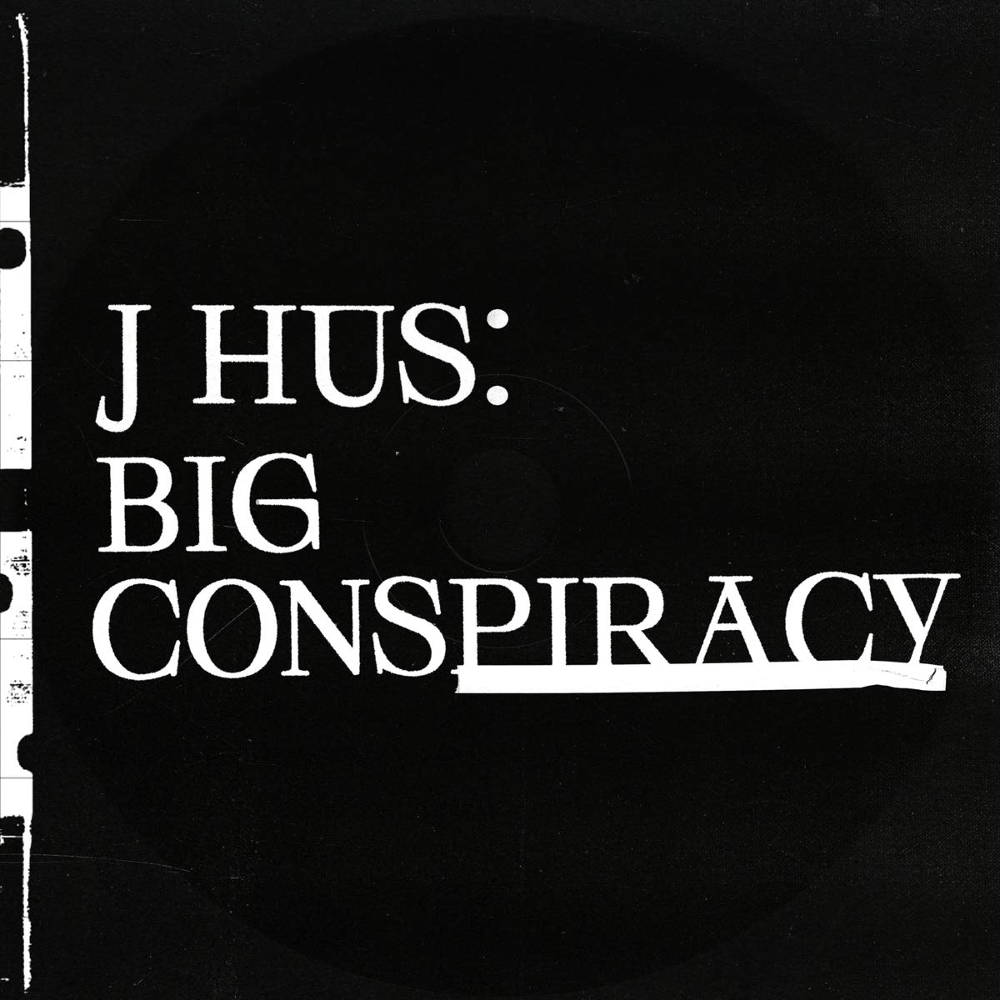

import { Slider, Button } from "@carbon/react";
import { ArrowUpRight } from "@carbon/icons-react";

import SliderJS1 from "../review/slider1";
import SliderJS2 from "../review/slider2";
import SliderJS3 from "../review/slider3";
import SliderJS4 from "../review/slider4";

import { Link } from "gatsby";

import Review1 from "../review/jhus1.mdx";

Album Review

<h1 className="h1--no--margin">{props.pageContext.frontmatter.title}</h1>

  <Link to="/best50/2020/">2020 Black Music Best No.19</Link>

<Row  className="image-card-group">
	<Column colMd={3} colLg={4} noGutterMdLeft="">
       <ImageCard>

</ImageCard>
	</Column>
	<Column colMd={4} colLg={8} noGutterMdLeft="">
	

	UKラッパー、J Husの3年ぶり2作目。前作の路線を継続していて、Raggae, Afro, JazzにGrime, TrapなどBlack Musicを幅広く取り入れたようなサウンドであり、最近では、こんな作風がAfro Swingとも呼ばれているようだ。
	 前作同様Jae5を中心としたProduceによる奇をてらわないオーソドックスなTrackが多いが、シリアスな中でもBurna Boy, Koffee, Ella Maiなど幅広いジャンルからのGuest参加もあって、飽きさせない作りになっている。
	 また、軽快な印象の曲も少なくなく、太目の声による唄うようなRapもそのままである。
	

	

	  <Button className="button-right-mergin"  href="https://amzn.to/2QB2C8r" renderIcon={ArrowUpRight} size='sm' kind='primary'>
      amazon.com
    </Button>
    <Button className="button-right-mergin"  href="https://amzn.to/3b7BWW2" renderIcon={ArrowUpRight} size='sm' kind='secondary'>
      amazon.co.jp
    </Button>
	

	
	</Column>
</Row>
<Row >
	<Column colMd={4} colLg={4} noGutterMdLeft="">

  <h3>Score card</h3>
	<SliderJS1 value="4" />
  <SliderJS2 value="2" />
	<SliderJS3 value="1" />
  <SliderJS4 value="8" />

</Column>
<Column colMd={8} colLg={8} noGutterMdLeft="">

<h3>Producers</h3>

	TSB(1,2,10)
	 IO(3,)
	 JAE5(4,7,11,12,13)
	 JAE5, Nana Rogues, Mike Orabiyi Riley(5)
	 IO and JAE5(6,14)
	 JAE5, IO, Levi Lennox and Maestro(8)
	 TSB and Sunny Kale(9)

<h3>Guests</h3>

	iceè tgm, Burna Boy, Koffee, Ella Mai

</Column>
</Row>

<h3>Tracks</h3>

| No. | Title                              | Composers                                            | Performer | Time  |
| --- | ---------------------------------- | ---------------------------------------------------- | --------- | ----- |
| 1   | Big Conspiracy (featuring iceè tgm | J Hus, TSB                                           | J Hus     | 03:39 |
| 2   | Helicopter (featuring iceè tgm)    | J Hus, TSB                                           | J Hus     | 02:34 |
| 3   | Fight for Your Right               | J Hus, IO                                            | J Hus     | 03:17 |
| 4   | Triumph                            | J Hus, JAE5                                          | J Hus     | 02:50 |
| 5   | Play Play (featuring Burna Boy)    | J Hus, Damini Ogulu, Nana Rogues, Mike Orabiyi Riley | J Hus     | 03:26 |
| 6   | Cucumber                           | J Hus, JAE5, Nana Rogues                             | J Hus     | 02:41 |
| 7   | Repeat (featuring Koffee)          | J Hus, JAE5, Mikayla Simpson                         | J Hus     | 02:33 |
| 8   | Fortune Teller                     | J Hus, IO, Levi Lennox, Maestro                      | J Hus     | 02:35 |
| 9   | Reckless                           | J Hus, Sunny Kale, TSB                               | J Hus     | 02:28 |
| 10  | No Denying                         | J Hus, TSB                                           | J Hus     | 03:48 |
| 11  | Must Be                            | J Hus, JAE5                                          | J Hus     | 03:28 |
| 12  | One and Only (featuring Ella Mai)  | J Hus, JAE5, Ella Mai                                | J Hus     | 03:29 |
| 13  | Love, Peace and Prosperity         | J Hus, JAE5                                          | J Hus     | 03:14 |
| 14  | Deeper Than Rap                    | J Hus,IO, JAE5                                       | J Hus     | 04:06 |

<h3>Other Reviews</h3>

<Row>
  <Column colMd={3} colLg={3} noGutterMdLeft>
    <Review1 />
  </Column>
</Row>
