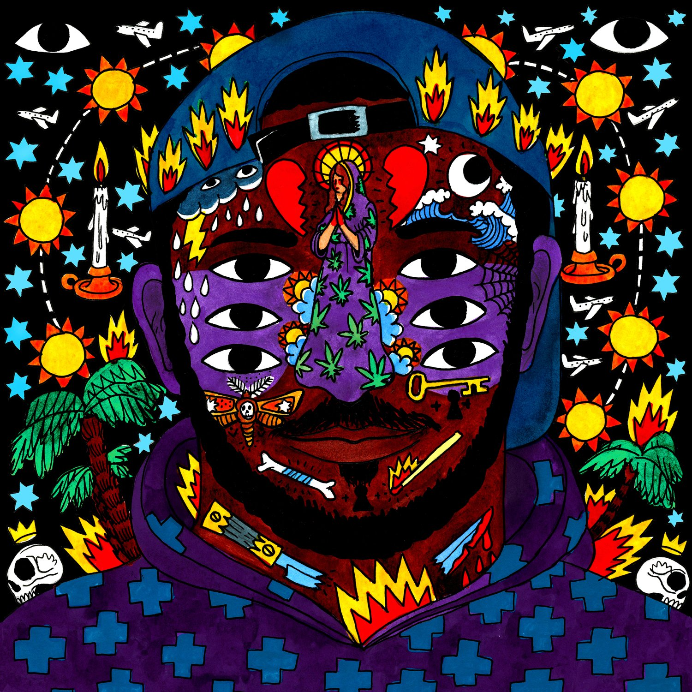

import { Slider, Button } from "@carbon/react";
import { ArrowUpRight } from "@carbon/icons-react";

import SliderJS1 from "../review/slider1";
import SliderJS2 from "../review/slider2";
import SliderJS3 from "../review/slider3";
import SliderJS4 from "../review/slider4";

import { Link } from "gatsby";

Album Review

<h1 className="h1--no--margin">{props.pageContext.frontmatter.title}</h1>

  <Link to="/best50/2016/">2016 Black Music Best No.10</Link>

<Row  className="image-card-group">
	<Column colMd={3} colLg={4} noGutterMdLeft="">
       <ImageCard>

</ImageCard>
	</Column>
	<Column colMd={4} colLg={8} noGutterMdLeft="">
	

	ハイチ生まれでモントリオール育ちの23歳、Kaytranadaの1stアルバム。Anderson.Paak, The Internet, Chance The Rapperなど旬のArtistに曲を提供し、今、大注目のProducerである。
	 サンプリングと打ち込み中心の作品で、一言でいうとおしゃれでクールなクラブミュージックということになるが、カッコ良いJazz風の曲や、ファンクの良い曲など、いろいろあって面白い。
	 近くのアメリカより、UKっぽいジャンルレスな感覚がある。インストのみの曲も多く、VocalやRapもサウンドの一つとして扱っているように感じる。音数が少ないのに、これだけのTrackを作れるのは、なかなかの才能だと思う。
	

	

	  <Button className="button-right-mergin"  href="https://amzn.to/3lZd8EV" renderIcon={ArrowUpRight} size='sm' kind='primary'>
      amazon.com
    </Button>
		<Button className="button-right-mergin"  href="https://amzn.to/3hfqmJS" renderIcon={ArrowUpRight} size='sm' kind='secondary'>
      amazon.co.jp
    </Button>
  

	
	</Column>
</Row>
<Row >
	<Column colMd={4} colLg={4} noGutterMdLeft="">

  <h3>Score card</h3>
	<SliderJS1 value="3" />
  <SliderJS2 value="1" />
	<SliderJS3 value="1" />
  <SliderJS4 value="9" />

</Column>
<Column colMd={8} colLg={8} noGutterMdLeft="">

<h3>Producers</h3>

	Kaytranada
	 Kaytranada, Karreim Higgins and River Tiber(2)
	 Kaytranada and BADBADNOTGOOD(6)

<h3>Guests</h3>

	Karriem Higgins, River Tiber, Craig David, AlunaGeorge, Goldlink, Vic Mensa, BADBADNOTGOOD, Phonte, Syd, Shay Lia, Little Dragon

</Column>
</Row>

<h3>Tracks</h3>

| No. | Title                  | Composers                                                                                                                                                    | Performer                                     | Time  |
| --- | ---------------------- | ------------------------------------------------------------------------------------------------------------------------------------------------------------ | --------------------------------------------- | ----- |
| 1   | Track Uno              | Louis Kevin Celestin / Michael Denne / Kenneth Gold                                                                                                          | Kaytranada                                    | 05:44 |
| 2   | Bus Ride               | Louis Kevin Celestin / Thomas Paxton-Beesley / Karriem Riggins                                                                                               | Kaytranada feat. Karriem Higgins, River Tiber | 02:13 |
| 3   | Got It Good            | Louis Kevin Celestin / Craig David / Lauren Faith / Tre Jean-Marie                                                                                           | Kaytranada feat. Craig David                  | 03:48 |
| 4   | Together               | D'Anthony Carlos / Louis Kevin Celestin / Aluna Francis                                                                                                      | Kaytranada feat. AlunaGeorge, Goldlink        | 03:17 |
| 5   | Drive Me Crazy         | Louis Kevin Celestin / Alan Hawkshaw / Victor Mensah                                                                                                         | Kaytranada feat. Vic Mensa                    | 04:37 |
| 6   | Weight Off             | Louis Kevin Celestin / Chester Hansen / Alexander Sowinski / Matthew Tavares / Leland Whitty                                                                 | Kaytranada feat. BADBADNOTGOOD                | 02:35 |
| 7   | One Too Many           | Louis Kevin Celestin / Phonte Coleman                                                                                                                        | Kaytranada feat. Phonte                       | 03:38 |
| 8   | Despite the Weather    | Louis Kevin Celestin / Bob Selvin                                                                                                                            | Kaytranada                                    | 02:01 |
| 9   | Glowed Up              | Brandon Anderson / Louis Kevin Celestin                                                                                                                      | Kaytranada                                    | 04:58 |
| 10  | Breakdance Lesson No.1 | Louis Kevin Celestin / David Frank / Michael Murphy                                                                                                          | Kaytranada                                    | 04:28 |
| 11  | You're the One         | Sydney Bennett / Louis Kevin Celestin / Nicholas Eaholtz                                                                                                     | Kaytranada feat. Syd                          | 03:47 |
| 12  | Vivid Dreams           | Louis Kevin Celestin / Thomas Paxton-Beesley                                                                                                                 | Kaytranada feat. River Tiber                  | 04:36 |
| 13  | Lite Spots             | Louis Kevin Celestin / Jards Macal? / Waly Salom?o                                                                                                           | Kaytranada                                    | 03:50 |
| 14  | Leave Me Alone         | Louis Kevin Celestin / Shay Lia                                                                                                                              | Kaytranada feat. Shay Lia                     | 04:37 |
| 15  | Bullets                | Erik Boon / Louis Kevin Celestin / Chester Hansen / Yukmi Nagano / Alexander Sowinski / Matthew Tavares / Fredrik Wallin / Leland Whitty / H?kan Wirenstrand | Kaytranada feat. Little Dragon                | 04:58 |
