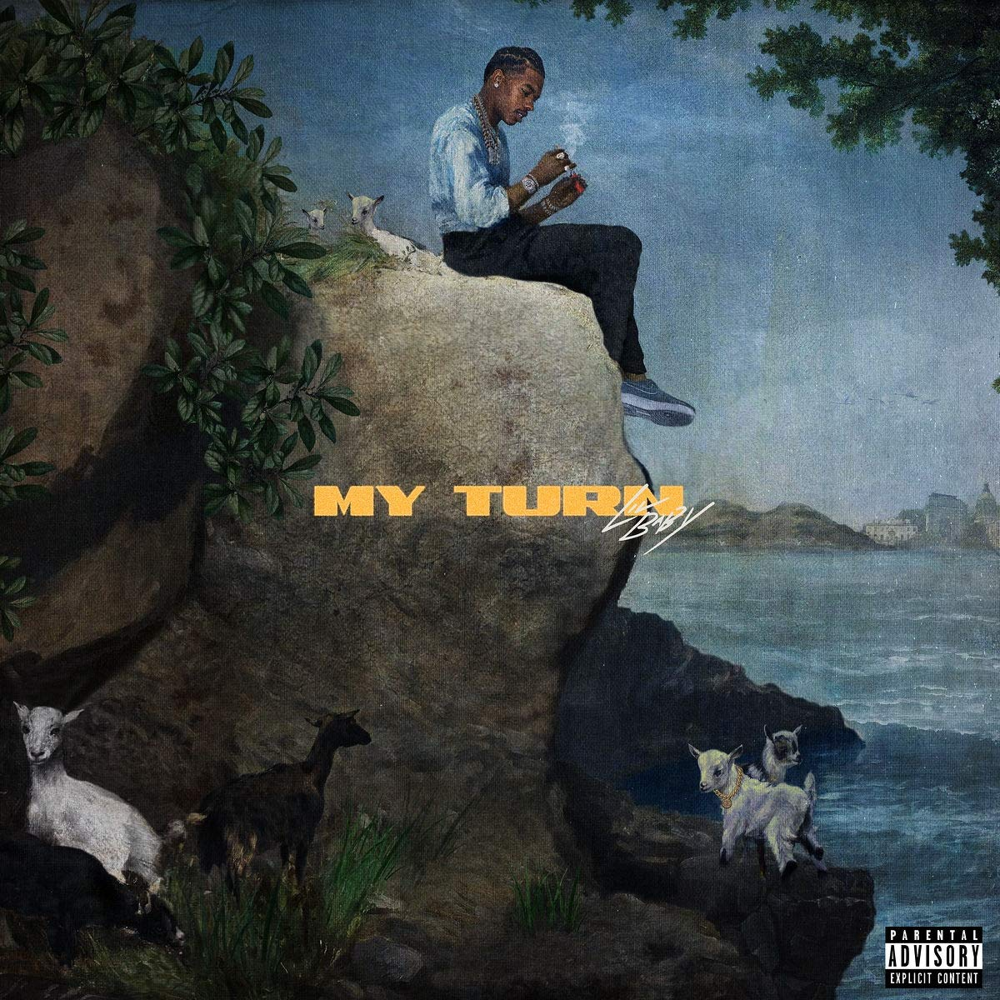

import { Slider, Button } from "@carbon/react";
import { ArrowUpRight } from "@carbon/icons-react";

import SliderJS1 from "../review/slider1";
import SliderJS2 from "../review/slider2";
import SliderJS3 from "../review/slider3";
import SliderJS4 from "../review/slider4";

import { Link } from "gatsby";

Album review

<h1 className="h1--no--margin">{props.pageContext.frontmatter.title}</h1>

  <Link to="/best50/2020/">2020 Black Music Best No.18</Link>

<Row  className="image-card-group">
	<Column colMd={3} colLg={4} noGutterMdLeft="">
       <ImageCard>

</ImageCard>
	</Column>
	<Column colMd={4} colLg={8} noGutterMdLeft="">
	

		ATL出身、24歳(リリース時点では23歳)のRapper, Lil Babyの2nd。2020/2にリリースされ、チャート1位を獲得し、2020年で最もストリーミング再生されたアルバムにもなっている。
		 本格的なArtist活動は2017年あたりからとのことだが、地元のQuality Controlと契約し、スキルを磨いての今回のブレイクとなっている。
		 南部らしいTrapにシリアスなトーンが合わさった、ゆったりとしたTrackが多く、ストリングやPianoの楽器やAutotuneなども効果的に使われている。
		 ゲスト参加しているLil Wayneにも通じるゆるめの半分唄うようなフローが特徴的。ただ、FutureやそのLil Wayneとの攻めの⑥⑩やPopな⑦などでは趣向を変えていて、多彩なところも魅せている。
	

	

	  <Button className="button-right-mergin"  href="https://amzn.to/3dV104A" renderIcon={ArrowUpRight} size='sm' kind='primary'>
      amazon.com
    </Button>
    <Button className="button-right-mergin"  href="https://amzn.to/3mDHz4j" renderIcon={ArrowUpRight} size='sm' kind='secondary'>
      amazon.co.jp
    </Button>
    <Button className="button-right-mergin"  href="https://apple.co/3t7ZZfW" renderIcon={ArrowUpRight} size='sm' kind='tertiary'>
      apple music
    </Button>
	

	</Column>
</Row>
<Row >
	<Column colMd={4} colLg={4} noGutterMdLeft="">

  <h3>Score card</h3>
	<SliderJS1 value="1" />
  <SliderJS2 value="2" />
	<SliderJS3 value="2" />
  <SliderJS4 value="8" />

</Column>
<Column colMd={8} colLg={8} noGutterMdLeft="">

<h3>Producers</h3>

	Atl Jacob(1)
	 Quay Global(2,5,11,16,18)
	 Murda Beatz(3)
	 Budda Beats(4)
	 Twysted Genius(6,8,10,13)
	 Tay Keith(7,9,12)
	 Wheezy(14)
	 Hit-Boy(15)
	 DJ Paul K.O.M. and Twhy Xclusive for Scale-A-Ton Ent(17)
	 Murda Beatz and Tyler Armes(19)
	 Chi Chi(20)

<h3>Guests</h3>

	Gunna, 42 Dugg, Future, Lil Uzi Vert, Lil Wayne, Moneybagg Yo, Young Thug, Rylo Rodriguez,

</Column>
</Row>

<h3>Tracks</h3>

| No. | Title                                               | Composers                                                               | Performer                     | Time  |
| --- | --------------------------------------------------- | ----------------------------------------------------------------------- | ----------------------------- | ----- |
| 1   | Get Ugly                                            | Dominique Jones, Jacob Canady                                           | Lil Baby                      | 02:35 |
| 2   | Heatin Up                                           | Dominique Jones, Chris Rosser, Sergio Kitchens                          | Lil Baby feat. Gunna          | 02:57 |
| 3   | How                                                 | Dominique Jones, Shane Lindstrom                                        | Lil Baby                      | 03:01 |
| 4   | Grace                                               | Dominique Jones, Zachary Thomas, Dion Marquise Hayes                    | Lil Baby feat. 42 Dugg        | 03:23 |
| 5   | Woah                                                | Dominique Jones, Chris Rosser                                           | Lil Baby                      | 03:03 |
| 6   | Live Off My Closet                                  | Dominique Jones, Nayvadius DeMun Wilburn Deundraeus Portis              | Lil Baby feat. Future         | 02:53 |
| 7   | Same Thing                                          | Dominique Jones, Brytavious Lakeith Chambers                            | Lil Baby                      | 02:42 |
| 8   | Emotionally Scarred                                 | Dominique Jones, Deundraeus Portis                                      | Lil Baby                      | 03:17 |
| 9   | Commercial                                          | Dominique Jones, Brytavious Lakeith Chambers, Symere Woods              | Lil Baby feat. Lil Uzi Vert   | 03:34 |
| 10  | Forever                                             | Dominique Jones, Deundraeus Portis, Dwayne Carter                       | Lil Baby feat. Lil Wayne      | 03:21 |
| 11  | Can't Explain                                       | Dominique Jones, Chris Rosser                                           | Lil Baby                      | 03:01 |
| 12  | No Sucker                                           | Dominique Jones, Brytavious Lakeith Chambers, Demario DeWayne White Jr. | Lil Baby feat. Moneybagg Yo   | 03:08 |
| 13  | Sum 2 Prove                                         | Dominique Jones, Deundraeus Portis                                      | Lil Baby                      | 03:25 |
| 14  | We Should                                           | Dominique Jones, Wesley Glass, Jeffery Williams                         | Lil Baby feat. Young Thug     | 02:56 |
| 15  | Catch the Sun (From “Queen & Slim: The Soundtrack”) | Dominique Jones, Chauncey Hollis                                        | Lil Baby                      | 03:02 |
| 16  | Consistent                                          | Dominique Jones, Chris Rosser                                           | Lil Baby                      | 03:01 |
| 17  | Gang Signs                                          | Dominique Jones, Paul D. Beauregard, Tim Joel Moore                     | Lil Baby                      | 02:49 |
| 18  | Hurtin                                              | Dominique Jones, Chris Rosser                                           | Lil Baby                      | 02:43 |
| 19  | Forget That                                         | Dominique Jones, Shane Lindstrom, Ryan Adams, Tyler Armes               | Lil Baby feat. Rylo Rodriguez | 02:47 |
| 20  | Solid                                               | Dominique Jones, Chidi Osondu, Hagan Lange                              | Lil Baby                      | 03:05 |
