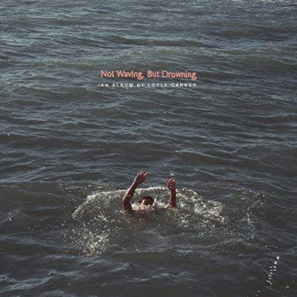

import { Slider, Button } from "@carbon/react";
import { ArrowUpRight } from "@carbon/icons-react";

import SliderJS1 from "../review/slider1";
import SliderJS2 from "../review/slider2";
import SliderJS3 from "../review/slider3";
import SliderJS4 from "../review/slider4";

import { Link } from "gatsby";

import Review1 from "../review/loylecarner1.mdx";

Album review

<h1 className="h1--no--margin">{props.pageContext.frontmatter.title}</h1>

  <Link to="/best50/2019/">2019 Black Music Best No.44</Link>

<Row  className="image-card-group">
	<Column colMd={3} colLg={4} noGutterMdLeft="">
       <ImageCard>

</ImageCard>
	</Column>
	<Column colMd={4} colLg={8} noGutterMdLeft="">
	

	デビュー作が好評だったLoyle Carnerの2年ぶりの2作目。1作目のレビューを読み返していたら、ほぼ同じ感想だった。なのでJazz, Soulを下敷きにしたアコースティック中心のゆるいビートに語り掛けるようなRapがのっかってるのは、前作同様。
	 Lyricも家族や身近や食！についてのもので、自分自慢じゃない自分語りという感じ。
	 前作のTom Mischに加え、Jorja Smith, Sampha, Jordan RakeiなどUKの一線級がGuest参加し、賑やかになったのが違いか。
	 今作を聴いて家族思いの好青年という印象を強くした。
	

    

	  <Button className="button-right-mergin"  href="https://amzn.to/3dPranZ" renderIcon={ArrowUpRight} size='sm' kind='primary'>
      amazon.com
    </Button>
    <Button className="button-right-mergin"  href="https://amzn.to/2YiNMqw" renderIcon={ArrowUpRight} size='sm' kind='secondary'>
      amazon.co.jp
    </Button>
	

	
	</Column>
</Row>
<Row >
	<Column colMd={4} colLg={4} noGutterMdLeft="">

  <h3>Score card</h3>
	<SliderJS1 value="2" />
  <SliderJS2 value="1" />
	<SliderJS3 value="1" />
  <SliderJS4 value="9" />

</Column>
<Column colMd={8} colLg={8} noGutterMdLeft="">

<h3>Producers</h3>

	Jordan Rakei(1,4,9,10,15)
	 Tom Misch(2,13)
	 Joice(3)
	 Rebel Kleff(5)
	 Kwes(6,8,11,14)
	 Jordan Rakei and Charttoe Day Wilson(12)

<h3>Guests</h3>

	Tom Misch, Jordan Rakei, Rebel Klef, Kiko Bun, Sampha, Jorja Smith, Jean-Coyle Carner

</Column>
</Row>

<h3>Tracks</h3>

| No. | Title                        | Composers                                                                   | Performer                              | Time  |
| --- | ---------------------------- | --------------------------------------------------------------------------- | -------------------------------------- | ----- |
| 1   | Dear Jean                    | Benjamin Coyle-Larner / Jordan Rakei                                        | Loyle Carner                           | 01:43 |
| 2   | Angel                        | Benjamin Coyle-Larner / Yussef Dayes / Tom Misch / Marcos Kostenbader Valle | Loyle Carner feat. Tom Misch           | 04:43 |
| 3   | Ice Water                    | Benjamin Coyle-Larner / Lawrence Dickens / Ben Joyce                        | Loyle Carner                           | 03:29 |
| 4   | Ottolenghi                   | Benjamin Coyle-Larner / Jordan Rakei / Alfa Sekitoleko                      | Loyle Carner and Jordan Rakei          | 03:17 |
| 5   | You Don't Know               | Benjamin Coyle-Larner / Dave Hamilton / Federico Marin / Kristian Revelle   | Loyle Carner, Rebel Kleff and Kiko Bun | 04:10 |
| 6   | Still                        | Benjamin Coyle-Larner / Kwesi Sey                                           | Loyle Carner                           | 03:33 |
| 7   | It's Coming Home?            | Desoleil (Brilliant Corners)                                                | Loyle Carner                           | 00:36 |
| 8   | Desoleil (Brilliant Corners) | Benjamin Coyle-Larner / Elan Tamara Sey / Kwesi Sey / Sampha Sisay          | Loyle Carner and Sampha                | 03:40 |
| 9   | Loose Ends                   | Benjamin Coyle-Larner / Jordan Rakei                                        | Loyle Carner and Jorja Smith           | 04:16 |
| 10  | Not Waving, But Drowning     | Jordan Rakei / Steve Smith                                                  | Loyle Carner                           | 01:04 |
| 11  | Krispy                       | Benjamin Coyle-Larner / Kwesi Sey                                           | Loyle Carner                           | 03:41 |
| 12  | Sail Away (Freestyle)        | Benjamin Coyle-Larner / Jordan Rakei / Charlotte Day Wilson                 | Loyle Carner                           | 04:16 |
| 13  | Looking Back                 | Benjamin Coyle-Larner / Tom Misch                                           | Loyle Carner                           | 02:58 |
| 14  | Carluccio                    | Benjamin Coyle-Larner / Elan Tamara Sey / Kwesi Sey / Duval Timothy         | Loyle Carner and Jean-Coyle Carner     | 03:11 |
| 15  | Dear Ben                     | Jean Coyle Larner / Jordan Rakei                                            | Loyle Carner                           | 03:30 |

<h3>Other Reviews</h3>

<Row>
  <Column colMd={3} colLg={3} noGutterMdLeft>
    <Review1 />
  </Column>
</Row>
