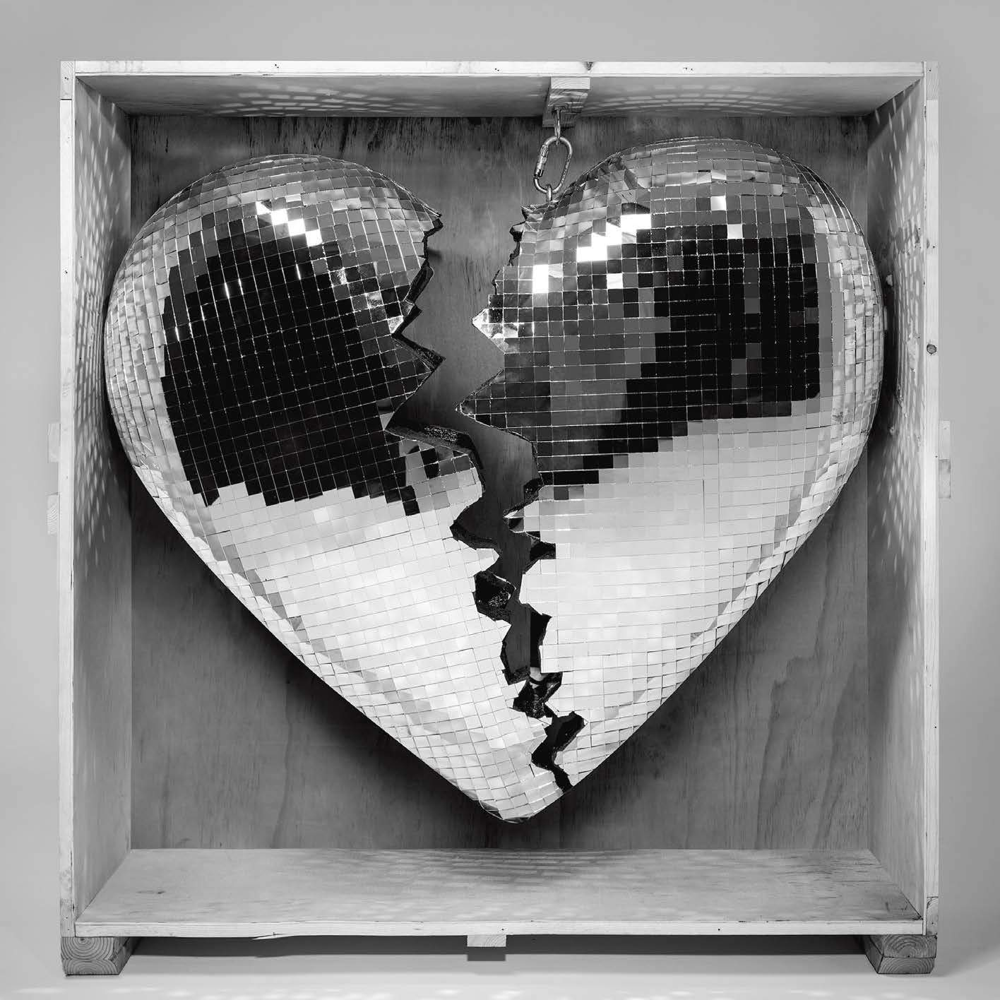

import { Slider, Button } from "@carbon/react";
import { ArrowUpRight } from "@carbon/icons-react";

import SliderJS1 from "../review/slider1";
import SliderJS2 from "../review/slider2";
import SliderJS3 from "../review/slider3";
import SliderJS4 from "../review/slider4";

import { Link } from "gatsby";

Album review

<h1 className="h1--no--margin">{props.pageContext.frontmatter.title}</h1>

  <Link to="/best50/2019/">2019 Black Music Album Best No.24</Link>

 
<Row  className="image-card-group">
	<Column colMd={3} colLg={4} noGutterMdLeft="">
       <ImageCard>

</ImageCard>
	</Column>
	<Column colMd={4} colLg={8} noGutterMdLeft="">
	

	前作が大ヒットしたMark Ronsonの4年振りアルバム。全曲女性Vocalが客演しており、Alicia, Camilo Cabella, Miley Cyrusなどの著名どころも参加している。
	 離婚をしたころもあって、全体のトーンはTitle通りにメランコリックなのだが、Guest陣のおかげで華やかな印象もするアルバムになっている。
	 メロディとVocalを聴かせるR&B作品であり、アップ、ミディアム、スローがバランス良く収まっている。美メロな曲ばかりであり、とても聴きやすい。流石プロの仕事という感じである。
	

	

	  <Button className="button-right-mergin"  href="https://amzn.to/2UbyEKj" renderIcon={ArrowUpRight} size='sm' kind='primary'>
      amazon.com
    </Button>
    <Button className="button-right-mergin"  href="https://amzn.to/2XD9iqR" renderIcon={ArrowUpRight} size='sm' kind='secondary'>
      amazon.co.jp
    </Button>
	

	
	</Column>
</Row>
<Row >
	<Column colMd={4} colLg={4} noGutterMdLeft="">

  <h3>Score card</h3>
	<SliderJS1 value="5" />
  <SliderJS2 value="2" />
	<SliderJS3 value="1" />
  <SliderJS4 value="9" />

</Column>
<Column colMd={8} colLg={8} noGutterMdLeft="">

<h3>Producers</h3>

	Mark Ronson(1,2,4,5,6,7,8,9.10.11.12)
	 Mark Ronson and Kevin Parker(3)

<h3>Guests</h3>

	Lykke Li, Camila Cabello, King Princess, Yebba, Alicia Keys, The Last Artful Dodgr, Miley Cyrus, Diana Gordon, Ilsey, Angel Olsen

</Column>
</Row>

<h3>Tracks</h3>

| No. | Title                       | Composers                                                                                                    | Performer                                             | Time  |
| --- | --------------------------- | ------------------------------------------------------------------------------------------------------------ | ----------------------------------------------------- | ----- |
| 1   | Late Night Prelude          | Ilsey Juber / Stephen Kozmeniuk / Mark Ronson / Lykke Li Zachrisson                                          | Mark Ronson                                           | 01:29 |
| 2   | Late Night Feelings         | Ilsey Juber / Stephen Kozmeniuk / Mark Ronson / Lykke Li Zachrisson                                          | Mark Ronson feat. Lykke Li                            | 04:11 |
| 3   | Find U Again                | Camila Cabello / Ilsey Juber / Kevin Parker / Mark Ronson                                                    | Mark Ronson feat . Camila Cabello                     | 02:56 |
| 4   | Pieces of Us                | Ilsey Juber / Mike Malchicoff / Mark Ronson / Mikaela Straus                                                 | Mark Ronson feat. King Princess                       | 03:26 |
| 5   | Knock Knock Knock           | Nicholas Movshon / Mark Ronson / Abbey Smith / Homer Steinweiss                                              | Mark Ronson feat. Yebba                               | 01:31 |
| 6   | Don't Leave Me Lonely       | Victor Axelrod / Clement Picard / Maxime Picard / Mark Ronson / Elliot Smith / Andrew Wyatt                  | Mark Ronson feat. Yebba                               | 03:36 |
| 7   | When U Went Away            | Nick Movshon / Elliot Smith / Homer Steinweiss / Andrew Wyatt                                                | Mark Ronson feat. Yebba                               | 01:57 |
| 8   | Truth                       | Thomas Brenneck / Alana Chenevert / Diana Gordon / Ilsey Juber / Nick Movshon / Mark Ronson                  | Mark Ronson feat. Alicia Keys, The Last Artful, Dodgr | 03:48 |
| 9   | Nothing Breaks Like a Heart | Thomas Brenneck / Miley Cyrus / Ilsey Juber / Clement Picard / Maxime Picard / Mark Ronson / Conor Szymanski | Mark Ronson feat. Miley Cyrus                         | 03:37 |
| 10  | True Blue                   | Angel Olsen / Mark Ronson                                                                                    | Mark Ronson feat. Angel Olsen                         | 05:48 |
| 11  | Why Hide                    | Romy Madley Croft / Diana Gordon / Leon Michaels / Nick Movshon / Mark Ronson / Homer Steinweiss             | Mark Ronson feat. Diana Gordon                        | 04:19 |
| 12  | 2:00 AM                     | Thomas Brenneck / Ilsey Juber / Mark Ronson / Lykke Li Zachrisson                                            | Mark Ronson feat. Lykke Li                            | 03:18 |
| 13  | Spinning                    | Ilsey Juber / Stephen Kozmeniuk / Mark Ronson / Lykke Li Zachrisson                                          | Mark Ronson feat. Ilsey                               | 03:11 |
