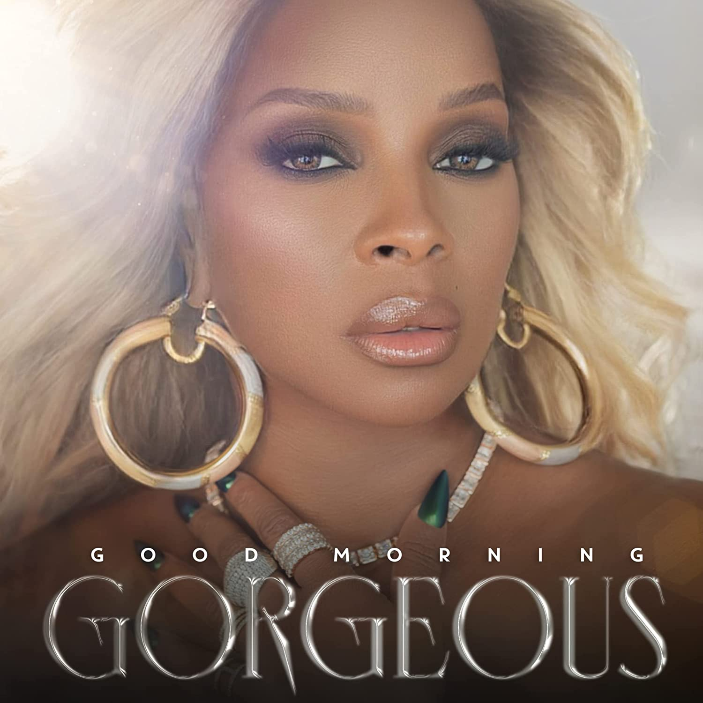

import { Slider, Button } from "@carbon/react";
import { ArrowUpRight } from "@carbon/icons-react";

import SliderJS1 from "../review/slider1";
import SliderJS2 from "../review/slider2";
import SliderJS3 from "../review/slider3";
import SliderJS4 from "../review/slider4";
import AdvJS2 from "../review/adv2";
import AdvJS3 from "../review/adv3";

import { Link } from "gatsby";

import Review1 from "../review/maryjblige10.mdx";

Album review

<h1 className="h1--no--margin">{props.pageContext.frontmatter.title}</h1>

<Row  className="image-card-group">
	<Column colMd={3} colLg={4} noGutterMdLeft="">
       <ImageCard>

</ImageCard>
	</Column>
	<Column colMd={4} colLg={8} noGutterMdLeft="">
		

			Super Bowlのハーフタイムショーでも存在感を示していたMary J Bilgeの5年ぶりのアルバム。デビュー30周年で年齢も51歳になったが、まだまだ現役感を維持した作品になっている。
			 DJ Khaled作の⑤やCool&Dreの⑨のような往年のHip-Hop色強めな曲やAnderson. Paakの⑩のような若かりし頃のようなスロー曲もあるが、全体的には、ミディアム〰バラードで占められていて、そのあたりでは、
			 Vocalも年相応の落ち着きと成熟を感じさせるものが多い。声質もところどころ掠れ気味な感じで、少し変わってきたような気がする。
		

  	

		  <Button className="button-right-mergin"  href="https://amzn.to/3BY0BMd" renderIcon={ArrowUpRight} size='sm' kind='primary'>
  	    	amazon.com
  	  </Button>
  	  <Button className="button-right-mergin"  href="https://amzn.to/3PgDKhO" renderIcon={ArrowUpRight} size='sm' kind='secondary'>
  	   	amazon.co.jp
  	  </Button>
			<Button className="button-right-mergin"  href="https://apple.co/3SFcWej" renderIcon={ArrowUpRight} size='sm' kind='tertiary'>
  	    amazon.co.jp
  	  </Button>
			<AdvJS2/>
		

	</Column>
</Row>
<Row >
	<Column colMd={4} colLg={4} noGutterMdLeft="">

  <h3>Score card</h3>
	<SliderJS1 value="5" />
  <SliderJS2 value="2" />
	<SliderJS3 value="1" />
  <SliderJS4 value="8" />

</Column>
<Column colMd={8} colLg={8} noGutterMdLeft="">

	<h3>Producers</h3>
	

		Bongo ByTheWay(1,3)
		 Bongo ByTheWay and Eric Hudson(2)
		 D'Mike(4)
		 DJ Khaled, Streetrunner and Tarik Azzouz(5)
		 D,Mile and H.E.R.(7)
		 Cool & Dre(8,9,12)
		 Anderson .Paak and Rogét(10)
		 London On Da Track(11)
		 J White Did It(13)
	

	<h3>Guests</h3>
	

		Anderson .Paak, Dave East, .DJ Khaled, Lucky Daye, H.E.R., Fivio Foreign, BJ The Chicago Kid, Usher
	

</Column>
</Row>

<h3>Tracks</h3>

| No. | Title                       | Composers                                                                                                                    | Performer                          | Time  |
| --- | --------------------------- | ---------------------------------------------------------------------------------------------------------------------------- | ---------------------------------- | ----- |
| 1   | No Idea                     | Anderson .Paak / Mary J. Blige / Uforo Ebong / Adriana Flores / Eric Hudson / Bryan Ponce                                    | Mary J. Blige                      | 02:16 |
| 2   | Love Will Never             | Mary J. Blige / Jocelyn Donald / Uforo Ebong / Eric Hudson / Phil Lewis                                                      | Mary J. Blige                      | 03:29 |
| 3   | Here With Me                | Anderson .Paak / Mary J. Blige / Ant Clemons / Uforo Ebong                                                                   | Mary J. Blige feat. Anderson .Paak | 02:19 |
| 4   | Rent Money                  | Mary J. Blige / Shawn Butler / Sean Combs / Dave East / Dernest Emille II / Daron Jones / Robert Kelly / Christopher Wallace | Mary J. Blige feat. Dave East      | 03:49 |
| 5   | Amazing                     | Denisia Andrews / Tarik Azzouz / Mary J. Blige / Willie Cobbs / Brittany Coney / DJ Khaled / Ellas McDaniel / Street Runner  | Mary J. Blige feat. DJ Khaled      | 02:39 |
| 6   | GMG (Interlude)             | Mary J. Blige                                                                                                                | Mary J. Blige                      | 01:11 |
| 7   | Good Morning Gorgeous       | Mary J. Blige / David Brown / H.E.R. / Dernest Emille II / Tiara Thomas                                                      | Mary J. Blige                      | 02:54 |
| 8   | Come See About Me           | Mary J. Blige / Ant Clemons / Jocelyn Donald / Andre Lyon / Leon Michels / Marcello Valenzano                                | Mary J. Blige                      | 03:28 |
| 9   | On Top                      | Thomas Bell / Mary J. Blige / Jocelyn Donald / Alex Hart / Shawn Hibbler / Jamie Hurton / Andre Lyon / Marcello Valenzano    | Mary J. Blige feat. Fivio Foreign  | 02:47 |
| 10  | Love Without the Heartbreak | Anderson .Paak / Alissia Benveniste / Mary J. Blige / Rogét Chahayed                                                         | Mary J. Blige                      | 03:48 |
| 11  | Falling in Love             | June Archer / Mary J. Blige / Jocelyn Donald / London on Da Track / Slim Wav                                                 | Mary J. Blige                      | 03:18 |
| 12  | Enough                      | Bianca Atterberry / Mary J. Blige / Andre Lyon / Peter Skellern / Marcello Valenzano                                         | Mary J. Blige                      | 03:05 |
| 13  | Need Love                   | Mary J. Blige / Charles Hinshaw / Kim Owens / Anthony White                                                                  | Mary J. Blige feat. Usher          | 03:04 |

<h3>Other Reviews</h3>

<Row>
  <Column colMd={3} colLg={3} noGutterMdLeft>
    <Review1 />
  </Column>
</Row>

<AdvJS3 />
