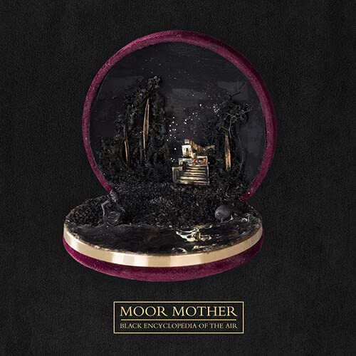

import { Slider, Button } from "@carbon/react";
import { ArrowUpRight } from "@carbon/icons-react";

import SliderJS1 from "../review/slider1";
import SliderJS2 from "../review/slider2";
import SliderJS3 from "../review/slider3";
import SliderJS4 from "../review/slider4";
import AdvJS2 from "../review/adv2";
import AdvJS3 from "../review/adv3";

import { Link } from "gatsby";

Album review

<h1 className="h1--no--margin">{props.pageContext.frontmatter.title}</h1>

  <Link to="/best50/2021/">2021 Black Music Album Best No.43</Link>

<Row  className="image-card-group">
	<Column colMd={3} colLg={4} noGutterMdLeft="">
       <ImageCard>

</ImageCard>
	</Column>
	<Column colMd={4} colLg={8} noGutterMdLeft="">
		

			Philadelphiaを拠点とし、詩人やアクティビストとしても知られるMoor Motherの2021年秋リリースのアルバム。Rapというより、Spoken Wordといったほうが良さそうな作品で、様々な暴力についてのメッセージを、声を荒げずに、抑えた調子で伝えている。
			 Guestも知ったところではArmand HammerのELUCIDやPink Siifuなど、多数参加しているが、みな、同じトーンで統一している。
			 Trackは、Free Jazz, Electronicaなどをベースにしており、上物と合わせて、ExperimentalでAbstractな印象を感じる。30分強と短めであるが、しっかりと主張が込められた作品に仕上がっている。
		

  		

			<Button className="button-right-mergin"  href="https://amzn.to/3F3ief6" renderIcon={ArrowUpRight} size='sm' kind='primary'>
  	  	amazon.com
  		</Button>
  		<Button className="button-right-mergin"  href="https://amzn.to/3TLNCDg" renderIcon={ArrowUpRight} size='sm' kind='secondary'>
  	  	amazon.co.jp
  		</Button>
			<Button className="button-right-mergin"  href="https://apple.co/3MVmLlL" renderIcon={ArrowUpRight} size='sm' kind='tertiary'>
  	  		amazon.co.jp
  		</Button>
			<AdvJS2/>
		

	</Column>
</Row>
<Row >
	<Column colMd={4} colLg={4} noGutterMdLeft="">

  <h3>Score card</h3>
	<SliderJS1 value="1" />
  <SliderJS2 value="2" />
	<SliderJS3 value="3" />
  <SliderJS4 value="8" />

</Column>
<Column colMd={8} colLg={8} noGutterMdLeft="">

	<h3>Producers</h3>
	

		Olof Melander(1,2,3,4,5,6,7,8,9,10,11)
		 Madam Data(12
		 Dudù Kouate(13)Bongo ByTheWay(1,3)
	

	<h3>Guests</h3>
	

		LUCID, Antonia Gabriera, Brother May, Lojii, Bfly, Orion Sun, Pink Siifu, Nappy Ninsa, Maassai, Yatta, Dudù Kouate, Black Quantum Futurism, Elaine Mitchener
	

</Column>
</Row>

<h3>Tracks</h3>

| No. | Title                       | Composers                                                                                                                    | Performer                          | Time  |
| --- | --------------------------- | ---------------------------------------------------------------------------------------------------------------------------- | ---------------------------------- | ----- |
| 1   | No Idea                     | Anderson .Paak / Mary J. Blige / Uforo Ebong / Adriana Flores / Eric Hudson / Bryan Ponce                                    | Mary J. Blige                      | 02:16 |
| 2   | Love Will Never             | Mary J. Blige / Jocelyn Donald / Uforo Ebong / Eric Hudson / Phil Lewis                                                      | Mary J. Blige                      | 03:29 |
| 3   | Here With Me                | Anderson .Paak / Mary J. Blige / Ant Clemons / Uforo Ebong                                                                   | Mary J. Blige feat. Anderson .Paak | 02:19 |
| 4   | Rent Money                  | Mary J. Blige / Shawn Butler / Sean Combs / Dave East / Dernest Emille II / Daron Jones / Robert Kelly / Christopher Wallace | Mary J. Blige feat. Dave East      | 03:49 |
| 5   | Amazing                     | Denisia Andrews / Tarik Azzouz / Mary J. Blige / Willie Cobbs / Brittany Coney / DJ Khaled / Ellas McDaniel / Street Runner  | Mary J. Blige feat. DJ Khaled      | 02:39 |
| 6   | GMG (Interlude)             | Mary J. Blige                                                                                                                | Mary J. Blige                      | 01:11 |
| 7   | Good Morning Gorgeous       | Mary J. Blige / David Brown / H.E.R. / Dernest Emille II / Tiara Thomas                                                      | Mary J. Blige                      | 02:54 |
| 8   | Come See About Me           | Mary J. Blige / Ant Clemons / Jocelyn Donald / Andre Lyon / Leon Michels / Marcello Valenzano                                | Mary J. Blige                      | 03:28 |
| 9   | On Top                      | Thomas Bell / Mary J. Blige / Jocelyn Donald / Alex Hart / Shawn Hibbler / Jamie Hurton / Andre Lyon / Marcello Valenzano    | Mary J. Blige feat. Fivio Foreign  | 02:47 |
| 10  | Love Without the Heartbreak | Anderson .Paak / Alissia Benveniste / Mary J. Blige / Rogét Chahayed                                                         | Mary J. Blige                      | 03:48 |
| 11  | Falling in Love             | June Archer / Mary J. Blige / Jocelyn Donald / London on Da Track / Slim Wav                                                 | Mary J. Blige                      | 03:18 |
| 12  | Enough                      | Bianca Atterberry / Mary J. Blige / Andre Lyon / Peter Skellern / Marcello Valenzano                                         | Mary J. Blige                      | 03:05 |
| 13  | Need Love                   | Mary J. Blige / Charles Hinshaw / Kim Owens / Anthony White                                                                  | Mary J. Blige feat. Usher          | 03:04 |

<AdvJS3 />
