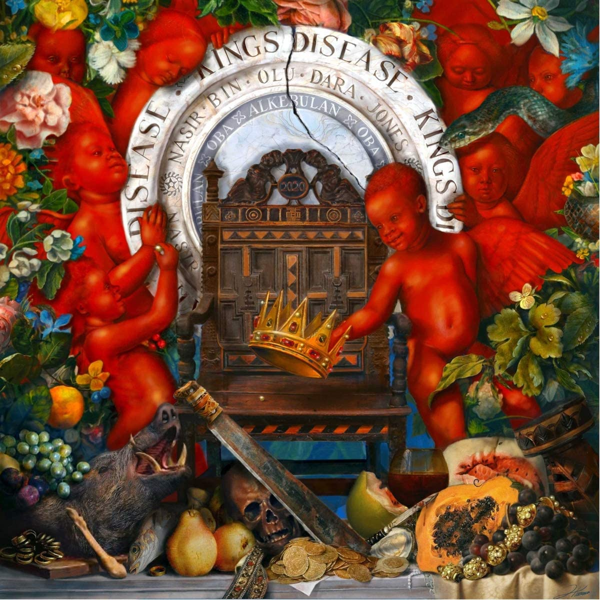

<ArticleCard
  title="Nas / King's Desease"
  href="/review/nas8L/"
  actionIcon="arrowRight"
>

</ArticleCard>

export default function Layout({ children }) {
  return (
    <>
      {children}
    </>
  );
}