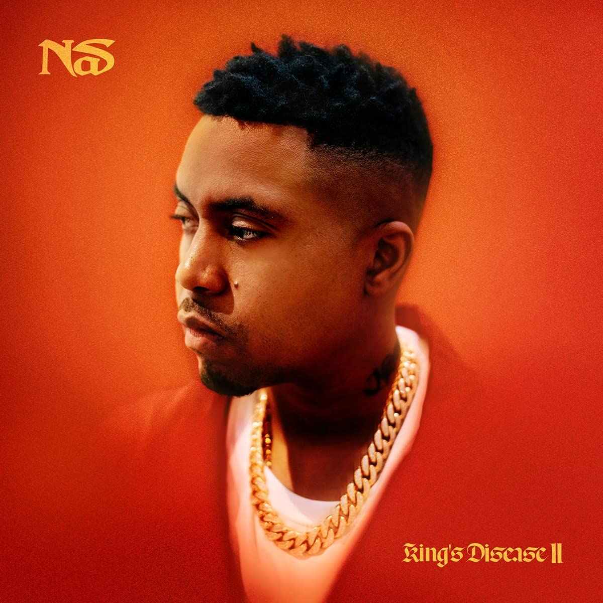

import { Slider, Button } from "@carbon/react";
import { ArrowUpRight } from "@carbon/icons-react";

import SliderJS1 from "../review/slider1";
import SliderJS2 from "../review/slider2";
import SliderJS3 from "../review/slider3";
import SliderJS4 from "../review/slider4";
import AdvJS2 from "../review/adv2";
import AdvJS3 from "../review/adv3";

import { Link } from "gatsby";

import Review1 from "../review/nas8.mdx";

Album review

<h1 className="h1--no--margin">{props.pageContext.frontmatter.title}</h1>

  <Link to="/best50/2021/">2021 Black Music Album Best No.24</Link>

<Row  className="image-card-group">
	<Column colMd={3} colLg={4} noGutterMdLeft="">
       <ImageCard>

</ImageCard>
	</Column>
	<Column colMd={4} colLg={8} noGutterMdLeft="">
		

			前作より、1年のインターバルでのリリースとなるNasの13作目。King's Deseaseシリーズの2作目となるが、この後、すぐにリリースされた次のアルバム含めて、3作連続でHit-Boyと組んでいる。2年で3作と50歳を目の前にして、制作意欲が湧いてきたようだ。
			 引き続き、Trackはサンプリング多めでオーソドックスでストレートのになっている。このあたり、Hit-Boyとは大分、相性が良さそうで、Nasの力強く、伸び伸びとしたフローを聴くことができる。
			 どの曲もクオリティ高めではあるが、Guest参加曲では、④でのEminemの圧巻のスキルが白眉となっており、また、久々になるLauryn HillのRapも力強い。
		

		

		  <Button className="button-right-mergin"  href="https://amzn.to/3Kp7zLJ" renderIcon={ArrowUpRight} size='sm' kind='primary'>
  	    amazon.com
  	  </Button>
  	  <Button className="button-right-mergin"  href="https://amzn.to/3xgVmVO" renderIcon={ArrowUpRight} size='sm' kind='secondary'>
  	    amazon.co.jp
  	  </Button>
			<Button className="button-right-mergin"  href="https://apple.co/38x0gU1" renderIcon={ArrowUpRight} size='sm' kind='tertiary'>
  	   	apple music
  	  </Button>
			<AdvJS2/>
		

	</Column>
</Row>
<Row >
	<Column colMd={4} colLg={4} noGutterMdLeft="">
		

		  <h3>Score card</h3>
			<SliderJS1 value="2" />
		  <SliderJS2 value="1" />
			<SliderJS3 value="1" />
		  <SliderJS4 value="9" />
		

	</Column>
	<Column colMd={8} colLg={8} noGutterMdLeft="">
		

			<h3>Producers</h3>
			

				Hit-Boy(all)
			

			<h3>Guests</h3>
			

				Eminem, EPMD, A Boogie Wit Da Hoodie, YG, Ms. Lauryn Hil, Charlie Wilson, Hit-Boy
			

		

	</Column>
</Row>

<h3>Tracks</h3>

| No. | Title             | Composers                                                                                                                                                               | Performer                            | Time  |
| --- | ----------------- | ----------------------------------------------------------------------------------------------------------------------------------------------------------------------- | ------------------------------------ | ----- |
| 1   | The Pressure      | Nasir Jones, Chauncey Hollis Jr., Dustin James Corbett, Quentin Miller                                                                                                  | Nas                                  | 3:07  |
| 2   | Death Row East    | Nasir Jones, Chauncey Hollis Jr., Dustin James Corbett, Strange Punch                                                                                                   | Nas                                  | 3:20  |
| 3   | 40 Side           | Nasir Jones, Chauncey Hollis Jr.                                                                                                                                        | Nas                                  | 2:40  |
| 4   | EPMD 2            | Nasir Jones, Marshall B. Mathers III, Erick Sermon, Parrish J. SmithH, Chauncey Hollis Jr.                                                                              | Nas feat. Eminem, EPMD               | 03:34 |
| 5   | Rare              | Nasir Jones, Chauncey Hollis Jr., Dustin James Corbett                                                                                                                  | Nas                                  | 03:26 |
| 6   | YKTV              | Nasir Jones, Artist Dubose, Keenon Jackson, Chauncey Hollis Jr., Dustin James Corbett                                                                                   | Nas feat. A Boogie Wit Da Hoodie, YG | 03:23 |
| 7   | Store Run         | Nasir Jones, Chauncey Hollis Jr.,                                                                                                                                       | Nas                                  | 03:19 |
| 8   | Moments           | Nasir Jones, Chauncey Hollis Jr., Justin Keith Williams                                                                                                                 | Nas                                  | 4:11  |
| 9   | Nobody            | Nasir Jones, Ms. Lauryn Hill, Chauncey Hollis Jr., Dustin James Corbett, Joshua Strange                                                                                 | Nas feat. Ms. Lauryn Hil             | 04:42 |
| 10  | No Phony Love     | Nasir Jones, Chauncey Hollis Jr., Justin Keith Williams                                                                                                                 | Nas feat. Charlie Wilson             | 03:05 |
| 11  | Brunch on Sundays | Nasir Jones, Matthew Burdette, Chauncey Hollis Jr., Derrick Carrington Gray, Dustin James Corbett, Rogét Chahayed, Mark Steven Evitts, Nicholas Leon Race, Shawn Jerrit | Nas feat. BLXST                      | 03:51 |
| 12  | Count Me In       | Nasir Jones, Chauncey Hollis Jr., Brandon Carrier                                                                                                                       | Nas                                  | 03:17 |
| 13  | Composure         | Nasir Jones, Chauncey Hollis Jr., Rogét Chahayed, Earl Taylor, Shaka Senghor                                                                                            | Nas feat. Hit-Boy                    | 03:23 |
| 14  | My Bible          | Nasir Jones, Chauncey Hollis Jr.,                                                                                                                                       | Nas                                  | 03:48 |
| 15  | Nas Is Good       | Nasir Jones, Chauncey Hollis Jr.,                                                                                                                                       | Nas                                  | 02:19 |

<h3>Other Reviews</h3>

<Row>
  <Column colMd={3} colLg={3} noGutterMdLeft>
    <Review1 />
  </Column>
</Row>

<AdvJS3 />
