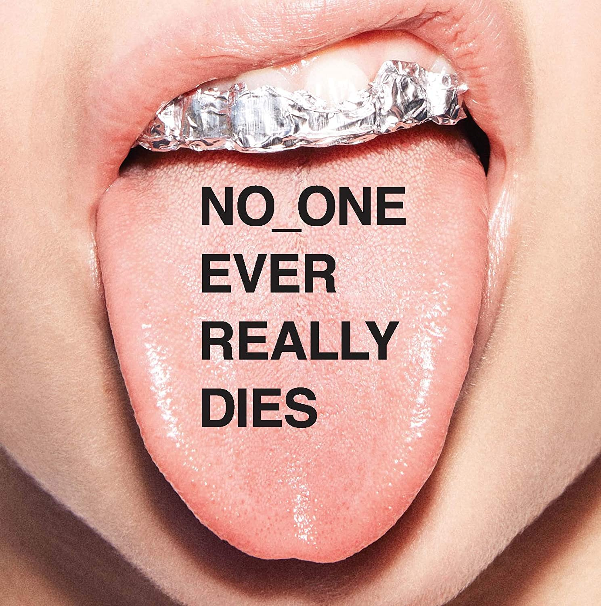

import { Slider, Button } from "@carbon/react";
import { ArrowUpRight } from "@carbon/icons-react";

import SliderJS1 from "../review/slider1";
import SliderJS2 from "../review/slider2";
import SliderJS3 from "../review/slider3";
import SliderJS4 from "../review/slider4";

import { Link } from "gatsby";

Album review

<h1 className="h1--no--margin">{props.pageContext.frontmatter.title}</h1>

  <Link to="/best50/2017/">2017 Black Music Best No.47</Link>

<Row  className="image-card-group">
	<Column colMd={3} colLg={4} noGutterMdLeft="">
       <ImageCard>

</ImageCard>
	</Column>
	<Column colMd={4} colLg={8} noGutterMdLeft="">
	

	7年ぶりとなるN.E.R.Dの5作目。グループ作ではあるが、最近、大忙しのPharrellの存在感がかなり強い。そんなPharrellの最近作の特徴であるPopで明るい印象はそのままに、アグレッシブさと遊びの要素が加わった尖がった作品になっている。
	 曲調も様々で、曲の途中でトーンが変わる曲も多く、実験的な試みも多数で、一曲一曲が聞き逃せない。逆に過去の作品のようなロック色は大分薄まったが、それはいい方向に働いていると思う。
	 また、Guestが超豪華。Billy Idol(日本のアイドル)よりの二人も参加している。
	

    

	  <Button className="button-right-mergin"  href="https://amzn.to/30urLpT" renderIcon={ArrowUpRight} size='sm' kind='primary'>
      amazon.com
    </Button>
    <Button className="button-right-mergin"  href="https://amzn.to/3eDZbr6" renderIcon={ArrowUpRight} size='sm' kind='secondary'>
      amazon.co.jp
    </Button>
	

	
	</Column>
</Row>
<Row >
	<Column colMd={4} colLg={4} noGutterMdLeft="">

  <h3>Score card</h3>
	<SliderJS1 value="4" />
  <SliderJS2 value="2" />
	<SliderJS3 value="1" />
  <SliderJS4 value="9" />

</Column>
<Column colMd={8} colLg={8} noGutterMdLeft="">

<h3>Producers</h3>

	Pharrell Williams(all)

<h3>Guests</h3>

	Rihanna, Gucci Mane, Wale, Future, Kendrick Lamar, Andre 3000, M.I.A.m Ed Sheeran, Momose Momo, First Summer Wika, Cara Delevingne, Thundercat, A$ap Rocky, Mary J, Blige

</Column>
</Row>

<h3>Tracks</h3>

| No. | Title                       | Composers                                               | Performer                             | Time  |
| --- | --------------------------- | ------------------------------------------------------- | ------------------------------------- | ----- |
| 1   | Lemon                       | Pharrell Williams                                       | N.E.R.D feat: Rihanna                 | 03:39 |
| 2   | Deep Down Body Thurst       | Pharrell Williams                                       | N.E.R.D                               | 04:11 |
| 3   | Voil?                       | Olubowale Akintimehin / Ramon Rivas / Pharrell Williams | N.E.R.D feat: Gucci Mane / Wale       | 04:20 |
| 4   | 1000                        | Nayvadius Wilburn / Pharrell Williams                   | N.E.R.D feat: Future                  | 04:03 |
| 5   | Don't Don't Do It!          | Pharrell Williams                                       | N.E.R.D feat: Kendrick Lamar          | 04:17 |
| 6   | ESP                         | Pharrell Williams                                       | N.E.R.D                               | 05:29 |
| 7   | Lightning Fire Magic Prayer | Pharrell Williams                                       | N.E.R.D                               | 07:44 |
| 8   | Rollinem 7's                | Andr? Benjamin / Pharrell Williams                      | N.E.R.D feat: Andre 3000              | 05:09 |
| 9   | Kites                       | Pharrell Williams                                       | N.E.R.D feat: Kendrick Lamar / M.I.A. | 04:50 |
| 10  | Secret Life of Tigers       | Pharrell Williams                                       | N.E.R.D                               | 03:45 |
| 11  | Lifting You                 | Pharrell Williams                                       | N.E.R.D feat: Ed Sheeran              | 03:42 |
