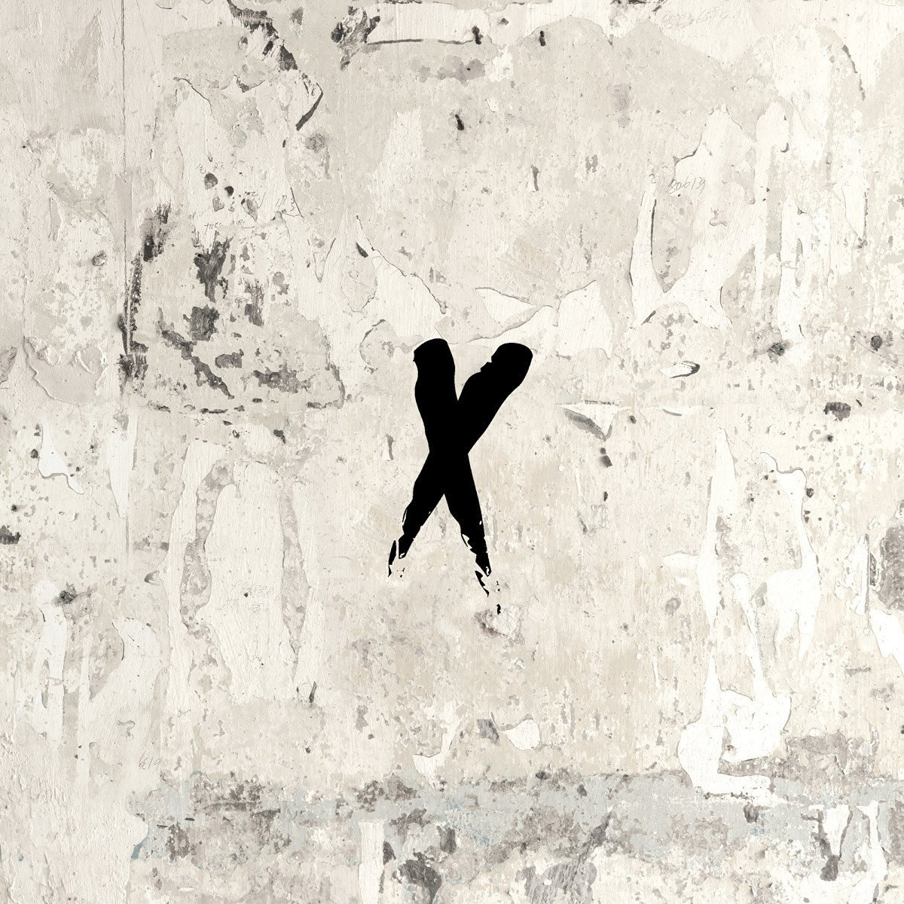

import { Slider, Button } from "@carbon/react";
import { ArrowUpRight } from "@carbon/icons-react";

import SliderJS1 from "../review/slider1";
import SliderJS2 from "../review/slider2";
import SliderJS3 from "../review/slider3";
import SliderJS4 from "../review/slider4";

import { Link } from "gatsby";

import Review1 from "../review/andersonpaak3.mdx";
import Review2 from "../review/andersonpaak4.mdx";

Album review

<h1 className="h1--no--margin">{props.pageContext.frontmatter.title}</h1>

  <Link to="/best50/2016/">2016 Black Music Album Best No.13</Link>

 
<Row  className="image-card-group">
	<Column colMd={3} colLg={4} noGutterMdLeft="">
       <ImageCard>

</ImageCard>
	</Column>
	<Column colMd={4} colLg={8} noGutterMdLeft="">
	

	今年(2016年)、絶賛ブレイク中のAnderson.Paak(MC, Vo)とKnxwledge(Producer)によるDuo作。Stone Throwよりリリースのデビューフルアルバムである。
	 Knxwledgeによるサンプリング+打ち込み中心で一部楽器がMixされたメローでPopで、時にJazzyなTrackのうえで、Paakがひしゃげた声でMCと唄を繰り広げている。
	 短い曲をどんどんつないでいく展開はクラブ向きだと思うが、普通に聴いてても気持ち良い。派手さはないが、2人の才能がうまく化学反応している作品だと思う。
	

	

	  <Button className="button-right-mergin"  href="https://amzn.to/3jr6Go3" renderIcon={ArrowUpRight} size='sm' kind='primary'>
      amazon.com
    </Button>
    <Button className="button-right-mergin"  href="https://amzn.to/2EMdsFY" renderIcon={ArrowUpRight} size='sm' kind='secondary'>
      amazon.co.jp
    </Button>
	

	
	</Column>
</Row>
<Row >
	<Column colMd={4} colLg={4} noGutterMdLeft="">

  <h3>Score card</h3>
	<SliderJS1 value="4" />
  <SliderJS2 value="1" />
	<SliderJS3 value="1" />
  <SliderJS4 value="9" />

</Column>
<Column colMd={8} colLg={8} noGutterMdLeft="">

<h3>Producers</h3>

	Knxwledge

<h3>Guests</h3>

</Column>
</Row>

<h3>Tracks</h3>

| No. | Title                  | Composers                                          | Performer | Time  |
| --- | ---------------------- | -------------------------------------------------- | --------- | ----- |
| 1   | Intro                  | Glen Boothe, Brandon Anderson                      | NxWorries | 00:48 |
| 2   | Livvin                 | Glen Boothe, Brandon Anderson                      | NxWorries | 02:45 |
| 3   | Wngs                   | Glen Boothe, Brandon Anderson                      | NxWorries | 01:36 |
| 4   | Best One               | Glen Boothe, Brandon Anderson                      | NxWorries | 03:14 |
| 5   | What More Can I Say    | Glen Boothe, Brandon Anderson                      | NxWorries | 02:36 |
| 6   | Kutless                | Glen Boothe, Brandon Anderson                      | NxWorries | 02:07 |
| 7   | Lyk Dis                | Glen Boothe, Brandon Anderson                      | NxWorries | 02:30 |
| 8   | Can't Stop             | Glen Boothe, Brandon Anderson                      | NxWorries | 02:01 |
| 9   | Get Bigger (Do U Love) | Glen Boothe, Brandon Anderson                      | NxWorries | 04:03 |
| 10  | Khadijah               | Glen Boothe, Brandon Anderson                      | NxWorries | 02:02 |
| 11  | H.A.N.                 | Glen Boothe, Brandon Anderson                      | NxWorries | 02:49 |
| 12  | Scared Money           | Glen Boothe, Brandon Anderson                      | NxWorries | 02:57 |
| 13  | Suede                  | Glen Boothe, Brandon Anderson, Gilbert Scott-Heron | NxWorries | 02:54 |
| 14  | Starlite               | Glen Boothe, Brandon Anderson                      | NxWorries | 03:23 |
| 15  | Sidepiece              | Glen Boothe, Brandon Anderson                      | NxWorries | 03:46 |
| 16  | Jodi                   | Glen Boothe, Brandon Anderson                      | NxWorries | 01:09 |
| 17  | Link Up                | Glen Boothe, Brandon Anderson                      | NxWorries | 03:31 |
| 18  | Another Time           | Glen Boothe, Brandon Anderson                      | NxWorries | 02:27 |
| 19  | Fkku                   | Glen Boothe, Brandon Anderson                      | NxWorries | 02:11 |

<h3>Other Reviews</h3>

<Row>
  <Column colMd={3} colLg={3} noGutterMdLeft>
    <Review1 />
  </Column>
  <Column colMd={3} colLg={3} noGutterMdLeft>
    <Review2 />
  </Column>
</Row>
