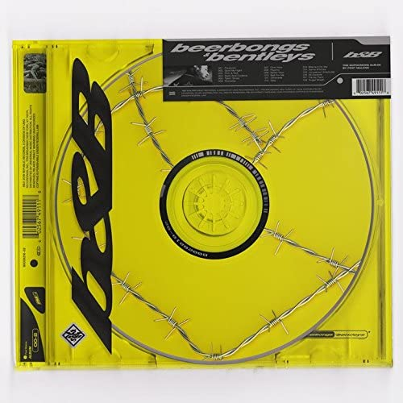

import { Slider, Button } from "@carbon/react";
import { ArrowUpRight } from "@carbon/icons-react";

import SliderJS1 from "../review/slider1";
import SliderJS2 from "../review/slider2";
import SliderJS3 from "../review/slider3";
import SliderJS4 from "../review/slider4";

import Review1 from "../review/postmalone2.mdx";

import { Link } from "gatsby";

Album review

<h1 className="h1--no--margin">{props.pageContext.frontmatter.title}</h1>

  <Link to="/best50/2018/">2019 Black Music Album Best No.49</Link>

 
<Row  className="image-card-group">
	<Column colMd={3} colLg={4} noGutterMdLeft="">
       <ImageCard>

</ImageCard>
	</Column>
	<Column colMd={4} colLg={8} noGutterMdLeft="">
	  

	    Texas出身のRapper, Post Maloneの2作目。チャート1位を獲得している。髭もじゃの風貌からのいかつい印象とは真反対で、バンドサウンドによるメローでメロディアスなR&B作品である。
       ゆったりとした曲がほとんどで、本人は唄に専任しており、唄声も一聴しただけでは、黒人の若者が唄っているかと思わせるような、せつなさと若干の清涼感を感じる。
       ロックを経た人であることを感じさせつつ、現代のR&Bのトレンドであるアンビエントで茫洋としたところを違和感なく融合させている。今のところ、今年一番のサプライズ。
    

    

	    <Button className="button-right-mergin"  href="https://amzn.to/2BC5ttL" renderIcon={ArrowUpRight} size='sm' kind='primary'>
        amazon.com
      </Button>
      <Button className="button-right-mergin"  href="https://amzn.to/2ZDZyfE" renderIcon={ArrowUpRight} size='sm' kind='secondary'>
        amazon.co.jp
       </Button>
	  

	  
    </Column>
</Row>
<Row >
  <Column colMd={4} colLg={4} noGutterMdLeft="">
    

      <h3>Score card</h3>
	    <SliderJS1 value="4" />
      <SliderJS2 value="2" />
	    <SliderJS3 value="1" />
      <SliderJS4 value="8" />
    

  </Column>
  <Column colMd={8} colLg={8} noGutterMdLeft="">
    

      <h3>Producers</h3>
      

        Cashio(1)
         Frank Dukes, Teddy Walton(2)
         Frank Dukes(3)
         Scott Storch(4)
         Louis Bell, Prep Bijan(5)
         Tank God, Louis Bell(6)
         Post Malone, Andrew Watt, Louis Bell(7)
         Post Malone, Louis Bell(8,11,13,15,17,18)
         Frank Dukes, Louis Bell(9)
         Louis Bell(10)
         Post Malone, Watt(12)
         Swish(14)
         London on da Track, RAubrey obinson, Roark Bailey(16)

      <h3>Guests</h3>
      

        Swae Lee, 21 Savage, Ty Dolla $ign, Nicki Minaj, G-Easy, YG, PartyNextDoor
      

    

  </Column>
</Row>

<h3>Tracks</h3>

| No. | Title                 | Composers                                                                                                      | Performer                      | Time  |
| --- | --------------------- | -------------------------------------------------------------------------------------------------------------- | ------------------------------ | ----- |
| 1   | Paranoid              | Austin Post, Idan Kalai, Louis Bell, Billy Walsh, Alexander Krashinsky                                         | Post Malone                    | 03:41 |
| 2   | Spoil My Night        | Austin Post, Khalif Brown, Adam Feeney, Teddy Walton, Louis Bell                                               | Post Malone feat. Swae Lee     | 03:14 |
| 3   | Rich & Sad            | Austin Post, Adam Feeney, Billy Walsh, Louis Bell                                                              | Post Malone                    | 03:26 |
| 4   | Zack and Codeine      | Austin Post, Scott Storch, Diego Ave, Louis Bell                                                               | Post Malone                    | 03:24 |
| 5   | Takin' Shots          | Austin Post, Jahron Brathwaite, Louis Bell, David Hughes, Billy Walsh                                          | Post Malone                    | 03:36 |
| 6   | Rockstar              | Austin Post, Shayaa Abraham-Joseph, Olufunmibi Awoshiley, Louis Bell                                           | Post Malone feat. 21 Savage    | 03:38 |
| 7   | Over Now              | Austin Post, Andrew Watt, Louis Bell, Tommy Lee                                                                | Post Malone,                   | 04:06 |
| 8   | Psycho                | Austin Post, Tyrone Griffin, Jr, .Louis Bell                                                                   | Post Malone feat Ty Dolla $ign | 03:41 |
| 9   | Better Now            | Austin Post, Louis Bell, Adam Feeney, Billy Walsh                                                              | Post Malone                    | 03:51 |
| 10  | Ball for Me           | Austin Post, Onika Maraj, Louis Bell                                                                           | Post Malone feat Nicki Minaj   | 03:26 |
| 11  | Otherside             | Austin Post, Louis Bell,                                                                                       | Post Malone                    | 03:48 |
| 12  | Stay                  | Austin Post, Andrew Watt, Louis Bell,                                                                          | Post Malone                    | 03:24 |
| 13  | Blame It on Me        | Austin Post, Louis Bell,                                                                                       | Post Malone                    | 04:21 |
| 14  | Same Bitches          | Austin Post, Jonathan Whitfield, Gerald Gillum, Keenon Jackson, Louis Bell, BillyWalsh, Idan Kalai, Rod Argent | Post Malone feat. G-Easy, YG   | 03:32 |
| 15  | Jonestown (Interlude) | Austin Post, Louis Bell, Te Whiti Warbrick, Nick Audino, Lewis Hughes                                          | Post Malone                    | 01:52 |
| 16  | 92 Explorer           | Austin Post, London Holmes, Louis Bell, Aubrey Robinson, Kendall Roark Bailey, Jaison Harris                   | Post Malone                    | 03:31 |
| 17  | Candy Paint           | Austin Post, Louis Bell                                                                                        | Post Malone                    | 03:47 |
| 18  | Sugar Wraith          | Austin Post, Louis Bell                                                                                        | Post Malone                    | 03:48 |

<h3>Other Reviews</h3>

<Row>
  <Column colMd={3} colLg={3} noGutterMdLeft>
    <Review1 />
  </Column>
</Row>
