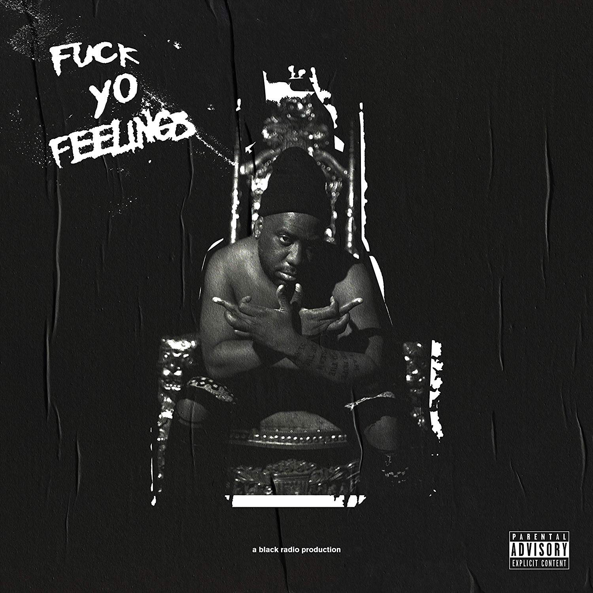

import { Slider, Button } from '@carbon/react';
import { ArrowUpRight  } from '@carbon/icons-react';

import SliderJS1 from "../review/slider1"
import SliderJS2 from "../review/slider2"
import SliderJS3 from "../review/slider3"
import SliderJS4 from "../review/slider4"
import AdvJS2 from "../review/adv2";
import AdvJS3 from "../review/adv3";

import { Link } from "gatsby";

import Review1 from "../review/robertglasper3.mdx";

import Review2_1 from "../review/rplusrequalnow2.mdx";
import Review2_2 from "../review/rplusrequalnow1.mdx";

import Review3_1 from "../review/martinglasperwonderwashington1.mdx";

Album review

<h1 className="h1--no--margin">{props.pageContext.frontmatter.title}</h1>

<Row  className="image-card-group">
	<Column colMd={3} colLg={4} noGutterMdLeft="">
       <ImageCard>

 
</ImageCard>
	</Column>
	<Column colMd={4} colLg={8} noGutterMdLeft="">
	

	幅広く活躍するJazz pianistのRobert Glasperによる3年ぶりのアルバム。Chris Dave, Derrick Hodgeとのセッションに多才なGuestを招いて2日で録り切ったということで、ライブ感のある作品になっている。Acoustic JazzとElectric Jazzを使い分けたTrackにRapと唄、ときにSpoken wordが載ってくる、今まで以上にジャンルを超えた構成になっている。スペーシーなところも相変わらずである。曲を隙間無くつないでいて、扱いとしてはMixtapeになるようだ。
	

	

	  <Button className="button-right-mergin"  href="https://amzn.to/2AYRcqi" renderIcon={ArrowUpRight} size='sm' kind='primary'>
      amazon.com
    </Button>
    <Button className="button-right-mergin"  href="https://amzn.to/2AH5xaK" renderIcon={ArrowUpRight} size='sm' kind='secondary'>
      amazon.co.jp
    </Button>
	

	
	
	<AdvJS2/>
	</Column>
</Row>
<Row >
	<Column colMd={4} colLg={4} noGutterMdLeft="">

    <h3>Score card</h3>
	<SliderJS1 value="2" />
    <SliderJS2 value="1" />
	<SliderJS3 value="1" />
    <SliderJS4 value="8" />

</Column>
<Column colMd={8} colLg={8} noGutterMdLeft="">

<h3>Producers</h3>

Robert Glasper(al)

<h3>Guests</h3>

Buddy, Denzel Curry, YBN Cordae, Bilal, Herbie Hancock, YBN Cordae, Bilal, Herbie Hancock, Yerba, Andra Day, Staceyann Chin, Baby Rose, Rapsody, Bridget Kelly, Song Bird, Bridget Kelly, Song Bird, Muhsinah, Queen Sheba, Yasin Bey

</Column>
</Row>

<h3>Tracks</h3>

| No. |	 Title                  |	 Composers                                                                                    |	 Performer                                             | Time  |
| --- |	----------------------- | ----------------------------------------------------------------------------------------------- |	------------------------------------------------------ | ----- |
| 1	  |	Intro                  	| Affion Crockett / Chris Dave / Robert Glasper / Derrick Hodge                                   |	Robert Glasper                                         | 04:48 |
| 2	  |	This Changes Everything	| Buddy / Denzel Curry / Chris Dave / Robert Glasper / Derrick Hodge                              |	Robert Glasper feat. Buddy, Denzel Curry               | 04:16 |
| 3	  |	Gone                   	| YBN Cordae / Chris Dave / Robert Glasper / Herbie Hancock / Derrick Hodge                       |	Robert Glasper feat. YBN Cordae, Bilal, Herbie Hancock | 03:44 |
| 4	  |	Let Me In              	| Chris Dave / Robert Glasper / Derrick Hodge / Mick Jenkins                                      |	Robert Glasper feat. Mick Jenkins                      | 04:39 |
| 5	  |	In Case You Forgot     	| Robert Glasper                                                                                  |	Robert Glasper                                         | 01:41 |
| 6	  |	Indulging in Such      	| Robert Glasper                                                                                  |	Robert Glasper                                         | 04:03 |
| 7	  |	Fuck Yo Feelings       	| Chris Dave / Robert Glasper / Derrick Hodge / SiR                                               |	Robert Glasper feat. Yerba                             | 02:30 |
| 8	  |	Endangered Black Woman 	| Muhammad Ayers / Staceyann Chin / Chris Dave / Andra Day / Robert Glasper / Derrick Hodge       |	Robert Glasper feat. Andra Day, Staceyann Chin         | 03:45 |
| 9	  |	Expectations           	| Chris Dave / Davionne / Marlanna Evans / Robert Glasper / Derrick Hodge / Tim Maxey / Baby Rose |	Robert Glasper feat. Baby Rose, Rapsody                | 04:54 |
| 10  |	All I Do               	| Chris Dave / Robert Glasper / Derrick Hodge / Bridget Kelly / SiR / Theresa Wilson              |	Robert Glasper feat. SiR, Bridget Kelly, Song Bird     | 06:53 |
| 11  |	Aah Whoa               	| Chris Dave / Robert Glasper / Derrick Hodge / Muhsinah / Queen Sheba                            |	Robert Glasper feat. Muhsinah, Queen Sheba             | 02:54 |
| 12  |	I Want You             	| Chris Dave / Robert Glasper / Derrick Hodge / SiR                                               |	Robert Glasper                                         | 02:47 |
| 13  |	Trade in Bars Yo       	| Chris Dave / Robert Glasper / Herbie Hancock / Derrick Hodge                                    |	Robert Glasper feat. Herbie Hancock                    | 01:42 |
| 14  |	DAF Fall Out           	| Chris Dave / Robert Glasper / Derrick Hodge                                                     |	Robert Glasper                                         | 02:01 |
| 15  |	Sunshine               	| YBN Cordae / Chris Dave / Robert Glasper / Derrick Hodge                                        |	Robert Glasper feat. YBN Cordae                        | 01:52 |
| 16  |	Liquid Swords          	| Chris Dave / Robert Glasper / Derrick Hodge                                                     |	Robert Glasper                                         | 04:37 |
| 17  |	DAF FTF                	| Chris Dave / Robert Glasper / Derrick Hodge                                                     |	Robert Glasper                                         | 04:32 |
| 18  |	Treal                  	| Yasiin Bey / Chris Dave / Robert Glasper / Derrick Hodge                                        |	Robert Glasper feat. Yasin Bey                         | 07:27 |
| 19  |	Cold                   	| Chris Dave / Robert Glasper / Derrick Hodge / Curtis Jews                                       |	Robert Glasper                                         | 02:00 |

<h3>Other Reviews</h3>

<Row>
  <Column colMd={3} colLg={3} noGutterMdLeft>
    <Review1 />
  </Column>
</Row>

<Row>
  <Column colMd={3} colLg={3} noGutterMdLeft>
    <Review2_1 />
  </Column>
  <Column colMd={3} colLg={3} noGutterMdLeft>
    <Review2_2 />
  </Column>
</Row>

<Row>
  <Column colMd={3} colLg={3} noGutterMdLeft>
    <Review3_1 />
  </Column>
</Row>

<AdvJS3 />