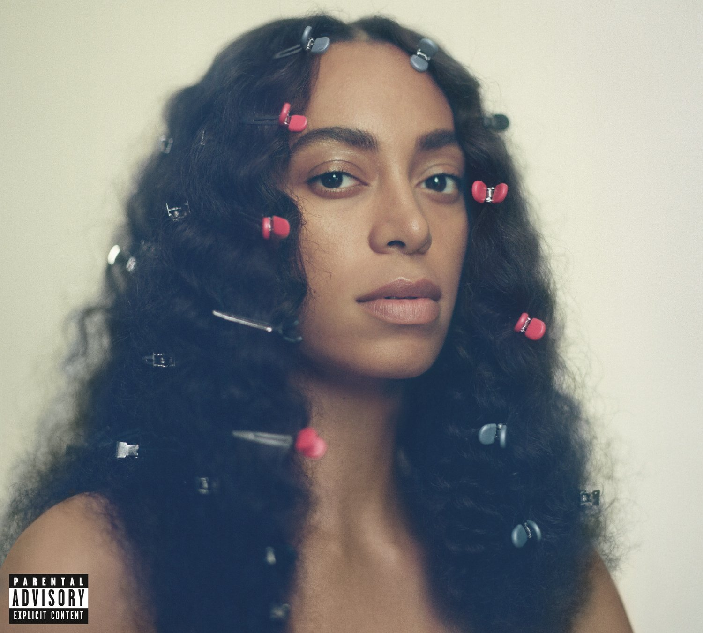

import { Slider, Button } from '@carbon/react';
import { ArrowUpRight  } from '@carbon/icons-react';

import SliderJS1 from "../review/slider1"
import SliderJS2 from "../review/slider2"
import SliderJS3 from "../review/slider3"
import SliderJS4 from "../review/slider4"

import { Link } from "gatsby"

import Review1 from "../review/solange4.mdx"

Album review

<h1 className="h1--no--margin">{props.pageContext.frontmatter.title}</h1>

<Link to="/best50/2016/">2016 Black Music Best No.2</Link>

<Row  className="image-card-group">
	<Column colMd={3} colLg={4} noGutterMdLeft="">
       <ImageCard>

 

</ImageCard>
	</Column>
	<Column colMd={4} colLg={8} noGutterMdLeft="">
	

	2012リリースのTrueがEP扱いなので、8年振りとなるSolangeのアルバム3作目。しかもメジャーでのリリースとなる、Grammyにもノミネートされている。Trueは、Dev Hynesの全面バックアップだったわけだが、今回はRaphael SaadiqをExecutve Producerに迎え、癒し効果抜群のナチュラルSoul Albumに仕上がっている。ただ、蓋を開けてみると、自身の住んでいたBlooklyn人脈のDave Longstrethら、UKから新進気鋭のSampha, サウスからLil Wayne等、バラエティに富んだGuestや制作陣が参加しており、変化をもたらしている。曲調はミディアム-スローでほぼバンドによる、ところどころJazzyなものだが、あくまでも中心にいるのはSolangeの囁くようなVocalだ。
	

	

	  <Button className="button-right-mergin"  href="https://amzn.to/31wTAhL" renderIcon={ArrowUpRight} size='sm' kind='primary'>
      amazon.com
    </Button>
    <Button className="button-right-mergin"  href="https://amzn.to/31ytCu9" renderIcon={ArrowUpRight} size='sm' kind='secondary'>
      amazon.co.jp
    </Button>
	

	
	
	</Column>
</Row>
<Row >
	<Column colMd={4} colLg={4} noGutterMdLeft="">

    <h3>Score card</h3>
	<SliderJS1 value="5" />
    <SliderJS2 value="2" />
	<SliderJS3 value="1" />
    <SliderJS4 value="9" />

</Column>
<Column colMd={8} colLg={8} noGutterMdLeft="">

<h3>Producers</h3>

Solange　Knowles, Questlove, Ray Angry and Magical(1)
 Raphael Saadiq, Solange　Knowles and Sir Dylan(2,3)
 Raphael Saadiq and Solange　Knowles(4)
 Solange　Knowles, Dave Longstreth, Raphael Saadiq and Sir Dylan(5,6)
 Solange　Knowles, Olubenga, Dave Longstreth, Sampha, Troy Johnson, Kwes and Adam Bainbridge(7)
 Sampha, Solange　Knowles, Dave Andrew Sitek and Patrick(8,9)
 Adam Bainbridge and Solange　Knowles(10)
 Solange　Knowles, Raphael Saadiq, Sean Nicholas Savage, Patrick Wimberly, Kwes and Sir Dylan(11)
 John Kirby and Solange　Knowles(12,17)
 Solange　Knowles and Dave Longstreth(13)
 Q-Tip and Solange　Knowles(14)
 Raphael Saadiq, Solange　Knowles and John Kirby(16)
 Solange　Knowles, Sampha and Dave Longstreth(18)
 Solange　Knowles(19)
 Solange　Knowles, Dave Longstreth, Kwes and Patrick Wimberly(20)
 Solange　Knowles and Troy Johnson(21)

<h3>Guests</h3>

Lil wayne, Sampha, The Dream, DJ The Chicago Kid, Q-Tip, Kelly Rowland, Nia Andrews, Kelela, Tweet

</Column>
</Row>

<h3>Tracks</h3>

| No. |	 Title                                         |	 Composers                         |	 Performer                               | Time	 |
| --- |	---------------------------------------------- | ------------------------------------- | ------------------------------------------- | ----- |
| 1	  |	Rise                                           | Solange                               | Solange                                     | 01:41 |
| 2	  |	Weary                                          | Solange                               | Solange                                     | 03:14 |
| 3	  |	The Glory Is in You (Interlude)                | Solange                               | Solange                                     | 00:17 |
| 4	  |	Cranes in the Sky                              | Solange                               | Solange                                     | 04:10 |
| 5	  |	Dad Was Mad (Interlude)                        | Solange                               | Solange                                     | 00:46 |
| 6	  |	Mad                                            | Dwayne Carter / Solange / Lil Wayne   | Solange feat. Lil wayne                     | 03:55 |
| 7	  |	Don't You Wait                                 | Solange                               | Solange                                     | 04:05 |
| 8	  |	Tina Taught Me ( Interlude)                    | Solange                               | Solange                                     | 01:14 |
| 9	  |	Don't Touch My Hair                            | Sampha Sisay / Solange                | Solange feat. Sampha                        | 04:17 |
| 10  |	This Moment (Interlude)                        | Solange                               | Solange                                     | 00:49 |
| 11  |	Where Do We Go                                 | Solange                               | Solange                                     | 04:24 |
| 12  |	For Us by Us (Interlude)                       | Solange                               | Solange                                     | 00:52 |
| 13  |	F.U.B.U.                                       | Terius Nash / Solange                 | Solange feat. The Dream, DJ The Chicago Kid | 05:13 |
| 14  |	Borderline (An Ode to Self Care)               | Solange                               | Solange feat. Q-Tip                         | 03:02 |
| 15  |	Got So Much Magic, You Can Have It (Interlude) | Nia Andrews / Kelly Rowland / Solange | Solange feat. Kelly Rowland , Nia Andrews   | 00:26 |
| 16  |	Junie                                          | Solange                               | Solange                                     | 03:06 |
| 17  |	No Limits (Interlude)                          | Solange                               | Solange                                     | 00:39 |
| 18  |	Don't Wish Me Well                             | Solange                               | Solange                                     | 04:15 |
| 19  |	Pedestals (Interlude)                          | Solange                               | Solange                                     | 00:57 |
| 20  |	Scales                                         | Solange                               | Solange feat. Kelela                        | 03:39 |
| 21  |	Closing: The Chosen Ones                       | Solange                               | Solange                                     | 00:42 |

<Row>
<Column colMd={3} colLg={3} noGutterMdLeft>
<Review1 />
</Column>
</Row>