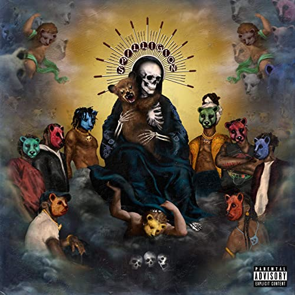

import { Slider, Button } from "@carbon/react";
import { ArrowUpRight } from "@carbon/icons-react";

import SliderJS1 from "../review/slider1";
import SliderJS2 from "../review/slider2";
import SliderJS3 from "../review/slider3";
import SliderJS4 from "../review/slider4";

import { Link } from "gatsby";

Album review

<h1 className="h1--no--margin">{props.pageContext.frontmatter.title}</h1>

  <Link to="/best50/2020/">2020 Black Music Best No.26</Link>

<Row  className="image-card-group">
	<Column colMd={3} colLg={4} noGutterMdLeft="">
       <ImageCard>

</ImageCard>
	</Column>
	<Column colMd={4} colLg={8} noGutterMdLeft="">
	

		J. ColeのDreamville所属、ATLのCollective, Spillage Villageのメジャー・デビュー作。結成は2010年と意外と活動歴は長く、当時のメンバーはEarthGangの二人, JID, Jurdan Bryant, Hollywood JBで、現在はこれに OG Maco, 6LACK(vo), Marian Mereba(vo)が加わっているようだ。
		 個々人でも活動している人たちであり、Collectiveと表わされていることもあって、Dangeon Familyのような形態をとっていると思われ、雰囲気も近いものがある。
		 ジャケットからはホラーっぽいのかなと思って聴き始めたが、3曲目あたりから、ファンクかつアーシーさが前面に押し出され、唄の比重が増して、俄然と楽しくなってくる。Gospelっぽい曲やスピリチュアルなところも感じられ、よくよくCDタイトルや曲名を見ると宗教と寄り添う作品であることが判ってくる。他にもJazzやFolkの要素もあって、個々の曲がユニークかつ、メロディーはキャッチーで面白い。
		 ジャケットの印象で聴かず嫌いしてはいけないと再認識させられる、そんなアルバムである。
	

	

	  <Button className="button-right-mergin"  href="https://amzn.to/3aeYhky" renderIcon={ArrowUpRight} size='sm' kind='primary'>
      amazon.com
    </Button>
    <Button className="button-right-mergin"  href="https://amzn.to/3aeYwMu" renderIcon={ArrowUpRight} size='sm' kind='secondary'>
      amazon.co.jp
    </Button>
    <Button className="button-right-mergin"  href="https://apple.co/3clDMFA" renderIcon={ArrowUpRight} size='sm' kind='secondary'>
      apple music
    </Button>
	

	</Column>
</Row>
<Row >
	<Column colMd={4} colLg={4} noGutterMdLeft="">
		

			<h3>Score card</h3>
			<SliderJS1 value="4" />
			<SliderJS2 value="4" />
			<SliderJS3 value="1" />
			<SliderJS4 value="9" />
		

</Column>
<Column colMd={8} colLg={8} noGutterMdLeft="">
	

		<h3>Producers</h3>
		

			Christo and Olu(1)
			 Olu, Hollywood Jb and Christo(2)
			 Nicki Jupiter, Hollywood Jb, Olu and BENJI(3,12)
			 Rascal, Hollywood Jb and Olu(4)
			 BENJI, Christo, Nice Rec and Olu(5)
			 Monte Cooker and Mesita(6)
			 BENJI, Chelsea Ova Olu, Hollywood Jb and Christo(7)
			 1500 or Nothin and Malik(8)
			 BENJI, Giszam, Hollywood Jb and Olu(9)
			 Christo, Elite, Jay Card, Mike Dean, Nice Rec and Olu(10)
			 OLu and BENJI(11)
		

		<h3>Guests</h3>
		

			Desi Banks, Big Rube, Kountry Wayne , Ant Clemons, Buddy, Ari Lennox, Masego, Chance The Rapper, Lucky Daye
		

	

</Column>
</Row>

<h3>Tracks</h3>

| No. | Title            | Composers                                                                                                                                                     | Performer                                                                                | Time  |
| --- | ---------------- | ------------------------------------------------------------------------------------------------------------------------------------------------------------- | ---------------------------------------------------------------------------------------- | ----- |
| 1   | Spill Vill       | Ruben Bailey / Desi Banks / Olu Fann / Kountry Wayne / John Welch                                                                                             | EarthGang / JID / Spillage Village feat: Desi Banks / Big Rube / Kountry Wayne           | 02:08 |
| 2   | Baptize          | Justin Bryant / Ant Clemons / Olu Fann / Eian Parker / Destin Route / John Welch                                                                              | EarthGang / JID / Spillage Village feat: Ant Clemons                                     | 04:55 |
| 3   | PsalmSing        | Nicolas Barnett / Justin Bryant / Olu Fann / Marian Mereba / Ian Welch                                                                                        | EarthGang / JID / Spillage Village feat: Mereba                                          | 03:54 |
| 4   | Ea'alah [Family] | Tobias Breuer / Justin Bryant / Olu Fann / Eian Parker / Destin Route                                                                                         | EarthGang / JID / Spillage Village feat: Hollywood Jb                                    | 04:00 |
| 5   | Mecca            | Olu Fann / Peter Mudge / Eian Parker / Destin Route / Ian Welch / John Welch                                                                                  | EarthGang / JID / Spillage Village                                                       | 04:50 |
| 6   | Judas            | Chancelor Bennett / Ahmanti Booker / Buddy / James Paul Cooley / Micah Davis / Destin Route / Courtney Shanade Salter                                         | EarthGang / JID / Spillage Village feat: Buddy / Ari Lennox / Masego / Chance the Rapper | 03:09 |
| 7   | Oshun            | Jordan Bryant / Justin Bryant / Olu Fann / William Greene / Eian Parker / Ricardo Valentine / Ian Welch                                                       | EarthGang / JID / Spillage Village feat: 6LACK / Jurdan Bryant                           | 04:02 |
| 8   | Cupid            | Brian Malik Baptiste / David Debrandon Brown / Larrance Dopson / Olu Fann / Quintin Gulledge / Khirye Tyler / Ricardo Valentine                               | EarthGang / JID / Spillage Village feat: 6LACK / Lucky Daye                              | 04:02 |
| 9   | Shiva            | Jordan Bryant / Olu Fann / Eian Parker / Destin Route / Ian Welch                                                                                             | EarthGang / JID / Spillage Village feat: BENJI / Jurdan Bryant                           | 04:20 |
| 10  | End of Daze      | Jordan Bryant / Justin Bryant / Jackson Card / Mike Dean / Olu Fann / Marian Mereba / Peter Mudge / Eian Parker / Anthony Parrino / Destin Route / John Welch | EarthGang / JID / Spillage Village feat: Jurdan Bryant / Hollywood Jb / Mereba           | 05:32 |
| 11  | Hapi             | Ruben Bailey / Olu Fann / Marian Mereba / Eian Parker / Ian Welch                                                                                             | EarthGang / JID / Spillage Village feat: BENJI / Mereba / Big Rube                       | 06:25 |
| 12  | Jupiter          | Nicolas Barnett / Jordan Bryant / Justin Bryant / Olu Fann / Marian Mereba / Eian Parker / Destin Route                                                       | EarthGang / JID / Spillage Village feat: BENJI / Jurdan Bryant / Hollywood Jb / Mereba   | 02:26 |
