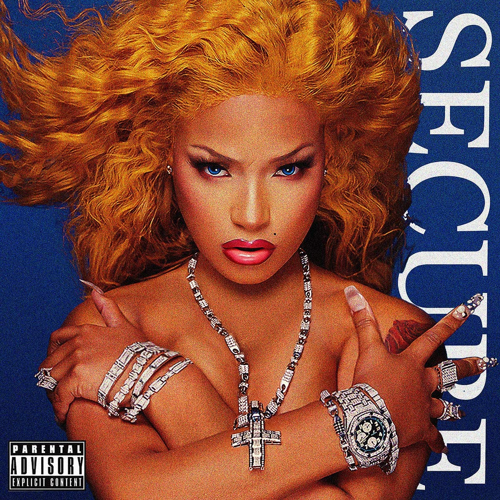

import { Slider, Button } from '@carbon/react';
import { ArrowUpRight  } from '@carbon/icons-react';

import SliderJS1 from "../review/slider1"
import SliderJS2 from "../review/slider2"
import SliderJS3 from "../review/slider3"
import SliderJS4 from "../review/slider4"

import { Link } from "gatsby"

Album review

<h1 className="h1--no--margin">{props.pageContext.frontmatter.title}</h1>

<Row  className="image-card-group">
	<Column colMd={3} colLg={4} noGutterMdLeft="">
       <ImageCard>

</ImageCard>
	</Column>
	<Column colMd={4} colLg={8} noGutterMdLeft="">
	

	UKはバーミンガム出身のRapper, Stefflon Donの初Physical作。両親がJamaica出身ということで、Dancehall RaggaeにGrim, Hip-Hopなどをミックスしたような作品。なのでDanceに適したノリの良い曲が中心となり、Sean PaulやSizzlaもゲスト参加している。他にも時流のアンビエントな空気を持つ曲やサウスっぽいHip-Hop良くなども含まれていて、UKに留まらないマーケットを視野に入れているのが判る。攻撃的なルックスもあって、Nicki Minajの対抗馬となるか期待したいと思う。
	

	

	  <Button className="button-right-mergin"  href="https://amzn.to/2NMPQSA" renderIcon={ArrowUpRight} size='sm' kind='primary'>
      amazon.com
    </Button>
    <Button className="button-right-mergin"  href="https://amzn.to/3ePvSTh" renderIcon={ArrowUpRight} size='sm' kind='secondary'>
      amazon.co.jp
    </Button>
	

	
	
	</Column>
</Row>
<Row >
	<Column colMd={4} colLg={4} noGutterMdLeft="">

    <h3>Score card</h3>
	<SliderJS1 value="2" />
    <SliderJS2 value="2" />
	<SliderJS3 value="1" />
    <SliderJS4 value="8" />

</Column>
<Column colMd={8} colLg={8} noGutterMdLeft="">

<h3>Producers</h3>

Rymez(1,2,3,4,5,7,8,12,13,14,15,16)
 Tiggs Da Author(6)
 KZ(9)
 J White(10)
 PRGRSHN(11)

<h3>Guests</h3>

	Future, Tiggs Da Author, Ebenezer, Fekky, Haile, Seal Paul, Popcaan, Sizzla, DJ Khaled

</Column>
</Row>

<h3>Tracks</h3>

| No. |	 Title                          |	 Composers                                                |	 Performer                                    |	 Time |
| --- |	------------------------------- | ----------------------------------------------------------- | --------------------------------------------- | ----- |
| 1	  |	Lil Bitch [Intro]              	| Stephanie Allen / Rodney Hwingwiri                          |	Stefflon Don                                  |	01:42 |
| 2	  |	Jellio                         	| Stephanie Allen / Rodney Hwingwiri                          |	Stefflon Don                                  |	03:06 |
| 3	  |	Finesse                        	| Stephanie Allen / Rodney Hwingwiri                          |	Stefflon Don                                  |	01:47 |
| 4	  |	Interlude                      	| Stephanie Allen / Jonathan Abreu Sosa                       |	Stefflon Don                                  |	01:03 |
| 5	  |	What You Want                  	| Stephanie Allen / Future / Rodney Hwingwiri                 |	Stefflon Don feat: Future                     |	04:28 |
| 6	  |	Pretty Girl                    	| Stephanie Allen / Adam Simon                                |	Stefflon Don feat: Tiggs Da Author            |	03:14 |
| 7	  |	Uber                           	| Stephanie Allen / Ebenezer / Rodney Hwingwiri               |	Stefflon Don feat: Ebenezer                   |	03:48 |
| 8	  |	Precious Heavy                 	| Stephanie Allen / Rodney Hwingwiri                          |	Stefflon Don                                  |	02:53 |
| 9	  |	Both Ways                      	| Stephanie Allen / Fekky / Jessie George                     |	Stefflon Don feat: Fekky                      |	04:02 |
| 10  |	Crunch Time                    	| Stephanie Allen                                             |	Stefflon Don                                  |	02:33 |
| 11  |	Favourite Girl                 	| Ras Haile Alexander / Stephanie Allen / Alexander Ras Kassa |	Stefflon Don feat: Haile                      |	03:22 |
| 12  |	Hurtin' Me                     	| Stephanie Allen / Rodney Hwingwiri / Karim Kharbouch        |	Stefflon Don feat: Seal Paul, Popcaan, Sizzla |	04:09 |
| 13  |	Senseless                      	| Stephanie Allen / Rodney Hwingwiri                          |	Stefflon Don                                  |	03:03 |
| 14  |	Regular                        	| Stephanie Allen / Rodney Hwingwiri                          |	Stefflon Don                                  |	04:04 |
| 15  |	Win                            	| Stephanie Allen / Rodney Hwingwiri / DJ Khaled              |	Stefflon Don feat: DJ Khaled                  |	03:23 |
| 16  |	Free Drip Tony Montana [Online]	| Stephanie Allen / Ashley Charles / Rodney Hwingwiri         |	Stefflon Don                                  |	02:07 |
