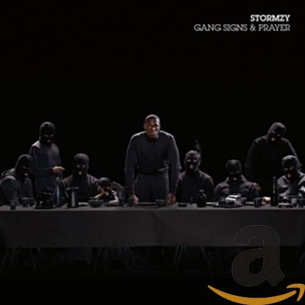

import { Slider, Button } from '@carbon/react';
import { ArrowUpRight  } from '@carbon/icons-react';

import SliderJS1 from "../review/slider1"
import SliderJS2 from "../review/slider2"
import SliderJS3 from "../review/slider3"
import SliderJS4 from "../review/slider4"

import { Link } from "gatsby"

Album review

<h1 className="h1--no--margin">{props.pageContext.frontmatter.title}</h1>

<Link to="/best50/2017/">2017 Black Music Album Best No.24</Link>

<Row  className="image-card-group">
	<Column colMd={3} colLg={4} noGutterMdLeft="">
       <ImageCard>

 
</ImageCard>
	</Column>
	<Column colMd={4} colLg={8} noGutterMdLeft="">
	

	London出身のHip-Hop MC, Stormzyのデビュー作。若くしてUKグライム新世代を代表する人だそうで、UKチャートでは一位を獲得している。そんな先入観を持たずに聴いた感じでは、あまり、USシーンとの違いは感じられなかった。構成として前半はTrapっぽいTrack中心のストレートなHip-Hop。中盤以降はバラエティに富んでいて、Keklaniをゲストに迎えたメローなR&B曲や、スムースなソウル、ゴスペルなど様々。StormzyのRapは歯切れがよく、高速なものも特長がある。AdeleなどをProduceしたFraser T. Smithがほぼ全曲にProducerとして関わっている。
	

	

	  <Button className="button-right-mergin"  href="https://amzn.to/3g551TQ" renderIcon={ArrowUpRight} size='sm' kind='primary'>
      amazon.com
    </Button>
    <Button className="button-right-mergin"  href="https://amzn.to/32X0nU3" renderIcon={ArrowUpRight} size='sm' kind='secondary'>
      amazon.co.jp
    </Button>
	

	
	
	</Column>
</Row>
<Row >
	<Column colMd={4} colLg={4} noGutterMdLeft="">

    <h3>Score card</h3>
	<SliderJS1 value="1" />
    <SliderJS2 value="2" />
	<SliderJS3 value="2" />
    <SliderJS4 value="8" />

</Column>
<Column colMd={8} colLg={8} noGutterMdLeft="">

<h3>Producers</h3>

Mura Masa and Fraser T. Smith(1)
 Fraser T. Smith, Swifta Beater and Stormzy(2)
 Fraser T. Smith, EV and Stormzy(3,16)
 Fraser T. Smith and Stormzy(4,8,9,10)
 Fraser T. Smith, Sir Spyro and Stormzy(5,7,11)
 Sons of Sonix, Fraser T. Smith and Stormzy(6)
 Fraser T. Smith, Sunny Kale and, Stormzy(12)
 Fraser T. Smith, Wizzy Wow AKA Isra Lohata and Stormzy(13)
 Stormzy and XTC(15)

<h3>Guests</h3>

Ghetts, J Hus, Kehlani, Wretch 32, Mnek, Raleigh Ritchie, Lily Allen

</Column>
</Row>

<h3>Tracks</h3>

| No. |	 Title                           |	 Composers                                                                             	|	 Performer                 | Time  |
| --- |	-------------------------------- | ----------------------------------------------------------------------------------------	| ---------------------------- | ----- |
| 1	  |	First Things First               | Mura Masa / Michael Omari                                                              	| Stormzy                      | 03:27 |
| 2	  |	Cold                             | Swifta Beater / Michael Omari                                                          	| Stormzy feat. Ghetts, J Hus  | 02:36 |
| 3	  |	Bad Boys                         | Ghetts / J Hus / Momodou Jallow / Michael Omari                                        	| Stormzy                      | 04:06 |
| 4	  |	Blinded by Your Grace, Pt. 1     | Michael Omari / Fraser T. Smith / Varren Wade / Dion Wardle                            	| Stormzy                      | 02:40 |
| 5	  |	Big for Your Boots               | Nozomi Cohen / Karl Joseph                                                             	| Stormzy                      | 03:58 |
| 6	  |	Velvet/Jenny Francis (Interlude) | Mikey Akin / Nao / Michael Omari / Moses Samuels                                       	| Stormzy                      | 05:39 |
| 7	  |	Mr. Skeng                        | Karl Joseph / Michael Omari                                                            	| Stormzy                      | 03:17 |
| 8	  |	Cigarettes & Cush                | Kehlani / Michael Omari / Fraser T. Smith / Dion Wardle                                	| Stormzy feat. Kehlani        | 05:49 |
| 9	  |	21 Gun Salute (Interlude)        | Mikey Akin / Michael Omari / Moses Samuels / Jermaine Scott                            	| Stormzy feat. Wretch 32      | 02:26 |
| 10  |	Blinded by Your Grace, Pt. 2     | Uzoechi Emenike / Michael Omari / Fraser T. Smith                                      	| Stormzy feat. Mnek           | 03:50 |
| 11  |	Return of the Rucksack           | Karl Joseph / Michael Omari / Dizzee Rascal                                            	| Stormzy                      | 03:04 |
| 12  |	100 Bags                         | Sunny Kale / Michael Omari                                                             	| Stormzy                      | 03:37 |
| 13  |	Don't Cry for Me                 | Jacob Anderson / Prince Galalie / Isra Lohata / Michael Omari / Varren Wade / Wizzy Wow	| Stormzy fat. Raleigh Ritchie | 03:34 |
| 14  |	Crazy Titch (Interlude)          | Crazy Titch                                                                            	| Stormzy                      | 02:41 |
| 15  |	Shut Up                          | Michael Omari / XTC                                                                    	| Stormzy                      | 02:59 |
| 16  |	Lay Me Bare                      | Kwabs / Michael Omari / Fraser T. Smith                                                	| Stormzy                      | 05:04 |
