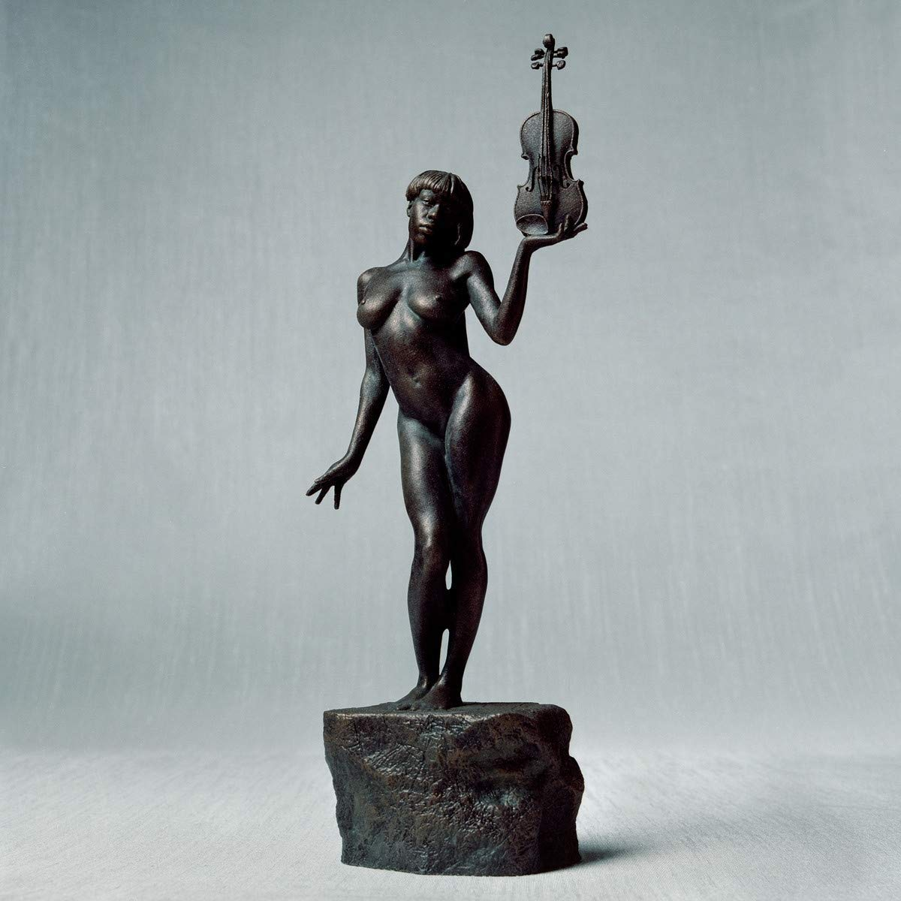

import { Slider, Button } from '@carbon/react';
import { ArrowUpRight  } from '@carbon/icons-react';

import SliderJS1 from "../review/slider1"
import SliderJS2 from "../review/slider2"
import SliderJS3 from "../review/slider3"
import SliderJS4 from "../review/slider4"

import { Link } from "gatsby"

Album review

<h1 className="h1--no--margin">{props.pageContext.frontmatter.title}</h1>

<Link to="/best50/2019/">2019 Black Music Best No.28</Link>

<Row  className="image-card-group">
	<Column colMd={3} colLg={4} noGutterMdLeft="">
       <ImageCard>

 

</ImageCard>
	</Column>
	<Column colMd={4} colLg={8} noGutterMdLeft="">
	

	Cicinatti出身のSinger, Violin奏者、Sudan Archivesのデビューアルバム。Stone Throwからのリリースである。当アルバムでは他にもSong Writing, Produceに加え様々な楽器演奏も披露している才女である。オーガニックというより、神秘的でエキゾチックな全体感はかなりユニークで、エレクトロ風味に加え、本人のViolinなどストリングスを多用したり、シンバルが遅れ気味にはいるところが特徴的だ。スロー中心のTrackは時には揺蕩うような優雅さも魅せる。そんなサウンドにスモーキーな声で、抑え気味に唄うVocalが一体化している。
	

	

	  <Button className="button-right-mergin"  href="https://amzn.to/3hkZYyZ" renderIcon={ArrowUpRight} size='sm' kind='primary'>
      amazon.com
    </Button>
    <Button className="button-right-mergin"  href="https://amzn.to/32xz6r3" renderIcon={ArrowUpRight} size='sm' kind='secondary'>
      amazon.co.jp
    </Button>
	

	
	
	</Column>
</Row>
<Row >
	<Column colMd={4} colLg={4} noGutterMdLeft="">

    <h3>Score card</h3>
	<SliderJS1 value="5" />
    <SliderJS2 value="2" />
	<SliderJS3 value="1" />
    <SliderJS4 value="8" />

</Column>
<Column colMd={8} colLg={8} noGutterMdLeft="">

<h3>Producers</h3>

Sudan Archives, Catherine Parks and Collin Davis(1)
 Sudan Archives and Will Archar(2,10)
 Black Taffy(3)
 Rodaidh McDonald(4)
 Sudan Archives(5,9)
 Sudan Archives and Andre Elias(6)
 Washed Out and Rodaidh McDonald(7)
 Sudan Archives, Rodaidh McDonald and John Debold(8)
 Paul White(12)
 Sudan Archives and Retro(11,13)
 Sudan Archives and Kenny Gilmore(14)

<h3>Guests</h3>

</Column>
</Row>

<h3>Tracks</h3>

| No. |	 Title                          |	 Composers                                        |	 Performer     | Time  |
| --- |	------------------------------- | --------------------------------------------------- | -------------- | ----- |
| 1	  |	Did You Know                   	| Sudan Archives                                      |	Sudan Archives | 03:14 |
| 2	  |	Confessions                    	| Will Archer / Sudan Archives / James R. McCall IV   |	Sudan Archives | 02:53 |
| 3	  |	Black Vivaldi Sonata           	| Sudan Archives / Black Taffy                        |	Sudan Archives | 02:50 |
| 4	  |	Down on Me                     	| Sudan Archives / James R. McCall IV                 |	Sudan Archives | 04:10 |
| 5	  |	Ballet of the Unhatched Twins I	| Sudan Archives                                      |	Sudan Archives | 00:41 |
| 6	  |	Green Eyes                     	| Sudan Archives / James R. McCall IV                 |	Sudan Archives | 03:41 |
| 7	  |	Iceland Moss                   	| Sudan Archives / James R. McCall IV                 |	Sudan Archives | 03:30 |
| 8	  |	Coming Up                      	| Sudan Archives / John Debold / James R. McCall IV   |	Sudan Archives | 03:41 |
| 9	  |	House of Open Tuning II        	| Sudan Archives                                      |	Sudan Archives | 00:38 |
| 10  |	Glorious                       	| Sudan Archives / James R. McCall IV                 |	Sudan Archives | 02:27 |
| 11  |	Stuck                          	| Sudan Archives                                      |	Sudan Archives | 01:08 |
| 12  |	Limitless                      	| Sudan Archives / Paul White                         |	Sudan Archives | 02:55 |
| 13  |	Honey                          	| Sudan Archives                                      |	Sudan Archives | 03:02 |
| 14  |	Pelicans in the Summer         	| Sudan Archives / Kenny Gilmore / James R. McCall IV |	Sudan Archives | 03:38 |
