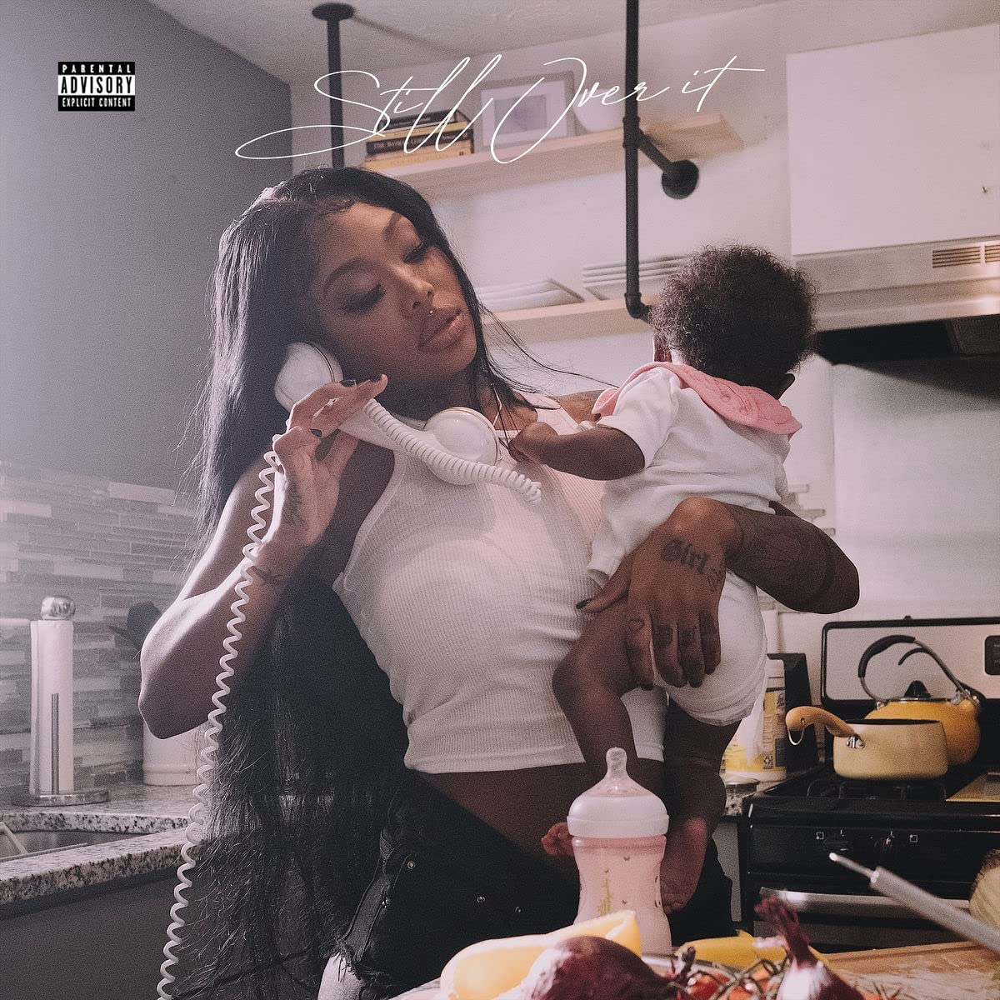

import { Slider, Button } from "@carbon/react";
import { ArrowUpRight } from "@carbon/icons-react";

import SliderJS1 from "../review/slider1";
import SliderJS2 from "../review/slider2";
import SliderJS3 from "../review/slider3";
import SliderJS4 from "../review/slider4";
import AdvJS2 from "../review/adv2";
import AdvJS3 from "../review/adv3";

import { Link } from "gatsby";

import Review1 from "../review/summerwalker1.mdx";

Album review

<h1 className="h1--no--margin">{props.pageContext.frontmatter.title}</h1>

  <Link to="/best50/2021/">2021 Black Music Best No.10</Link>

<Row  className="image-card-group">
	<Column colMd={3} colLg={4} noGutterMdLeft="">
       <ImageCard>

</ImageCard>
	</Column>
	<Column colMd={4} colLg={8} noGutterMdLeft="">
		

			Summer Walker、2年ぶりの2nd。デビュー作の好調さを維持していてチャート1位を獲得し、高評価も得ている。PhysicalのCDジェケットの写真で抱えている自身のお子さんの父親であるLondon On Da Trackが今作でも多くの曲をProducer参加しているが、破局してしまってるとのことで、内省的であったり、失恋を唄った曲が多いようだ。
			 前作同様、ミディアム～スローのメロディアスな曲で占められており、Trackもオーソドックスなものがほとんど。
			 Cardi BやAri Lennoxなど、筆者的には同類の女性VoをGuestに迎えているのが面白い。他にも豪華なGuest陣を迎えているが、あまり目立ってなくて、主人公はあくまでもSummer Walkerの唄であり、しっとりと表現力豊かに唄いあげている。
		

		

		  <Button className="button-right-mergin"  href="https://amzn.to/3JFje8e" renderIcon={ArrowUpRight} size='sm' kind='primary'>
  	    amazon.com
  	  </Button>
  	  <Button className="button-right-mergin"  href="https://amzn.to/3v64IT0" renderIcon={ArrowUpRight} size='sm' kind='secondary'>
  	    amazon.co.jp
  	  </Button>
			<Button className="button-right-mergin"  href="https://apple.co/3JHqwbU" renderIcon={ArrowUpRight} size='sm' kind='tertiary'>
  	   	apple music
  	  </Button>
			<AdvJS2/>
		

	</Column>
</Row>
<Row >
	<Column colMd={4} colLg={4} noGutterMdLeft="">
		

		  <h3>Score card</h3>
			<SliderJS1 value="5" />
		  <SliderJS2 value="1" />
			<SliderJS3 value="1" />
		  <SliderJS4 value="9" />
		

	</Column>
	<Column colMd={8} colLg={8} noGutterMdLeft="">
		

			<h3>Producers</h3>
			

				London on da Track and Arsenio Archer(1,5)
				 Buddah Bless(2)
				 Forthenight(3)
				 London on da Track, OG Parker, Tee Romano, Hitmaka, Chrishan, Xeryus Gittens(4)
				 Slimwav(6)
				 London on da Track and Killah B(7)
				 London on da Track, Slimwav and Remey Williams(8,11)
				 London on da Track and Dijon Stylez(9)
				 Cue Sheet(10)
				 London on da Track, Remey Williams and JustAcoustic(12)
				 Active By Night and Dylan Graham(13)
				 The Neptunes(14)
				 London on da Track, Dahryl Camper and Tone Deaf(15)
				 Young Rog and JAYDOT(16)
				 Summer Walker(17)
				 9th Wonder(18)
				 Slimwav, Nineteen85, Active By Night and Daniel East(19)
			

			<h3>Guests</h3>
			

				Cardi B, JT from City Girls, SZA, Ari Lennox, Lil Durk, Pharrell Williams, Omarion
			

		

	</Column>
</Row>

<h3>Tracks</h3>

| No. | Title                   | Composers                                                                                                                                                                                        | Performer                              | Time  |
| --- | ----------------------- | ------------------------------------------------------------------------------------------------------------------------------------------------------------------------------------------------ | -------------------------------------- | ----- |
| 1   | Bitter                  | Summer Walker, Belcalis Almanzar, Derez Lenard, London Tyler Holmes, Arsenio Archer, Garrett Hamler, Aubrey Robinson                                                                             | Summer Walker narration by Cardi B     | 04:50 |
| 2   | Ex for a Reason         | Summer Walker, Jatavia Johnson, Nija Charles, London Tyler Holmes, Tyron Douglas, Garrett Hamler, Aubrey Robinson                                                                                | Summer Walker feat. JT from City Girls | 03:45 |
| 3   | No Love                 | Summer Walker, Solána Rowe, Nija Charles Ocasey, Sony Ramos                                                                                                                                      | Summer Walker feat. SZA                | 03:51 |
| 4   | Throw It Away           | Summer Walker, Nija Charles, Jocelyn Donald, London Tyler Holmes, Joshua Parker, Terrence Williams, Christian Ward, Christopher Dotson, Xeryus Gittens, Aubrey Robinson, Myron Avant, Steve Huff | Summer Walker                          | 02:32 |
| 5   | Reciprocate             | Summer Walker, London Tyler Holmes, Arsenio Archer, Aubrey Robinson                                                                                                                              | Summer Walker                          | 03:02 |
| 6   | You Don't Know Me       | Summer Walker, Jerome Monroe                                                                                                                                                                     | Summer Walker                          | 03:20 |
| 7   | Circus                  | Summer Walker, Taylor Hill, London Tyler Holmes, Brian Vincent Bates, Aubrey Robinson, Kendall Bailey                                                                                            | Summer Walker                          | 02:14 |
| 8   | Insane                  | Summer Walker, London Tyler Holmes, Jerome Monroe, Remey Williams, Kendall Bailey                                                                                                                | Summer Walker                          | 03:09 |
| 9   | Constant Bullshit       | Summer Walker, London Tyler Holmes, Dijon Rasboro, Garrett Hamler, Aubrey Robinson                                                                                                               | Summer Walker                          | 03:17 |
| 10  | Switch a Nigga Out      | Summer Walker, Evgeniy Shamov                                                                                                                                                                    | Summer Walker                          | 02:57 |
| 11  | Unloyal                 | Summer Walker, Courtney Salter, London Tyler Holmes, Jerome Monroe, Remey Williams, Aubrey Robinson                                                                                              | Summer Walker feat. Ari Lennox         | 03:27 |
| 12  | Closure                 | Summer Walker, Johntá Austin, London Tyler Holmes, Remey Williams, James Jarvis, Aubrey Robinson, Kendall Bailey                                                                                 | Summer Walker                          | 02:11 |
| 13  | Toxic                   | Summer Walker, Durk Banks, Moreno Gijsbers, Dylan Graham, Jan Branicki                                                                                                                           | Summer Walker feat. Lil Durk           | 04:26 |
| 14  | Dat Right There         | Summer Walker, Pharrell Williams, Chad Hugo, Garrett Hamler                                                                                                                                      | Summer Walker feat. Pharrell Williams  | 03:09 |
| 15  | Screwin                 | Summer Walker, Omari Grandberry, London Tyler Holmes, Darhyl Camper, Antonio Williams, Garrett Hamler, Aubrey Robinson, Cooper McGill                                                            | Summer Walker feat. Omarion            | 05:33 |
| 16  | Broken Promises         | Summer Walker                                                                                                                                                                                    | Summer Walker                          | 03:03 |
| 17  | Session 33              | Summer Walker                                                                                                                                                                                    | Summer Walker                          | 02:07 |
| 18  | 4th Baby Mama (Prelude) | Summer Walker, Garrett Hamler, Patrick Douthit                                                                                                                                                   | Summer Walker                          | 01:15 |
| 19  | 4th Baby Mama           | Summer Walker, Jerome Monroe, Paul Jefferies, Gijsbers, Ashanti Guerrero, Roy Hamilton, Ernest Dixon, Tyrell Bing                                                                                | Summer Walker                          | 03:45 |

<h3>Other Reviews</h3>

<Row>
  <Column colMd={3} colLg={3} noGutterMdLeft>
    <Review1 />
  </Column>
</Row>

<AdvJS3 />
