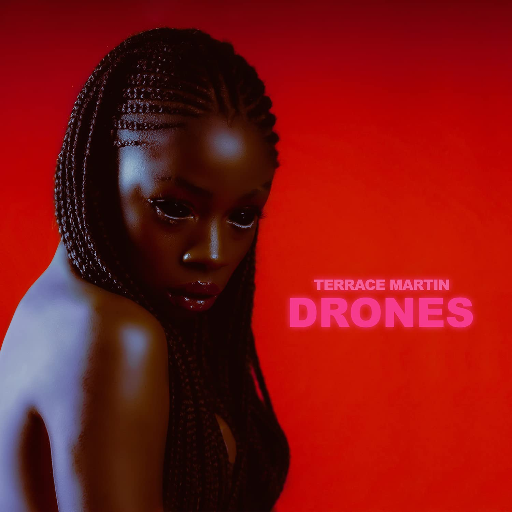

import { Slider, Button } from "@carbon/react";
import { ArrowUpRight } from "@carbon/icons-react";

import SliderJS1 from "../review/slider1";
import SliderJS2 from "../review/slider2";
import SliderJS3 from "../review/slider3";
import SliderJS4 from "../review/slider4";
import AdvJS2 from "../review/adv2";
import AdvJS3 from "../review/adv3";

import { Link } from "gatsby";

Album review

<h1 className="h1--no--margin">{props.pageContext.frontmatter.title}</h1>

<Row  className="image-card-group">
	<Column colMd={3} colLg={4} noGutterMdLeft="">
       <ImageCard>

</ImageCard>
	</Column>
	<Column colMd={4} colLg={8} noGutterMdLeft="">
		

			Jazz Sax奏者、Producerとして知られるTerrace Martinのソロとしては5年ぶりのアルバム。今やRobert Glasperと並んでWestの音楽界の潤滑油となっているともいえる。
			 コラボレーション、ゲスト参加が多い人でもあり、そんな人脈を駆使して、当作でもGuestがやたらに豪華である。Kendrick LamarやSnoopなどの使い方は勿体ない気もする。
			 Jazzに軸足を置いてるTerraceではあるか、Jazzといえるのはスピリチュアルな⑨ぐらいで、これはGuestでもあるKamasi Washington風。Saxもほとんど吹いておらず、Produceに専念している。また、ほとんどの曲でVocalかRapが入っているのも意外な感じだ。
			 構成面では前半はファンクなトーンの曲が多く、アップ〰ミディアムが中心となっている。後半にかけて、判りやすさより、音楽性を求めた聴きごたえのある曲が多くなっている。R&B, Hip-Hop, Jazzはもとより、キューバ、アフリカ、ハウスなど様々なジャンルの要素をMix UpしたBlack Music集大成みたいな作品である。
		

		

		  <Button className="button-right-mergin"  href="https://amzn.to/3HrD0mr" renderIcon={ArrowUpRight} size='sm' kind='primary'>
  	    amazon.com
  	  </Button>
  	  <Button className="button-right-mergin"  href="https://amzn.to/3IqGtCJ" renderIcon={ArrowUpRight} size='sm' kind='secondary'>
  	    amazon.co.jp
  	  </Button>
			<Button className="button-right-mergin"  href="https://apple.co/3IveCBI" renderIcon={ArrowUpRight} size='sm' kind='tertiary'>
  	   	apple music
  	  </Button>
			<AdvJS2/>
		

	</Column>
</Row>
<Row >
	<Column colMd={4} colLg={4} noGutterMdLeft="">
		

		  <h3>Score card</h3>
			<SliderJS1 value="3" />
		  <SliderJS2 value="2" />
			<SliderJS3 value="1" />
		  <SliderJS4 value="9" />
		

	</Column>
	<Column colMd={8} colLg={8} noGutterMdLeft="">
		

			<h3>Producers</h3>
			

				Jahaan Sweet and Terrace Martin(1)
				 Terrace Martin(2,12)
				 Jeff Gity, Terrace Martin and Trevor Lawrence Jr.(3)
				 Kid Culture and Terrace Martin(4,8)
				 Arin Ray, Kenneth Crouch and Terrace Martin(5)
				 Channel Tres, Robert Glasper and Terrace Martin(6)
				 Robert Glasper and Terrace Martin(7)
				 Hit-Boy and Terrace Martin(9)
				 Allen RItter and Terrace Martin(10)
				 Nate Mercereau, RIcky Reed and Terrace Martin(11)
				 Darhyl "DJ"Camper Jr,, James Fauntleroy and Terrace Martin(13)
			

			<h3>Guests</h3>
			

				Kendrick Lamar, Snoop Dogg, TY Dolla $ign, James Fauntleroy, Cordae, Arin Ray, Smino , Channel Tres, Celeste, Hit-Boy, Robert Glasper, Kamasi Washington, YG, Malaya, Leon Bridges, D Smoke, Kim Burrell
			

		

	</Column>
</Row>

<h3>Tracks</h3>

| No. | Title                           | Composers                                                                                                                                                                  | Performer                                                                        | Time  |
| --- | ------------------------------- | -------------------------------------------------------------------------------------------------------------------------------------------------------------------------- | -------------------------------------------------------------------------------- | ----- |
| 1   | Turning Poison Into Medicine    | Terrace Martin / Jahaan Sweet / Marlon Williams                                                                                                                            | Terrace Martin                                                                   | 01:46 |
| 2   | Drones                          | Calvin Broadus / Kendrick Duckworth / James Fauntleroy / Robert Glasper / Tyrone Griffin / Trevor Lawrence Jr. / Terrace Martin / Robert "Sput" Searight / Marlon Williams | Terrace Martin feat. Kendrick Lamar, Snoop Dogg, TY Dolla $ign, James Fauntleroy | 04:25 |
| 3   | Leave Us Be                     | Jeff Gitelman / Dennis Hamm / Trevor Lawrence Jr. / Jason L. Martin / Terrace Martin                                                                                       | Terrace Martin                                                                   | 02:44 |
| 4   | Work It Out                     | Cordae Dunston / Daniel Hackett / Jason L. Martin / Terrace Martin / Marlon Williams                                                                                       | Terrace Martin feat. Cordae                                                      | 03:07 |
| 5   | This Morning                    | Kenneth Crouch / Christopher Smith Jr. / Terrace Martin / Arin Ray / Kiefer Shackelford / Marlon Williams                                                                  | Terrace Martin feat. Arin Ray, Smino                                             | 03:43 |
| 6   | Tapped                          | Robert Glasper / Terrace Martin / Maurice Powell / Celeste Waite / Sheldon Young                                                                                           | Terrace Martin feat. Channel Tres, Celeste                                       | 03:08 |
| 7   | Reflection                      | James Fauntleroy / Robert Glasper / Imogen Heap / Terrace Martin                                                                                                           | Terrace Martin feat. James Fauntleroy                                            | 02:50 |
| 8   | Leimert Park                    | Daniel Hackett / Jason L. Martin / Terrace Martin                                                                                                                          | Terrace Martin                                                                   | 02:16 |
| 9   | Griots of the Crenshaw District | Robert Glasper / Chauncey Hollis / Terrace Martin / Kamasi Washington                                                                                                      | Terrace Martin feat. Hit-Boy, Robert Glasper, Kamasi Washington                  | 03:23 |
| 10  | Evil Eyes                       | Keyon Harrold / Keenon Jackson / Terrace Martin / Allen Ritter / Malaya Watson                                                                                             | Terrace Martin feat. YG, Malaya                                                  | 03:50 |
| 11  | Sick of Cryin                   | Todd Bridges / Daniel Farris / Eric Frederic / Terrace Martin / Nate Mercereau                                                                                             | Terrace Martin feat. Leon Bridges, D Smoke                                       | 03:21 |
| 12  | Don't Let Go                    | PJ Morton                                                                                                                                                                  | Terrace Martin                                                                   | 01:47 |
| 13  | Listen to God                   | Kim Burrell / Darhyl Camper / James Fauntleroy / Robert Glasper / Terrace Martin / Marlon Williams                                                                         | Terrace Martin feat. Kim Burrell, Robert Glasper, James Fauntleroy,              | 04:22 |

<AdvJS3 />
