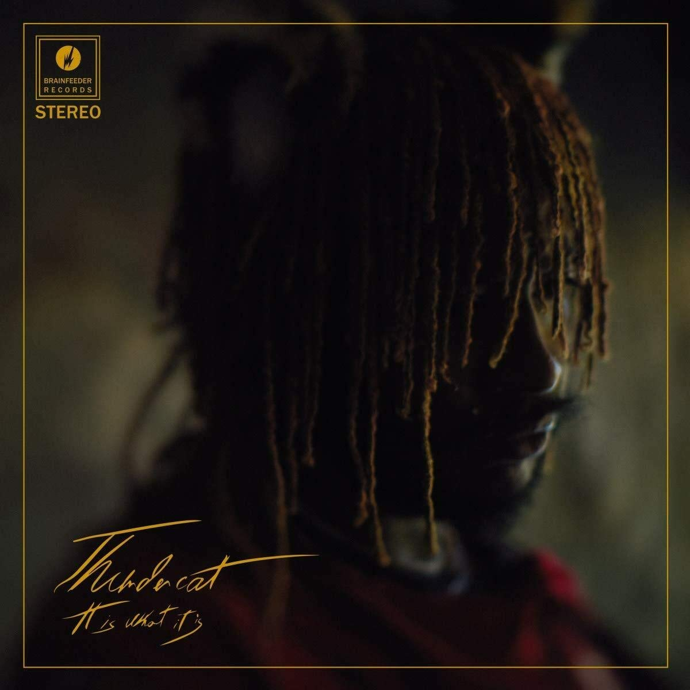

import { Slider, Button } from '@carbon/react';
import { ArrowUpRight  } from '@carbon/icons-react';

import SliderJS1 from "../review/slider1"
import SliderJS2 from "../review/slider2"
import SliderJS3 from "../review/slider3"
import SliderJS4 from "../review/slider4"

import Review1  from "../review/thundercat1.mdx"

import { Link } from "gatsby"

Album review

<h1 className="h1--no--margin">{props.pageContext.frontmatter.title}</h1>

<Link to="/best50/2020/">2020 Black Music Best No.6</Link>

<Row  className="image-card-group">
	<Column colMd={3} colLg={4} noGutterMdLeft="">
       <ImageCard>

 
</ImageCard>
	</Column>
	<Column colMd={4} colLg={8} noGutterMdLeft="">
	

	前作がマルチジャンルで高い評価を受けたThindercatの3年ぶり4作目。今回はほぼ全曲、Flying Lotusとの共同Produceとなっている。前作に比べると曲と唄に比重が置かれているようで、楽器中心のSoul, Jazz, Funk, Rockを取り混ぜたTrackがベースとなっている。もちろん、Thundercatの超絶技巧のBaseも局所で聴くことができる。逆にあまり難解でトリッキーなところは無く、Popになっている気がする。ミディアム中心にアップ、スローと使い分けており、Thundercatがファルセット多用な唄を全編で披露している。
	

	

	  <Button className="button-right-mergin"  href="https://amzn.to/3fLBKg8" renderIcon={ArrowUpRight} size='sm' kind='primary'>
      amazon.com
    </Button>
    <Button className="button-right-mergin"  href="https://amzn.to/3ip7EAL" renderIcon={ArrowUpRight} size='sm' kind='secondary'>
      amazon.co.jp
    </Button>
	

	
	
	</Column>
</Row>
<Row >
	<Column colMd={4} colLg={4} noGutterMdLeft="">

    <h3>Score card</h3>
	<SliderJS1 value="5" />
    <SliderJS2 value="2" />
	<SliderJS3 value="1" />
    <SliderJS4 value="9" />

</Column>
<Column colMd={8} colLg={8} noGutterMdLeft="">

<h3>Producers</h3>

Thundercat(1,2,3,4,7,8,9,10,1213,14,15,16,17,18,19,20,21,22,23)
 Sounwave(5,6,11)

<h3>Guests</h3>

Michael McDonald, Kenny Roggins, kendrick Lamar, Wiz kahlifa, Kamasi Washington

</Column>
</Row>

<h3>Tracks</h3>

| No. |	 Title                          |	 Composers                                                                                                          |	 Performer                                               | Time	 |
| --- |	------------------------------- | --------------------------------------------------------------------------------------------------------------------- | ---------------------------------------------------------- | ----- |
| 1   |	Lost in Space/Great Scott/22-26	| Stephen Bruner, Steven Ellison, Scott Kinsey                                                                         	| Thundercat                                                 | 01:22 |
| 2   |	Innerstellar Love              	| Stephen Bruner, Steven Ellison                                                                                       	| Thundercat feat. Louis Cole                                | 02:41 |
| 3   |	I Love Louis Cole              	| Stephen Bruner, Louis Cole                                                                                           	| Thundercat feat. Childish Gambino, Steve Arrington & Steve | 03:23 |
| 4   |	Black Qualls                   	| Stephen Bruner, Steve Lacy, Steve Arrington, Donald Glover, Charles Dickerson, Steven Ellison, Miguel Atwood-Ferguson	| Thundercat                                                 | 03:09 |
| 5   |	Miguel's Happy Dance           	| Stephen Bruner, Steven Ellison, Miguel Atwood-Ferguson                                                               	| Thundercat                                                 | 02:11 |
| 6   |	How Sway                       	| Stephen Bruner, Steven Ellison, Dennis Hamm                                                                          	| Thundercat                                                 | 01:14 |
| 7   |	Funny Thing                    	| Stephen Bruner, Charles Dickerson, Dennis Hamm                                                                       	| Thundercat feat. Zack Fox                                  | 01:56 |
| 8   |	Overseas                       	| Stephen Bruner, Steven Ellison, Mark Spears                                                                          	| Thundercat                                                 | 01:28 |
| 9   |	Dragonball Durag               	| Stephen Bruner, Steven Ellison                                                                                       	| Thundercat                                                 | 03:01 |
| 10  |	How I Feel                     	| Stephen Bruner, Taylor Graves                                                                                        	| Thundercat                                                 | 01:08 |
| 11  |	King of the Hill               	| Stephen Bruner, Steven Ellison, Alexander Sowinski, Chester Hansen, Leland Whitty, Matty Tavares                     	| Thundercat                                                 | 02:51 |
| 12  |	Unrequited Love                	| Stephen Bruner, Steven Ellison                                                                                       	| Thundercat feat. Lil B & Ty Dolla $ign                     | 03:14 |
| 13  |	Fair Chance                    	| Stephen Bruner, Spears, Tyrone Griffin Jr., Brandon McCartney                                                        	| Thundercat                                                 | 03:57 |
| 14  |	Existential Dread              	| Stephen Bruner, Steven Ellison                                                                                       	| Thundercat feat. Pedro Martins                             | 00:51 |
| 15  |	It Is What It Is               	| Stephen Bruner, Steven Ellison, Pedro Martins                                                                        	| Thundercat feat. Michael McDonald                          | 05:02 |

<Row>
<Column colMd={3} colLg={3} noGutterMdLeft>
<Review1 />
</Column>
</Row>