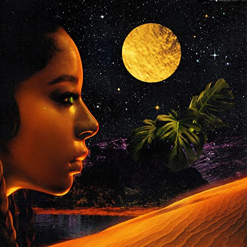

import { Slider, Button } from '@carbon/react';
import { ArrowUpRight  } from '@carbon/icons-react';

import SliderJS1 from "../review/slider1"
import SliderJS2 from "../review/slider2"
import SliderJS3 from "../review/slider3"
import SliderJS4 from "../review/slider4"

import { Link } from "gatsby"

Album Review

<h1 className="h1--no--margin">{props.pageContext.frontmatter.title}</h1>

<Link to="/best50/2020/">2020 Black Music Best No.21</Link>

<Row className="image-card-group">
	<Column colMd={3} colLg={4} noGutterMdLeft="">
    <ImageCard>

 

</ImageCard>
	</Column>
	<Column colMd={4} colLg={8} noGutterMdLeft="">
	

	  2020年夏リリースのVictoria Monétの9曲入りEP。Motownとグループでの契約があったがリリース無しのまま解散と苦難の時代もあった。そこから抜け出して、2010年頃からSong Writingで頭角を現わし、近年はAriana Grandeのパートナーとして多くの楽曲のWritingに加わっている。そんなArianaとは同い年であり、全体的な印象は近いものがあるが、こちらのほうが、やや大人っぽく、R&Bよりであり、Sentialなところもある。
     TrackはD'Mileによる手堅い作りであり、アップ～ミディアム～スローと曲調は様々で、⑦のような煌びやかな曲もあったりする。歌声はソフトで透明感があり、耳に心地よい。
  

  

	  <Button className="button-right-mergin"  href="https://amzn.to/3sc2ptR" renderIcon={ArrowUpRight} size='sm' kind='primary'>
      amazon.com
    </Button>
    <Button className="button-right-mergin"  href="https://amzn.to/2LbKOSf" renderIcon={ArrowUpRight} size='sm' kind='secondary'>
      amazon.co.jp
    </Button>
    <Button className="button-right-mergin"  href="https://apple.co/39kM2m3" renderIcon={ArrowUpRight} size='sm' kind='tertiary'>
      apple music
    </Button>
	

	</Column>
</Row>
<Row >
  <Column colMd={4} colLg={4} noGutterMdLeft="">
    

      <h3>Score card</h3>
	    <SliderJS1 value="5" />
      <SliderJS2 value="1" />
	    <SliderJS3 value="1" />
      <SliderJS4 value="8" />
    

  </Column>
  <Column colMd={4} colLg={8} noGutterMdLeft="">
    

      <h3>Producers</h3>
      

        Tim Suby and D'mile(1)
         D'mile(2,4,9)
         D'mile and Yonatan “xSDTRK” Ayal(3,8)
         Deputy and D'mile(5)
         SG Lewis(6)
         D'mile and Bregma(7)
      

      <h3>Guests</h3>
      

        Khalid, SG Lewis
      

    

  </Column>
</Row>

<h3>Tracks</h3>

| No. |	 Title                                       |	 Composers                                                                                                                   	|	 Performer                           | Time	 |
| --- |	-------------------------------------------- | ------------------------------------------------------------------------------------------------------------------------------	| ------------------------------------ | ----- |
|	1	  |	Moment                                       | Victoria Monét                                                                                                                	|	Victoria Monét                       | 02:59 |
|	2	  |	Big Boss (Interlude)                         | Dernst "D'Mile" Emile II and Victoria Mon?t                                                                                    |	Victoria Monét                       | 01:31 |
|	3	  |	Dive                                         | Victoria Mon?t, Yonatan Ayal, Dernst Emile II and Kyla Moscovich                                                               |	Victoria Monét                       | 03:45 |
|	4	  |	We Might Even Be Falling in Love (Interlude) | Dernst "D'Mile" Emile II and Victoria Mon?t                                                                                    |	Victoria Monét                       | 00:51 |
|	5	  |	Jaguar                                       | Victoria Monét                                                                                                                	|	Victoria Monét                       | 03:31 |
|	6	  |	Experience                                   | Victoria Monét, Khalid Robinson, Kyla Moscovich and Samuel George Lewis                                                       	|	Victoria Monét feat. Khalid, SG Lewi | 02:56 |
|	7	  |	Ass Like That                                | Victoria Monét, Dernst "D'Mile" Emile II, Dillan Beau Baillard, Donnell Stephens III, Jeremy Alexander Uribe and Kennedi Lykke	|	Victoria Monét                       | 03:40 |
|	8	  |	Go There with You                            | Victoria Mon?t, Yonatan Ayal and Dernst Emile II                                                                               |	Victoria Monét                       | 03:03 |
|	9	  |	Touch Me                                     | Dernst "D'Mile" Emile II, Kenneth B. Edmonds and Victoria Mon?t                                                                |	Victoria Monét                       | 03:11 |
