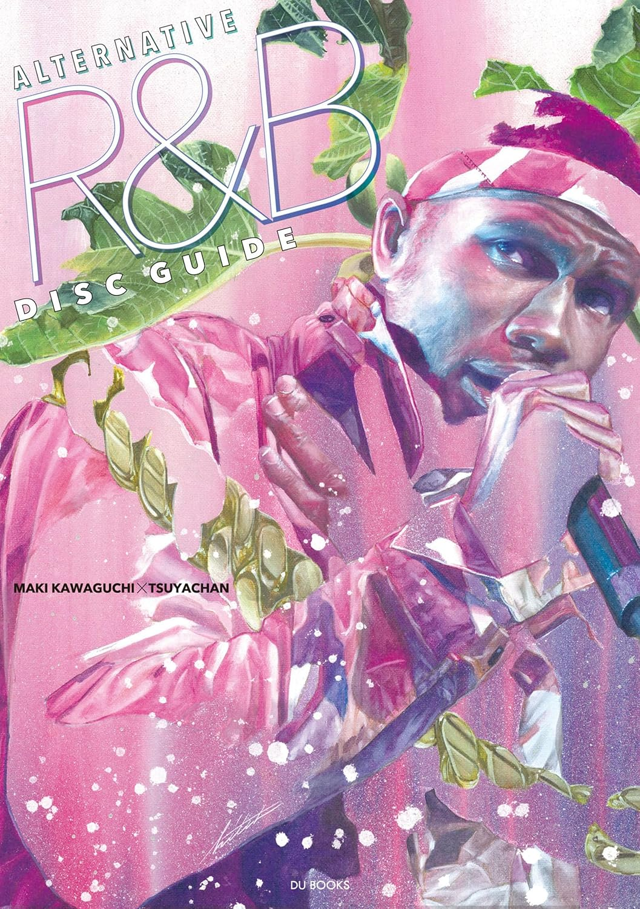

import { Button } from "@carbon/react";
import { ArrowUpRight } from "@carbon/icons-react";

<Row>
  <Column colMd={8} colLg={12} noGutterMdLeft="">
    
Book Review

    <h1 className="h1-no-bottom-margin">オルタナティブR&Bディスクガイド</h1>
    
フランク・オーシャン、ソランジュ、SZAから広がる新潮流

  </Column>
</Row>

<Row>
<Column colMd={3} colLg={4} noGutterMdLeft="">

 

</Column>
<Column colMd={5} colLg={8} noGutterMdLeft="">
  

    
監修

    

      川口真紀, つやちゃん
    

     
     
    
出版社

    

      DU Books
    

     
    
ページ数 / サイズ

    

      205ページ / 21 x 15 x 1.5 cm 
    

     
    
発売日

    

      2024/3/29
    

     
    
定価

    

      2500円(税抜き)
    

    

    <Button href="https://amzn.to/3CxXnBJ" renderIcon={ArrowUpRight} size='sm' kind='primary'>
      amazon.co.jp
    </Button>
    

  

</Column>
</Row>

<Row>
  <Column colMd={8} colLg={12} noGutterMdLeft="">
    

      ー フランク・オーシャン、ソランジュ、SZAから広がる新潮流 ー
       ー あたらしい歌、百花繚乱 ー
    

    

      本書冒頭にコンセプトとして、”オルタナティブR&Bを中心に、同時代の刺激的な作品を紹介する”とあり、カバーする範囲はちょっと
      広めではある。また、オルタナティブR&Bのざっくりとした定義として、"浮遊感のあるシンセ音を基調とした、深遠でアンビエントなサウンド"、
      "トラップ的なドラム"、"シャウター系とは対照的な、繊細で官能的、時にフィルターやリヴァーブがほど施されたヴォーカル"、"主に内省的な歌詞"
      とあり、この辺を選盤のゆるい基準としたディスクガイドとなっている。
      ちなみにグラミー賞では"Progressive R&B"という言い方をしているが、ほぼ同義語と思ってよいであろう。
       
      それで内容はというと、US/UKを中心として、萌芽期(2009-2015)、成熟期(20016-2018)、百花繚乱(2019-2023)という、
      年代別構成となっている。何しろこういった音楽がメジャーになりはじめたのが最近なので、2009年からと比較的直近の作品に絞られることになる。
      そのため、多くの人にとっては同時代的に聴いた作品を振り返ることになる。
      また、韓国編、日本編もあるのが特徴的。ただ、自分にとっては疎いところなので、知らないアーティストばかりだった。個人的には、正直、
      いらなかったかな。
       
      ガイドは、各年代ごとに、その年代の特徴、代表する10作品前後についてのレビュー(各1枚/1ページ)、その他の作品のレビュー(4枚/1ページ)で
      構成されている。代表する作品については文句なしで、Frank Oceanが3枚、The Weeknd, Kelela, Solange, Beyoncé, Jhené Aikoが2枚、選ばれている。
      その中でもJhené Aikoや加えてTinasheが重要アーティストとして描かれているのが意外だった。ただ、最重要としてはもちろん、Frank Oceanを位置づけている。
      また、Drake、Summer Walker、PJ Mortonなど、ジャンル的にギリギリな人の作品も選ばれており、ジャンルの境界の曖昧さや時代がボーダーレスになってきたことが判るし、
      敢えて明確にする意味も無い気がする。さらに選ばれたアーティストも見ると、ジェンダーレスというキーワードも通奏低音的にながれていると思う。
      レビュー枚数は約400枚なので、超メジャーな作品以外もカバーされているが、索引が無いのが残念だった。
       
      そのレビュー自体の記述は真っ当なものが多く、こういったガイドの特徴になるが、振り返っての価値みたいな当時気づかなかったことも
      書かれているので、読んでみる意義はあると思う。
      その他にも章の間に、いくつかの興味深いエッセイが載せられていて、Noa "40" Shebib, Frank Ocean, SZAなどがとりあげられていて、
      こちらも読みごたえがあった。
       全体を通すと、あらためてAlternative R&Bが明確に主流になってることが再認識され、いずれ、Alternative R&Bというジャンルも
      無くなるのかなと思った。
    

  </Column>
</Row>
