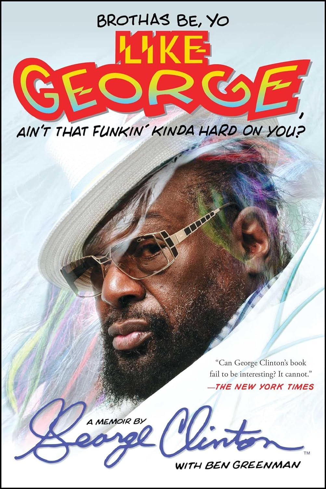

import { Button } from "@carbon/react";
import { ArrowUpRight } from "@carbon/icons-react";

<Row>
  <Column colMd={8} colLg={12} noGutterMdLeft="">
    
Book Review

    <h1 className="h1-no-bottom-margin">ファンクはつらいよ ジョージ・クリントン自伝 バーバーショップからマザーシップまで旅した男の回顧録</h1>
  </Column>
</Row>

<Row>
<Column colMd={3} colLg={4} noGutterMdLeft="">

  

</Column>
<Column colMd={5} colLg={8} noGutterMdLeft="">
  

    
著者

    

      George Clinton, Ben Greenman
    

    
訳者

    

      押野素子
    

    
監修・解説

    

      丸谷久兵衛
    

     
    
出版社

    

      DU Books
    

     
    
ページ数 / サイズ

    

      485ページ / 19.5 x 14 x 3.8 cm 
    

     
    
発売日

    

      2016/7/22
    

     
    
定価

    

      3000円(税抜き)
    

    

    <Button href="https://amzn.to/3tEzJ2b" renderIcon={ArrowUpRight} size='sm' kind='primary'>
      amazon.co.jp
    </Button>
    

  

</Column>
</Row>

<Row>
  <Column colMd={8} colLg={12} noGutterMdLeft="">
    

      - ジョージ・クリントン・サーガ : 床屋から銀河系の大スターになったジョージ・クリントンの立身出世物語 -
       
      ご存じ、ファンクの巨人にして、生き字引であるジョージ・クリントンの自伝。バーバーショップからドゥーワップシンガーを
      経て、Pファンク軍団を率いて成功し、今に至るまでが描かれている。
      The New Yorkerの編集者にして小説家のベン・グリーンマンの力を借りているが、自伝なので一人称で書かれている。
       
      特に1978年のデビュー当時(なんと37歳)から、活発に活動していた1980年代までの出来事が、どこまでが事実か判らないが、
      赤裸々に描かれている。
      長い間、ドラッグ依存症であり、ドラッグ(クラックなど)の入手や吸引にまつわる出来事も、詳しく書かれていて、
      これ、法的に大丈夫なのかな？と思ったりする。
       
      同時代的にジョージ・クリントンを追いかけては無かったので、下記のような多くのことを知ることができて、
      それだけでも面白かった。
       
      ・Parliament, Funkadelicだけでなく、Bootsy's Rubber Bandなど身内をも有機的に連携・融合させながら活動してたこと。
       
      ・スライ・ストーンと1年以上、一緒に暮らしていて、同じドラッグ依存症となり、スライがシーンよりフェイドアウトしていくところを
      間近で見てきたこと。
       
      ・マザーシップやスター・チャイルド、ドクター・ファンケンシュタインなどのキャラクターは、半分は思い付きだが、
      半分は商業的成功を狙った戦略的なものだったこと。
       
      ・交友関係が、めちゃくちゃ広く、プリンス、ケンドリック・ラマーなどの音楽的志向の近いひとたちだけでなく、Primal Screamなど
      他分野のアーティストとの交流も多かったこと。
       
      ・Doors, Cream, Beatlesなどロックからの影響を受けていること。
       
      ・著作権や楽曲所有権で、悪徳マネージャーに搾取されていて、長い間、問題を抱えていたが、ドラッグ依存症のせいで、
      頭が回らなかったこと。(その後、権利問題も、依存症も解決したとのこと)
       
      もちろん、Bernie Warrell, Bootsy Collins, Eddie Hazel, Garry Shider, Rogerなどおなじみの面々は頻出するし、
      書ききれないほどのSoul, R&B, Funkアーティストが登場するので、黒人音楽の裏歴史を知るという観点でも、
      大変興味深かった。
       
      写真も32ページにわたって、掲載されているので、具体的イメージを湧かせながら、文章を読むことができた。
    

  </Column>
</Row>
