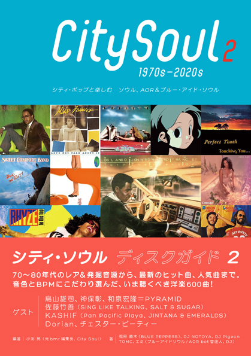

import { Button } from "carbon-components-react";
import { ArrowUpRight24 } from "@carbon/icons-react";

import Review1 from "../book/citysouldiskguideA.mdx";

<Row>
  <Column colMd={"12"} colLg={"12"} noGutterMdLeft="">
    
Book Review

    <h1 className="h1-no-bottom-margin">シティ・ソウル ディスクガイド 2</h1>
    

      1970s-2020s シティポップと楽しむ　ソウル、AOR&ブルー・アイド・ソウル{" "}
    

  </Column>
</Row>

<Row>
  <Column colMd={"3"} colLg={"4"} noGutterMdLeft="">

  </Column>
  <Column colMd={"4"} colLg={"8"} noGutterMdLeft="">
    

      
編著 / 著者

      

        小渕 晃 / City Soul Collective
      

       
      
出版社

      

        DU Books(株) ディスクユニオン
      

       
      
ページ数 / サイズ

      

        197ページ / 20.8 x 14.8 x 1.3 cm 
      

       
      
発売日

      

        2021/1/10
      

       
      
定価

      

        2000円(税抜き)
      

      

        <Button href="https://amzn.to/3bIjaWb" kind="primary" size="small" renderIcon={ArrowUpRight24}>
          amazon.co.jp
        </Button>
      

    

  </Column>
</Row>

<Row>
  <Column colMd={"8"} colLg={"8"} noGutterMdLeft="">
    

      シティ・ソウルのディスクガイド本のまさかの第2弾。今回は1970年から2020年までのディスクが取り上げられている。
      シティ・ソウルの定義については、前作の1に加え、2を追加し、広い範囲からの600曲の紹介となっている。
       
      1.制作者の深い音楽知識、リスニング体験をもとに、ソウルとジャズ、ロックなどのクロスオーヴァーにより生みだされるポップミュージック
       
      2.ヒッピホップが世界の音楽の中心にあるいまのヒップホップ世代にも受け入れられる、ある種のグルーブを備えた作品。
       
      主要な作品は前作で取り上げられてしまったわけで、若干、出がらし気味になるのは仕方ないが、その分、間口を思い切り広げ、US/UKだけでなく東欧も含むヨーロッパ、南米、インドネシア、タイなどのアジア、それにハワイまでカバーしている。
      というように、ちょっとマニアックになってるので、よほどの物好きな人以外は、VOL1から読むことをお薦めする。
       
      前作同様、シティソウルの全盛期だった1980-1983からの選出が多く、全世界的なムーブメントだったことが判る。
      加えて、2015-2020を2度目のクロスオーヴァーの時代としてフィーチャーしてるが新たな着眼点のようだ。
       
      ゲスト・インタビューとして、PYRAMIDの3人(鳥山雄司、神保彰、和泉宏隆)、佐藤竹善、KASHIF、DORIANとの対談が載っているが、
      特に前者2組は、自分より少し上の世代で、同感できる部分が多かったし、改めて、良いミュージシャンは良いリスナーでもあるなぁと思った。
      また、"音質・音響から考えるシティ・ソウル"というコラムもプロならではの視点で面白かった。
       
      このようなロングテールなところに位置するディスクのガイド本が成り立つのは、ストリーミングで、気になる作品を気楽に聴ける環境が整ってるおかげなのではないかと思うし、
      功罪入り乱れるストリーミングではあるが、ここではメリットが現われていると思った。
    

  </Column>
</Row>

<h3>Other Books</h3>

<Row>
  <Column colMd={3} colLg={3} noGutterMdLeft>
    <Review1 />
  </Column>
</Row>
