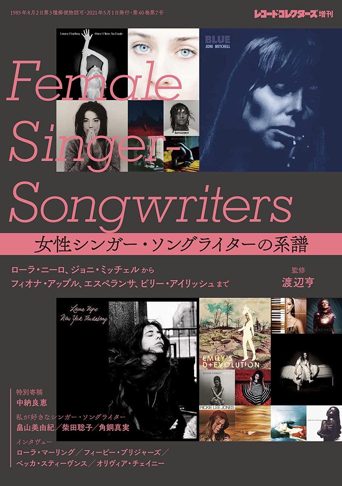

import { Button } from "@carbon/react";
import { ArrowUpRight } from "@carbon/icons-react";

<Row>
  <Column colMd={8} colLg={12} noGutterMdLeft="">
    
Book Review

    <h1 className="h1-no-bottom-margin">女性シンガー・ソングライターの系譜 </h1>
  </Column>
</Row>
<Row>
<Column colMd={3} colLg={4} noGutterMdLeft="">

  

</Column>
<Column colMd={5} colLg={8} noGutterMdLeft="">
  

    
監修

    

      渡辺亨
    

     
    
出版社

    

      株式会社ミュージック・マガジン
    

     
    
ページ数 / サイズ

    

      255ページ / 21 x 14.8 x 2.5 cm 
    

     
    
発売日

    

      2021/5/1
    

     
    
定価

    

      2000円(税抜き)
    

    

    <Button href="https://amzn.to/42uYGd5" renderIcon={ArrowUpRight} size='sm' kind='primary'>
      amazon.co.jp
    </Button>
    

  

</Column>
</Row>

<Row>
  <Column colMd={8} colLg={12} noGutterMdLeft="">
    

      - ローラ・ニーロ、ジョニ・ミッチェルから フィオナ・アップル、エスペランサ、ビリー・アイリッシュまで -
       
       
      Black Musicにフォーカスしたものでは無いですが、多くのアーティストが載っているので、購入しました。
       
      1960年代後半から現在にいたるまでの著名なシンガーソングライターとその作品をとりあげた書籍。
      何しろレコード・コレクターズ増刊なので、解説が丁寧で均質化されているのが特徴。その分、面白みやくだけた感じは無いのはいたしかたないところだが、
      ページ数に比べると中身は濃い。
       
      作品だけでなく、アーティスト自体の解説にページが割かれているのは、(数え間違いがなければ)19人で、Black Musicからは、
      Sade, Me'shell NdegéOcello, Erykah Badu, Alicia Keys, Esperanza Spalding, St. Vincentの6人。
      他のも、Lauryn Hill, Amel Lallieux, India.Arie, Amy Winehouse, Lianne La Havas, Laura Mvula, Valerie June,
      Janelle Monàe, Yola, Solange, Adele, FKA Twigs, Nai Palm, Little Simzなどのアルバムがとりあげられていが、
      作品の解説だけでなく、アーティスト自身についてもさらっと紹介してくれている。
      また、ラテンアメリカ, アフリカ, ヨーロッパなど幅広くカバーしているので、この分野について網羅的に知ることができる。
       
      トピックごとの長めのコラムや、アーティストのインタビューも多く、全体的に飽きさせない構成にはなっていると思う。
    

  </Column>
</Row>
