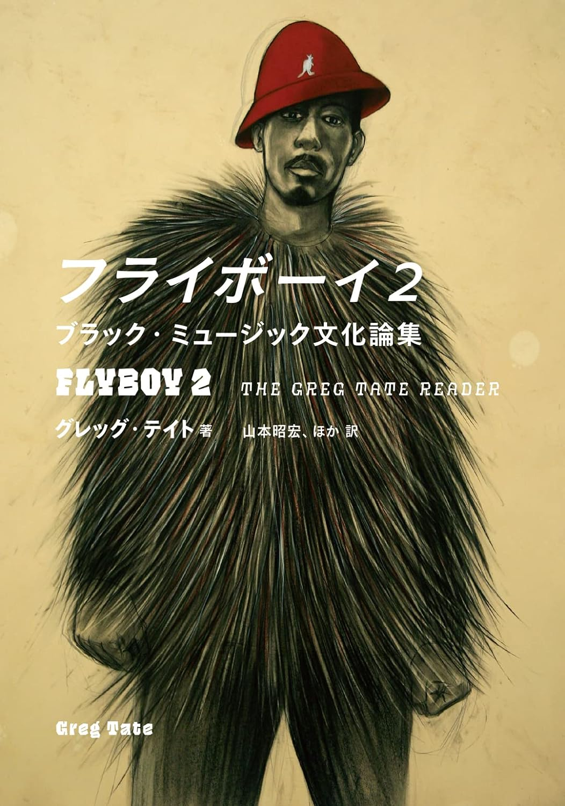

import { Button } from "@carbon/react";
import { ArrowUpRight } from "@carbon/icons-react";

<Row>
  <Column colMd={12} colLg={12} noGutterMdLeft="">
    
Book Review

    <h1 className="h1-no-bottom-margin">フライボーイ2</h1>
    
ブラック・ミュージック文化論集

  </Column>
</Row>

<Row>
<Column colMd={3} colLg={4} noGutterMdLeft="">

 

</Column>
<Column colMd={4} colLg={8} noGutterMdLeft="">
  

    
著者

    
Greg Tate

    
訳者

    
山本昭宏 ほか

     
    
出版社

    
(株)Pヴァイン

     
    
ページ数 / サイズ

    
478ページ / 14.8 x 2.8 x 21 cm

     
    
発売日

    
2023/6/13

     
    
定価

    
3980円(税抜き)

    

    <Button href="https://amzn.to/3ULD7TP" renderIcon={ArrowUpRight} size='sm' kind='primary'>
      amazon.co.jp
    </Button>
    

  

</Column>
</Row>

<Row>
  <Column colMd={8} colLg={8} noGutterMdLeft="">
    
- 本邦初訳となる「ヒップホップ・ジャーナリズムのゴッドファーザー」と呼ばれた黒人批評家による博覧強記の代表作！ -

    

       
      長い間、The Village Voiceにアメリカのブラック・ミュージックや黒人文化について寄稿し、
      Hip-Hopを批評に値する音楽ジャンルとして確立することに貢献したGreg Tateの評論集。
      USで本作が出版されたのは2016年であるが、日本版出版を待たずに2021年に帰らぬ人となってしまった。
       
      内容は1990年代から2015年代中ごろまでに寄稿した評論を5部にカテゴライズしたもので、Hio-Hop, R&B, Jazzを中心に
      アーティストや作品をひとつづつ取り上げ、評論や考察を加えたものが多くなっている。
      ただ、音楽以外にも映画や書籍などをとりあげてもいるので、”ブラック・ミュージック文化論集”というサブタイトルは
      誤解を生む気もする。
       
      また、Wayne Shorter, Ice Cube, Wynton Marsalis, Miles Davis, Björk, 俳優のJeffrey Wright,
      Don Cheadle, コメディアンのRichard Pryor(とマネージャー)への長めのインタビューも載っているが、
      これらはGreg独特の一歩踏み込んだものになっている。
       
      他にも、James Brown, Mishell Ndegeocello, Chaka Kahn, John Coltrane, Sun Ra, George Clinton, Jimi Hendrix,
      Michael Jackson, Gil Scott-helon, Sade, Outkast, Wutang-Clanなどさまざまなミュージシャンがとりあげられており、
      ジャンルのなかのひとならではの深くて鋭い評論は他の追随を許さないものになっている。
       
      難解な表現や、捻りのきいた表現も少なくはないが、各トピックは1-20ページ程度なので、迷子にならずに
      読み切れると思う。また、映画、書籍、文化人など自分の知識外の話題も少なくなく、理解が追い付かないところもあるが、
      仕方ないかな。
       
      いずれにしても、アメリカ黒人として長い間、これらの音楽・文化に寄り添った経験に基づく、
      近い視点からの考察に終始しでおり、その造詣や洞察の深さには敬意を表したい。
       
      

  </Column>
</Row>
