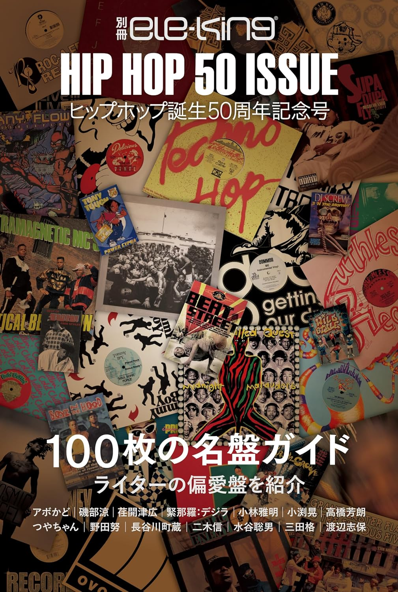

import { Button } from "@carbon/react";
import { ArrowUpRight } from "@carbon/icons-react";

<Row>
  <Column colMd={12} colLg={12} noGutterMdLeft="">
    
Book Review

    <h1 className="h1-no-bottom-margin">別冊ele-king ヒップホップ誕生50周年記念号</h1>
  </Column>
</Row>

<Row>
<Column colMd={3} colLg={4} noGutterMdLeft="">

  

</Column>
<Column colMd={4} colLg={8} noGutterMdLeft="">
  

    
監修

    

      小渕晃
    

    
編集

    

      野田努
    

     
    
出版社

    

      (株)Pヴァイン
    

     
    
ページ数 / サイズ

    

      157ページ / 14.8 x 1.1 x 22 cm 
    

     
    
発売日

    

      2023/12/4
    

     
    
定価

    

      1800円(税抜き)
    

    

    <Button href="https://amzn.to/3UqNi0j" renderIcon={ArrowUpRight} size='sm' kind='primary'>
      amazon.co.jp
    </Button>
    

  

</Column>
</Row>

<Row>
  <Column colMd={8} colLg={8} noGutterMdLeft="">
    

      - 100枚の名盤ガイド ライターの偏愛盤を紹介 -
       
       
      タイトルにあるように2023/8/11のHip-Hop生誕50周年を記念して、100枚をとりあげた名盤ガイド。
      80年代が18枚、90年代が44枚、00年代が10枚、10年代が24枚、20年代が4枚と、ややばらつきがあるが、
      各年2枚を選んでいるわけではなく、歴史的価値で選んでいるので、こうなっているようだ。
      また、1アーティストあたり1枚、ただし、Dr. Dreだけ2枚(The Chronicと2001)、選ばれている。
       
      そういうわけなので、hip-hop50年のベスト100というわけにはいかないが、概ね、妥当なセレクションだと思う。
      一方、音楽的価値より歴史的価値を重視した選出傾向にあるので、若干の違和感は仕方ない。
       
      名盤ガイド部分は、1ページ当たり、1枚を取り上げ、これまた歴史的価値をメインにした、きちんとした解説が記載されており、
      このへんは好感が持てる。
       
      これ以外には、Hip-Hopファッションの変遷や、グレッグ・テイト、渡辺志保、つやちゃんなどのコラムも
      載っているが、付け加え程度かな。
       
      また、100枚選者12人による”50年分の私の偏愛アルバム/シングル”のコーナーがあり、1人当たり最大3枚ピックアップ
      しているが、こういうパーソナルなものも、かえって面白かった。
       
      現時点でHip-Hop50周年を総括したような書籍はこれくらいなので、そういった意味でも手元に置いておいても良さそうだ。
    

  </Column>
</Row>
