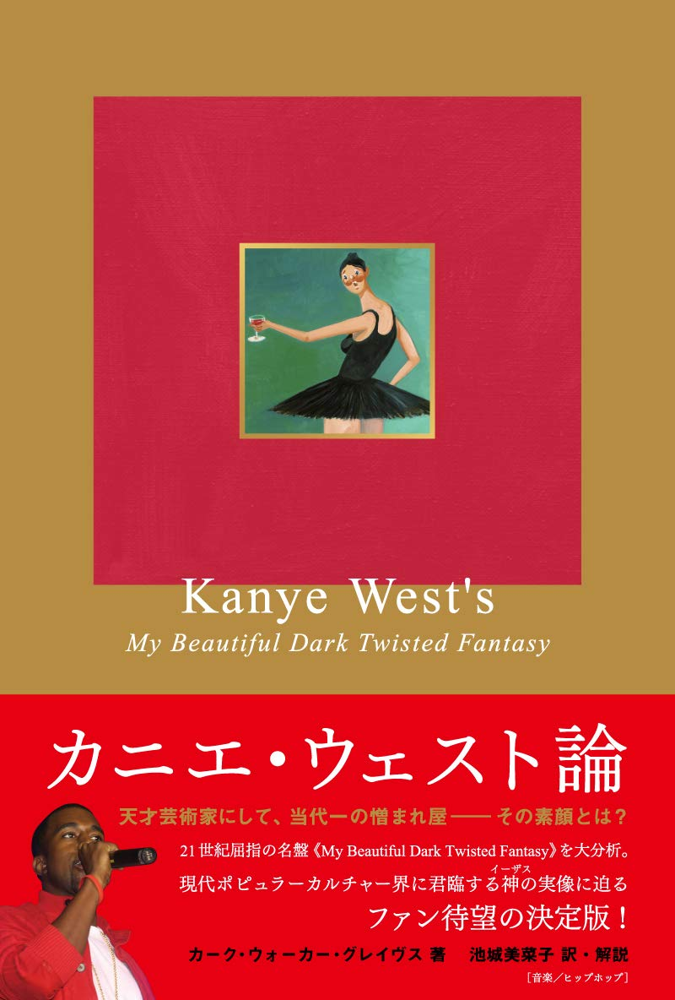

import { Button } from "carbon-components-react";
import { ArrowUpRight24 } from "@carbon/icons-react";

<Row>
  <Column colMd={"12"} colLg={"12"} noGutterMdLeft="">
    
Book Review

    <h1 className="h1-no-bottom-margin">カニエ・ウェスト論</h1>
    
《マイ・ビューティフル・ダーク・ツイステッド・ファンタジー》から読み解く奇才の肖像

  </Column>
</Row>

<Row>
<Column colMd={"3"} colLg={"4"} noGutterMdLeft="">

  

</Column>
<Column colMd={"4"} colLg={"8"} noGutterMdLeft="">
  

    
著者

    

      Kirk Walker Graves, 池城美奈子 (翻訳)
    

     
    
出版社

    

      DU Books
    

     
    
ページ数 / サイズ

    

      231ページ / 18.4 x 13.1 x 1.5 cm
    

     
    
発売日

    

      2019/8/30
    

     
    
定価

    

      1800円(税抜き)
    

    

      <Button href="https://amzn.to/3pvyX2Y" kind="primary" size="small" renderIcon={ArrowUpRight24}>
        amazon.co.jp
      </Button>
    

  

</Column>
</Row>

<Row>
  <Column colMd={"8"} colLg={"8"} noGutterMdLeft="">
    

      - 天才芸術家にして、当代一の憎まれ屋―その素顔とは？ -
       
        今世紀を代表するHip-Hopアーティスト、かつ、お騒がせセレブで、オバマ元大統領いうところのJackass(ばか、間抜け)であるKanye West(最近Yeに本名を改名)の
        傑作"My Beatiful Dark Twisted Fantasy（MBDTF)"をとりあげた書籍。
        <a href="/book/dangelosvoodooL">ディアンジェロ《ヴードゥー》がかけたグルーヴの呪文</a>と同じく、本国のUSでは33 1/3シリーズとして出版されている。
       
        構成的には、前半がはKanye Westについての評論であり、後半はMBDTFの各曲を1曲あたり10ページ前後を費やして深堀した解説になっている。
        取材やインタビューなどは一切行わずに、外部から得られる情報や発言、Kanyeの作品自体に基づいた論旨に終始しており、その分、臨場感は期待できない。
        また、他のアーティスト本と、だいぶ趣が変わっていて、評論に分類されるべき内容で、Kanye WestやMBDTFを題材にして、著者の主張が展開される内容になっている。
        もったいぶった表現や、文学的表現が散見され、Kanye Westとは関係ないパートもあったりして、面食らうことも少なくない。きちんと理解するのは宗教的バックグラウンドも必要になる。
       
        ここまでは否定的な印象ではあるが、他に類をみないの洞察力による評論ではあり、各曲について細部にまで行き届いた深堀がされていて、この辺には圧倒される。
        また、付録的に掲載されている訳者・池上さんの解説やKanye年表などはファンにとっては楽しめるものになっている。
    

  </Column>
</Row>
