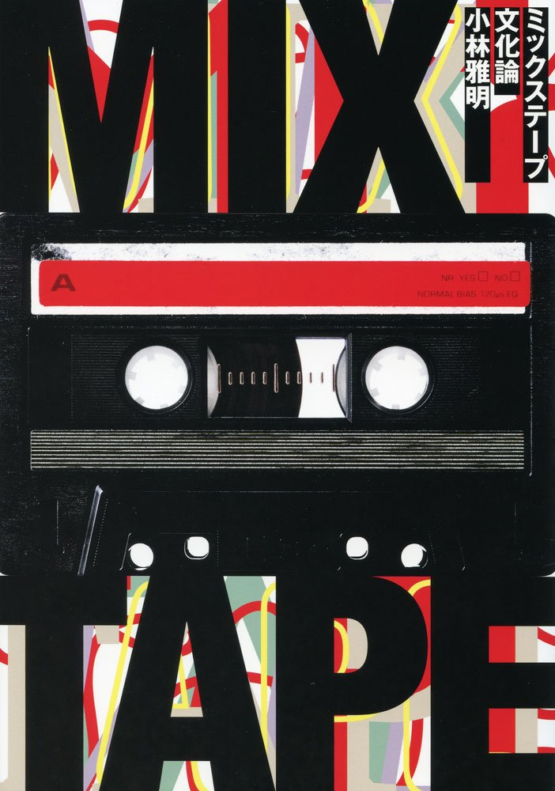

import { Button } from "@carbon/react";
import { ArrowUpRight } from "@carbon/icons-react";

import Review1 from "./newrandbprimerA.mdx";

<Row>
  <Column colMd={8} colLg={12} noGutterMdLeft="">
    
Book Review

    <h1 className="h1-no-bottom-margin">ミックステープ文化論</h1>
    
裏ヒップホップ史

  </Column>
</Row>

<Row>
  <Column colMd={3} colLg={4} noGutterMdLeft="">

 

  </Column>
  <Column colMd={5} colLg={8} noGutterMdLeft="">
    

      
著者

      
小林雅明

       
      
出版社

      
株式会社シンコーミュージック・エンターテインメント

       
      
ページ数 / サイズ

      
159ページ / 21 x 14.8 x 2.5 cm

       
      
発売日

      
2018/8/15

       
      
定価

      
1800円(税抜き)

      

      <Button href="https://amzn.to/3DM7UKv" renderIcon={ArrowUpRight} size='sm' kind='primary'>
        amazon.co.jp
      </Button>
      

    

  </Column>
</Row>

<Row>
  <Column colMd={8} colLg={12} noGutterMdLeft="">
    
- 2017年グラミー賞で最優秀ラップ・アルバムを授賞したのはチャンス・ザ・ラッパーによる“ミックステープ”だった -

    

       
      近年は、正式リリースのアルバムとクオリティも変わらず、逆に正式リリースでも配信のみも多くなったので、
      その境界が曖昧なミックステープであるが、その発祥から現代に到るまでの変遷を丁寧に描いた作品。
      読んでみると、自分のミックステープについての理解がだいぶ、間違ってことが判った。
       
      その歴史はHip-Hopと同じ1970年ころから始まり、DJが自分のプレイリストをベースにミックステープを作成、カセットにダビングして、
      売りさばいて稼ぎにしていたとのこと。DJハリウッド、キッド・カプリやマーリー・マールなどが登場している。
       
      その後、R&BのアカペラをHip-HopのTrackに載せたブレンドという手法が台頭し、このあたりで、Mary J. Bligeのデビューと
      重なって、パフィーやロンGなどが現れる。
       
      そして、サンプリングの著作権問題がインパクトとなって、ミックステープは無料だから、著作権問題は無いという法律上、
      あいまいな根拠のうえで、主に売れる前のアーティストが自身の作品を公開するという目的に使われるようになるが、
      自分はこのへんからミックステープの存在を認識し始めた気がする。しばしばダウンロードしていたDatpiffなど文面に現れてくる。
       
      2000年代にはいるあたりで、50Centが狙撃されたせいで、没になりかけた作品がミックステープとして、大手レーベルを介さずに販売され、
      チャートインしたことで、転換期を迎える。ある意味、インディレーベル的な役割を果たしているように思える。
       
      このあたりから、クオリティーもあがって、Danny BrownやThe Weekndなど、多くの若手や、独立系のアーティストの
      ツールとなり、さらに大手レーベルも販促につかうようになって、現在にいたっている。
       
      ミックステープの歴史として、こういった幹となるストーリーとともに、各地で動きや現場でのエピソードも豊富に描かれていて、
      裏ヒップホップ史というか、ストリートレベルでのシーンの変遷が、良く判る本なので、
      全ヒップホップ・ファン必読なように思えるし、よくぞ、ここまで描き切ってくれたなと感心した。
      

  </Column>
</Row>
