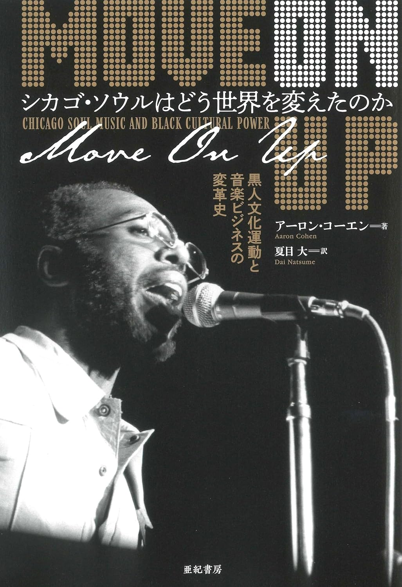

import { Button } from "@carbon/react";
import { ArrowUpRight } from "@carbon/icons-react";

<Row>
  <Column colMd={8} colLg={12} noGutterMdLeft="">
    
Book Review

    <h1 className="h1-no-bottom-margin">シカゴ・ソウルはどう世界を変えたのか </h1>
    
Move On Up

  </Column>
</Row>

<Row>
<Column colMd={3} colLg={4} noGutterMdLeft="">

 

</Column>
<Column colMd={5} colLg={8} noGutterMdLeft="">
  

    
著者

    
アーロン・コーエン

     
    
訳者

    
夏目大

     
    
出版社

    
株式会社 亜紀書房

     
    
ページ数 / サイズ

    
464ページ / 19.5 x 13.8 x 3.1 cm

     
    
発売日

    
2024/1/5

     
    
定価

    
3500円(税抜き)

    

    <Button href="https://amzn.to/3B4S0Jx" renderIcon={ArrowUpRight} size='sm' kind='primary'>
      amazon.co.jp
    </Button>
    

  

</Column>
</Row>

<Row>
  <Column colMd={8} colLg={12} noGutterMdLeft="">
    
- 黒人文化運動と音楽ビジネスの変革史 -

    

       
      元ダウンビート誌の編集者で、カレッジでも教鞭をとるアーロン・コーエンの著作で、表題通り、50年代より70年代のシガゴにおける黒人音楽をを取り巻く社会状況を、
      多くの当事者インタビューと資料に基づいて、時系列的・客観的にまとめた作品。
       
      南部より多くの黒人労働者が流入し、一大コミュニティが形成されたシカゴにおけるソウルミュージックシーンやその隆盛や変遷、様々なアーティストの台頭を史実にもとづき、主観を排して丁寧に描いている。
       
      さらには、シカゴにおいて地域ごとに形成されたコミュニティの特性(例えば、住宅事情)やそこでライブハウスが果たした役割、音楽ビジネスとここにおいて黒人が主体的、主導的に活動できていたこと、
      ソウルミュージック隆盛に一役買ったラジオ局の動静、音楽ビジネス側からラジオ局への働きかけなど、音楽そのものだけではなく、これを取り巻くものについても比重を置き詳しく描かれている。
       
      読んでみると、人種差別的な事柄についての記述もあるが、比較的自由かつ主体的に、黒人が音楽やこれにまつわるビジネスを続けてこれたことが判る。
      また、公民権活動等についても、割とあっさりとした描き方で、音楽との強い結びつきにはあまり触れていない。
       
      本自体の主旨として音楽そのものを深堀したものではなく、それは仕方無いが、カーティス・メイフィールド、ジェリー・バトラー、ダニー・ハサウェイ、アース・ウィンド＆ファイアー、
      ミニー・リパートン、チャカ・カーン、テリー・キャリアーあたりは頻繁に触れられているので、このへんがソウルファンのお楽しみになる。
    

  </Column>
</Row>
