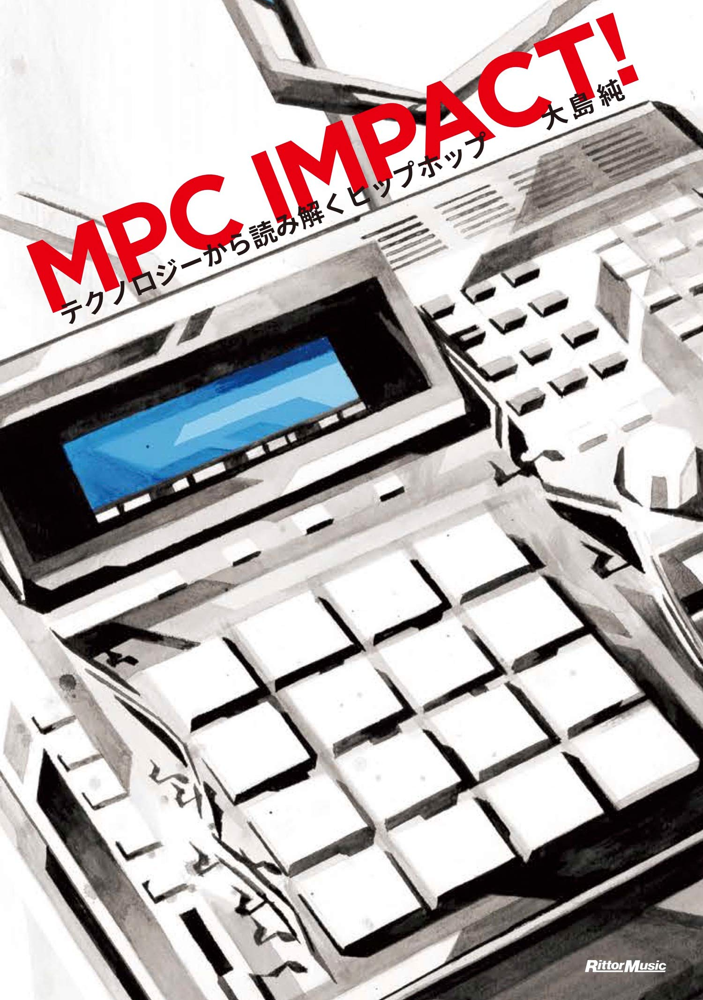

import { Button } from 'carbon-components-react';
import { ArrowUpRight24  } from '@carbon/icons-react';

<Row >
  <Column colMd={"12"} colLg={"12"} noGutterMdLeft="">
    
Book Review

    <h1 className="h1-no-bottom-margin">
    MPC Impact
    </h1>
    
テクノロジーから読み解くヒップホップ

    </Column>
</Row>

<Row>
<Column colMd={"3"} colLg={"4"} noGutterMdLeft="">

</Column>
<Column colMd={"4"} colLg={"8"} noGutterMdLeft="">
  

    
著者

    

    大島　純
    

     
    
出版社

    

    (株)リットーミュージック
    

     
    
ページ数 / サイズ

    

    255ページ / 18.6 x 12.8 x 2 cm
    

     
    
発売日

    

    2020/1/23
    

     
    
定価

    

    1800円(税抜き)
    

    

    <Button href="https://amzn.to/2U5xgc5" kind="primary" size="small" renderIcon={ArrowUpRight24}>
          amazon.co.jp
    </Button>
    

  

</Column>
</Row>

<Row>
<Column colMd={"8"} colLg={"8"} noGutterMdLeft="">
  

    AKAIのMPCシリーズを中心にサンプラー、ドラムマシーンの進化と、それに伴うHip-Hopミュージックの歴史を著した作品。
    Marley Marl, Pete Rock, DJ Premier, J Dillaなどの革新的ビートメーカー / Producerrが工夫とアイデアでデバイスの能力を駆使して、ビートを作り出してことに焦点を当てつつ、
    きっちりとした取材をもとに、デバイスの作り手側のエピソードも明らかにしている。
    Hip-Hop Musicがテクノロジーとともに進化してきたことが、大きな特徴であることがよく判る。
    デバイスへの知識が浅い自分でも十分楽しめたし、一気に読むことができた。
  

</Column>
</Row>

export default function Layout({ children }) {
  return (
    <>
      {children}
    </>
  );
}