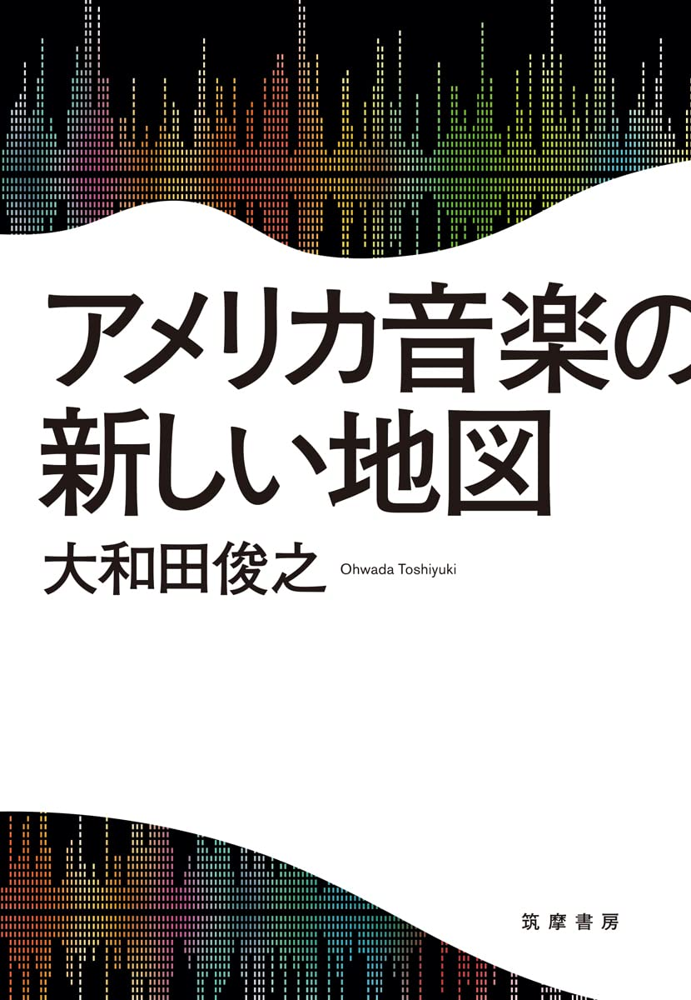

import { Button } from "carbon-components-react";
import { ArrowUpRight24 } from "@carbon/icons-react";

<Row>
  <Column colMd={"12"} colLg={"12"} noGutterMdLeft="">
    
Book Review

    <h1 className="h1-no-bottom-margin">アメリカ音楽の新しい地図</h1>
    

      アメリカ音楽最新形
    

  </Column>
</Row>

<Row>
<Column colMd={"3"} colLg={"4"} noGutterMdLeft="">

  

</Column>
<Column colMd={"4"} colLg={"8"} noGutterMdLeft="">
  

    
著者

    

      大和田俊之
    

     
     
    
出版社

    

    (株)筑摩書房
    

     
    
ページ数 / サイズ

    

    240ページ / 13.2 x 1.7 x 18.8 cm 
    

     
    
発売日

    

    2021/12/30
    

     
    
定価

    

    1600円(税抜き)
    

    

    <Button href="https://amzn.to/3b3KmBT" kind="primary" size="small" renderIcon={ArrowUpRight24}>
      amazon.co.jp
    </Button>
    

  

</Column>
</Row>

<Row>
  <Column colMd={"8"} colLg={"8"} noGutterMdLeft="">
    

      -2010年代以降のアメリカ音楽シーンを彩るポップスターたち。激変する政治経済、人口動態、メディア、そしてコロナ禍の中で、彼らの輝きはいかなる現代アメリカの相貌を描きだすのか。『アメリカ音楽史』の著者にして、ポピュラー音楽研究の俊英が放つ最新のアメリカ音楽グラフィティ!-
        
      テイラー・スウィフト、ケンドリック・ラマー、ブルーノ・マーズ、カーディ・B、ラナ・デル・レイ、チャンス・ザ・ラッパー、BTSといった近年、活躍中のアーティストをとりあげ、社会的背景や文化的背景におけるポジショニングを考察し、作品を再評価した評論集。
      web筑摩上で連載されたものを書籍としてまとめたものであり、今日(2022/6/18)現在も、テイラー・スウィフト編をそのままwebで読むことができる。(https://www.webchikuma.jp/articles/-/606)
       
      純粋なBlack Music本では無いが、多くの部分を占めているので、購入してみました。
       
      ”文化系のためのヒップホップ入門”では、入門ということもあり、判りやすくカジュアルな表現に努めている著者ではあるが、こちらの本では、やや硬めな内容になっており、
      慶応の教授が本職ということもあって、他社の著述を引用しつつ、これを論拠にして、自分の主張をジャスティフィケーションするといった論文チックなアプローチが散見される。
      それでも目の付け所と洞察力はさすがで、カントリーミュージックの左傾化、アジア系アーティストの活躍、ランキング・システム、BLM、パンデミックなど気になる話題と、前出のアーティストの言動や動向との
      関係性を明らかにし、普通では気づかない視点を与えてくれている。
    

  </Column>
</Row>
