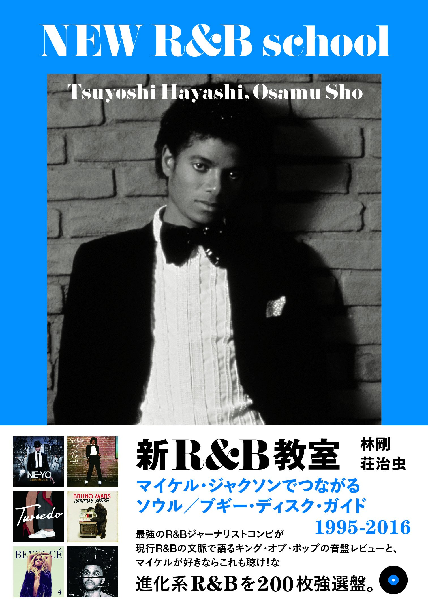

import { Button } from "carbon-components-react";
import { ArrowUpRight24 } from "@carbon/icons-react";

import Review1 from "./newrandbprimerA.mdx";

<Row>
  <Column colMd={"8"} colLg={"12"} noGutterMdLeft="">
    
Book Review

    <h1 className="h1-no-bottom-margin">新R&B教室</h1>
    
マイケル・ジャクソンでつながるソウル／ブギー・ディスク・ガイド 1995-2016

  </Column>
</Row>

<Row>
<Column colMd={"3"} colLg={"4"} noGutterMdLeft="">

  

</Column>
<Column colMd={"5"} colLg={"8"} noGutterMdLeft="">
  

    
著者

    

      林剛, 荘治虫
    

     
    
出版社

    

      スペースシャワーブックス
    

     
    
ページ数 / サイズ

    

      159ページ / 13 x 1.2 x 18.3 cm 
    

     
    
発売日

    

      2016/8/1
    

     
    
定価

    

      1600円(税抜き)
    

    

    <Button href="https://amzn.to/3phj1jF" kind="primary" size="small" renderIcon={ArrowUpRight24}>
      amazon.co.jp
    </Button>
    

  

</Column>
</Row>

<Row>
  <Column colMd={"8"} colLg={"12"} noGutterMdLeft="">
    

      - 最強のR&Bジャーナリストコンビが現行R&Bの文脈で語るキング・オブ・ポップの音盤レビューと、マイケルが好きならこれも聞け！な進化系R&Bを200枚強選盤。 -
       
       
      3種シリーズのR&Bのディスクガイドのうちの2冊目。↑の帯書き(キャッチコピー)にあるように、
      マイケル本人と彼に様々な側面で影響を受けたアーティストの作品を取り上げている。後半ではこれにジャネットも加わっているので、女性Vocalもしっかりカバーされている。
       
      構成としては、冒頭にマイケルのディスコグラグラフィーと、ところどころに彼に関するコラムが17本。これには、Produce面でマイケルを支えたクインシーやテディ・ライリー、ロドニー・ジャーキンスについてのコラムも含まれる。
      中盤にジャネットのディスコグラフィーが配置され、残りは本筋のディスクガイドとなる。
       
      ディスクガイドは、ダンス／ブギー編、メロウ／センシティヴ編、キッズ／ヤング・スター編、ヴォーカル・グループ編、ポップ／アイドル編、スウィート／セクシー編といった、
      マイケルのアーティスト・ヒストリーや、作風に合わせた6編にカテゴライズされている。
      取り上げられているアーティストは、Chris Brown, Ne-Yo, The Weekndなどのもろに影響を受けた人たちをはじめ、
      R-Kelly, Smokey Robinsonなどの意外なところや、New Edition, Boyz II MenなどのVocal Groupと多岐に渡っている。
      また、女性Vocalでは、Mariah Carey, Ariagna GrandeにMissy Elliott, Aaliyahとこちらも幅広く、マイケルの影響力の大きさをあらためて認識させれる。
       
      1冊目の"新R&B入門"と同じことを書くが、著者が2人のみなので、ディスク選出において寄せ集め感が無く、章ごとのまとまりも良くて、メッセージの一貫性もあるので、安心感がある。
      小振りな本であるが、1ページ当たりで紹介しているディスクが2枚のみなので、他のディスクガイドに比べると、記述量が多く濃密で、より深い知識が得られる。
      その分、200枚強と数は少ないのはいたしかたないところだが、ジャンルが絞られているので、かえって必要十分な気もする。
       
      

  </Column>
</Row>

<h3>Other Reviews</h3>

<Row>
  <Column colMd={3} colLg={3} noGutterMdLeft>
    <Review1 />
  </Column>
</Row>
