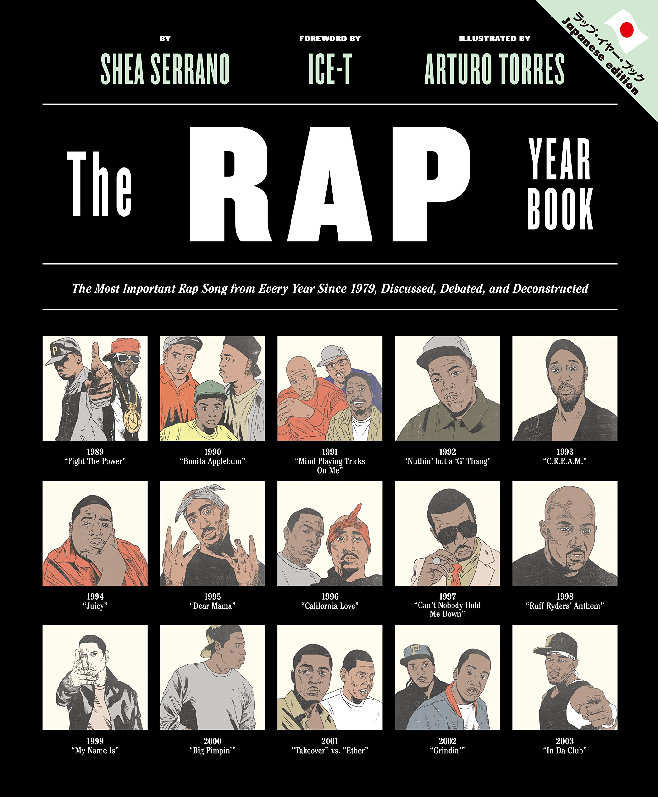

import { Button } from 'carbon-components-react';
import { ArrowUpRight24  } from '@carbon/icons-react';

<Row >
  <Column colMd={"12"} colLg={"12"} noGutterMdLeft="">
      
Book Review

    <h1 className="h1-no-bottom-margin">
    ラップ・イヤー・ブック 
    </h1>
    
The Rap Year Book イラスト図解 ヒップホップの歴史を変えたこの年この曲 

  </Column>
</Row>

<Row>
<Column colMd={"3"} colLg={"4"} noGutterMdLeft="">

</Column>
<Column colMd={"4"} colLg={"8"} noGutterMdLeft="">
  

    
著者

    

    シェイ・セラーノ Shea Serrano
    

     
    
出版社

    

    DU Books(株) ディスクユニオン
    

     
    
ページ数 / サイズ

    

    239ページ / 22.6 x 19.6 x 2.2 cm 
    

     
    
発売日

    

    2017/1/1
    

     
    
定価

    

    2500円(税抜き)
    

    

    <Button href="https://amzn.to/3eIn7u8" kind="primary" size="small" renderIcon={ArrowUpRight24}>
          amazon.co.jp
    </Button>
    

  

</Column>
</Row>

<Row>
  <Column colMd={"8"} colLg={"8"} noGutterMdLeft="">
    

    - The Most Important Rap Song From Every Year Since 1979. Discusses, Debated and Deconstructed. -
     
    Rapの黎明期、1979年から2014年まで、毎年、代表曲を一枚選び、解説を加えた書籍。
    ちなみに、1979年はご存じThe Sugarhill　GangのRapper’s Delightで、2014年はRick Gang feat. Young Thug and Rich Homie QuanのLifeStyleであり、選曲は前半のほうが的を得ている気がする。 
    1曲ごとに正味5ページを割いていて、解説やイラストは面白おかしく、Rhymeの特徴的な部分部分をとりあげたチャートも有ったりして、わりと読みやすい。
    また、”反論”として、毎年もう一曲、小コラムで紹介されている。 
    代表曲をストリーミングで2回ぐらいループさせながら読み、1曲分5ページ進んで、一区切りするという読み方が適している。(自分はそうしました。) &nbsp;
    また、全体を通して、読むと、Rapの歴史を一通り学べるありがたい本でもある。
    

  </Column>
</Row>

export default function Layout({ children }) {
  return (
    <>
      {children}
    </>
  );
}