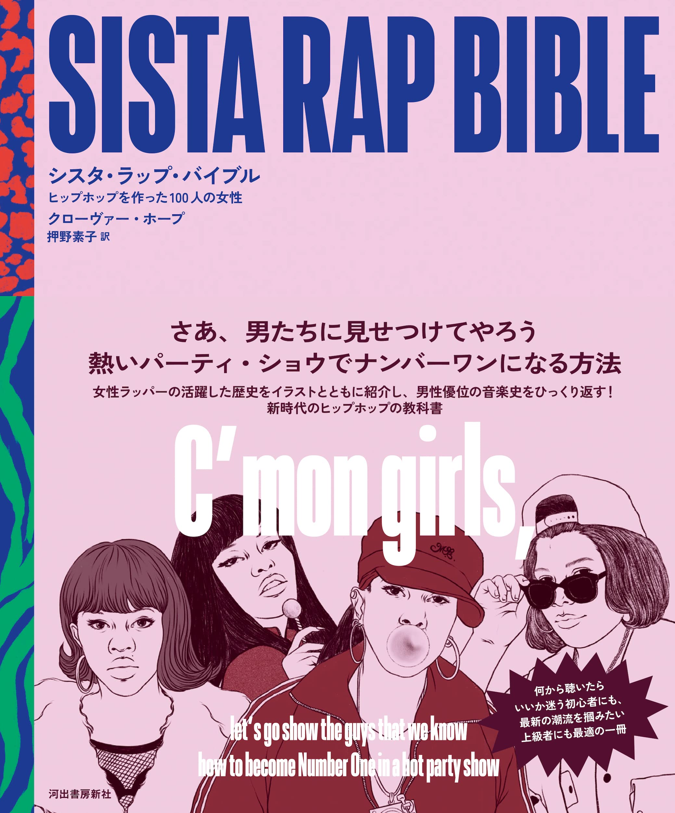

import { Button } from "carbon-components-react";
import { ArrowUpRight24 } from "@carbon/icons-react";

<Row>
  <Column colMd={"12"} colLg={"12"} noGutterMdLeft="">
    
Book Review

    <h1 className="h1-no-bottom-margin">シスタ・ラップ・バイブル</h1>
    

      ヒップホップを作った100人の女性
    

  </Column>
</Row>

<Row>
<Column colMd={"3"} colLg={"4"} noGutterMdLeft="">

  

</Column>
<Column colMd={"4"} colLg={"8"} noGutterMdLeft="">
  

    
著者

    

      Clover Hope
    

     
    
訳者

    

      押野素子
    

     
    
出版社

    

    (株)河出書房新社
    

     
    
ページ数 / サイズ

    

    238ページ / 19 x 1.8 x 22.6 cm 
    

     
    
発売日

    

    2022/2/28
    

     
    
定価

    

    2990円(税抜き)
    

    

    <Button href="https://amzn.to/3PmCStm" kind="primary" size="small" renderIcon={ArrowUpRight24}>
      amazon.co.jp
    </Button>
    

  

</Column>
</Row>

<Row>
  <Column colMd={"8"} colLg={"8"} noGutterMdLeft="">
    

      -さあ、男たちに見せつけてやろう 熱いパーティ・ショウでナンバーワンになる方法-
        
      70年代から、最近に至るまで、その時々で活躍していた女性Rapper100人強を、時系列的に紹介してくれている一冊。
      ① 数ページを割いているメインなアーティストがMC Sha-Rockから、Cardi Bまで、41人/グループ。② 1ページなのが10人/グループ。
      ③ 残りは、1ページに数人/グループまとめてと、強弱がつけられている。
      近年、活躍しているLizzo, Megan Thee Stallion, Doja Catあたりが③の扱いで、SZA, Rapsodyなどがそもそもカバーされてないのは
      ちょっと残念だが、そこを勘案しても十分に楽しめる本になっている。
       
      特に①②でカバーされているアーティストについては、冒頭にNEVER(功績)、WHO SHE IS(略歴)、LISTEN(必聴トラック)の欄があるので、
      理解が進むし、必聴トラックをストリーミングで聴きながらという、読み方もできる。
       
      アーティストの紹介文は、平易で判りやすく、古めの人でも、きちんと掘り下げているところは好感がもてるし、知識が深まるのでありがたい。
      筆者が女性なので女性視点なところがあるのも特徴的だ。
      また、女性Rapperというと、どうしてもSexy系で売り出していた人が多いのだが、きわどいLyricも平然と紹介されたりしている。
      女性Rapper第一号は誰だ？論争があったというのも、面白かった。
       
      一通り読んで、あらためて、歴史を振り返ってみると、男性優位のHip-Hop界において、目立った女性アーティストは
      一時点で一人という時代が続いてきて、最近やっと勢力図を広げているのがよくわかり、これもジェンダーレスの時代ならではなのかなと思った。
    

  </Column>
</Row>
