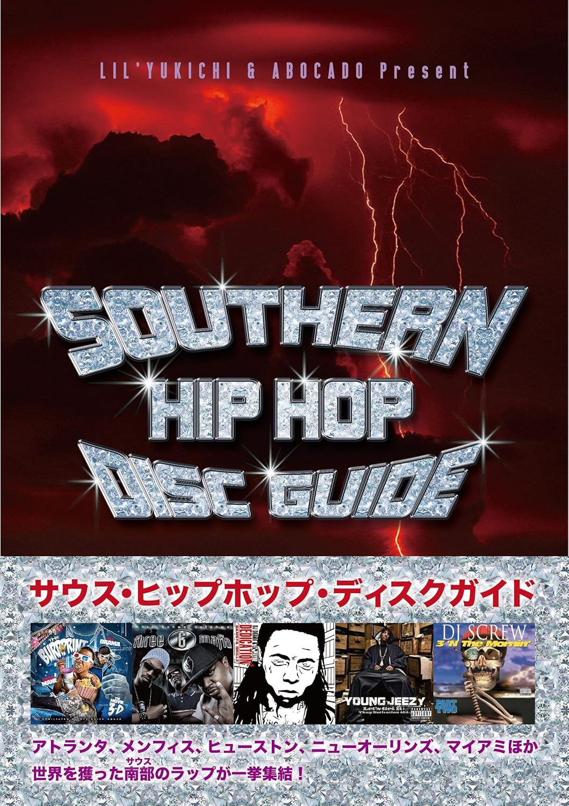

import { Button } from "@carbon/react";
import { ArrowUpRight } from "@carbon/icons-react";

<Row>
  <Column colMd={12} colLg={12} noGutterMdLeft="">
    
Book Review

    <h1 className="h1-no-bottom-margin">サウス・ヒップホップ・ディスクガイド</h1>
    
トラップ・ミュージックを生んだ南部のラップ史

  </Column>
</Row>

<Row>
<Column colMd={3} colLg={4} noGutterMdLeft="">

 

</Column>
<Column colMd={4} colLg={8} noGutterMdLeft="">
  

    
監修

    
Lil' Yukichi, アボかど

     
    
出版社

    
 DU Books

     
    
ページ数 / サイズ

    
165ページ / 14.8 x 1.9 x 21 cm

     
    
発売日

    
2025/5/23

     
    
定価

    
2800円(税抜き)

    

    <Button href="https://amzn.to/4nHJwLD" renderIcon={ArrowUpRight} size='sm' kind='primary'>
      amazon.co.jp
    </Button>
    

  

</Column>
</Row>

<Row>
  <Column colMd={8} colLg={8} noGutterMdLeft="">
    
- アトランタ、メンフィス、ヒューストン、ニューオーリンズ、マイアミほか、世界を獲った南部のラップが一挙集結！ -

    

       
      タイトル通りのサウス・ヒップホップのディスクガイド。この分野に超強いお二人が監修を務めている。
       
      本編のディスクガイド部分は2000-2005,2006-2012,2013-2025とその前の1990sの4編構成になっており、2025年の最新作までカバーされている。
      1ページを割いてレビュー・紹介されているディスクが40枚、1ページ4枚なのが154枚なので、計200枚弱がカバーされていることになるが、これで十分な感じで、意外とあまりメジャーでは無いアーティストも含まれている。
       
      レビューは、あまりくだけた感じにはならず、筆者の思い入れを多少こめつつ、丁寧なものになっている。併せて、アーティストの本拠地が載っているのは親切なところ。
       
      レビュー以外のトピックが、かなり充実していて、サウスを構成する州のマップ、Lil' Yukichiのインタビュー、アルバムジャケットのデザイナーの話、メンフィスの話、ATLの歩き方、南部ヒップホップ用語集、
      アドリブ進化論、Lil Wayneの話、BBQチキンウイングの作り方、南部プロデューサーの話といったコラムも掲載されていて、サウス・ヒップホップを包括的に知ってもらいたいという意気込みが感じられる。
       
      ホログラム加工の表紙など、南部風味たっぷりで、サウス好きだった往時のBMRを思い出した。ただ、字が小さく、その分、情報量は多いが、ちょっと読みにくかったところは残念。
    

  </Column>
</Row>
