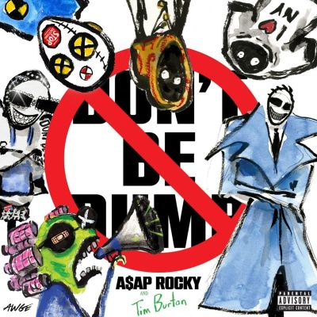

import { Slider, Button } from "@carbon/react";
import { ArrowUpRight } from "@carbon/icons-react";

import SliderJS1 from "../review/slider1";
import SliderJS2 from "../review/slider2";
import SliderJS3 from "../review/slider3";
import SliderJS4 from "../review/slider4";
import AdvJS2 from "../review/adv2";
import AdvJS3 from "../review/adv3";

import { Link } from "gatsby";

Album Review

<h1 className="h1--no--margin">{props.pageContext.frontmatter.title}</h1>

<Row  className="image-card-group">
	<Column colMd={3} colLg={4} noGutterMdLeft="">
       <ImageCard>

</ImageCard>
	</Column>
	<Column colMd={4} colLg={8} noGutterMdLeft="">
		

			ファッションアイコンや俳優としても活躍するA$AP Rockyの8年ぶりとなる通算4作目のスタジオ・アルバム。
       アルバムのコンセプトは、ハーレムの遺産、ハイファッションの美学、そして前衛的なアートが交差する「ゲットー・フューチャリズム」や「シネマティック・ゴシック」と称されており、異なる6つの人格（アルターエゴ）を使い分け、多層的な世界観を構築している。
			ファッション狂の独身男性から、Rihannaとの間に3人の子供を持つ父親へと進化した彼の、成熟した精神性が作品の核となっている。
       サウンドは、エクスペリメンタル・ヒップホップ、トラップ、サイケデリアを軸に、ジャズやノイズ・メタル、ロックまでを飲み込んだもので、映画監督 Tim
      Burtonと作曲家Danny Elfman が制作に深く関わったことで、ヒップホップの枠を超えたゴシックで映画的な雰囲気が漂っている。
			特にDoechiiを招いたDuke EllingtonのCaravanまんま使いの⑬はクールでカッコよい。
       緩急自在なフロウと歌声も聴かせてくれており、声の質感を楽曲ごとに大胆に変化させている。
			 リリックは極めて個人的なもので、家庭生活の喜びを語る一方で、元友人との銃撃事件を巡る裁判や裏切りについても赤裸々に触れている。特に「Stole
      Ya Flow」では、フロウの盗用や Rihannaとの関係を巡って、因縁の相手であるDrakeやTravis Scottに対して痛烈なディスを放っている。
		

		

		  <Button className="button-right-mergin"  href="https://amzn.to/4p3GuCV" renderIcon={ArrowUpRight} size='sm' kind='primary'>
  	    amazon.com
  	  </Button>
  	  <Button className="button-right-mergin"  href="https://amzn.to/4f13Q7u" renderIcon={ArrowUpRight} size='sm' kind='secondary'>
  	    amazon.co.jp
  	  </Button>
			<Button className="button-right-mergin"  href="https://apple.co/4aAQn59" renderIcon={ArrowUpRight} size='sm' kind='tertiary'>
  	    apple music
  	  </Button>
		<AdvJS2/>
		

	</Column>
</Row>
<Row >
	<Column colMd={4} colLg={4} noGutterMdLeft="">
		

		  <h3>Score card</h3>
			<SliderJS1 value="1" />
		  <SliderJS2 value="1" />
			<SliderJS3 value="2" />
		  <SliderJS4 value="9" />
		

	</Column>
	<Column colMd={4} colLg={8} noGutterMdLeft="">
		

			<h3>Producers</h3>
			

				A$AP Rocky, Jordan Patrick and Rance(1)
				 A$AP Rocky, Kelvin Krash and Soufien 3000(2)
				 A$AP Rocky, Rance and Thundercat(3)
				 A$AP Rocky, ICYTWAT, Kelvin Krash and Rance(4)
				 A$AP Rocky, Brent Faiyaz, Hit-Boy, Loukeman, Rance and  Thundercat(5)
				 A$AP Rocky, Cardo Got Wings and Thundercat(6)
				 A$AP Rocky, Take a Daytrip, Will Grogan and Mingo4u(7)
				 A$AP Rocky, BossMan Dlow, Rex Kudo and Hitkidd(8)
				 A$AP Rocky, Slay Squad, Deaton Chris Anthony and Ging, Rance(9)
				 A$AP Rocky, Cristoforo Donadi and Rance(10)
				 A$AP Rocky, Greg Kurstin and Manny Laurenko(11)
				 Damon Albarn, T-Minus, Digital Nas, Hector Delgado and A$AP Rocky(12)
				 A$AP Rocky and Jordan Patrick(13)
				 A$AP Rocky, Jordan Patrick and Loukeman(14)
				 A$AP Rocky, will.i.am, Emile Haynie and Rex Kudo(15)
			

			<h3>Guests</h3>
			

				Brent Faiyaz, BossMan Dlow, Sauce Walka, Slay Squad, Gorillaz, Westside Gunn, Doechii, will.i.am, Jessica Pratt
			

		

	</Column>
</Row>

<h3>Tracks</h3>

| No. | Title                         | Composers                                                                                                                                                    | Performer                                  | Time  |
| --- | ----------------------------- | ------------------------------------------------------------------------------------------------------------------------------------------------------------ | ------------------------------------------ | ----- |
| 1   | ORDER OF PROTECTION           | Rakim Athelston Mayers, Jordan Patrick, Larrance Dopson                                                                                                      | A$AP Rocky                                 | 02:51 |
| 2   | HELICOPTER                    | Rakim Athelston Mayers, Kelvin Magnusen, Soufien Rhouat                                                                                                      | A$AP Rocky                                 | 02:44 |
| 3   | INTERROGATION (SKIT)          | Rakim Athelston Mayers, Stephen Lee Bruner, Larrance Dopson                                                                                                  | A$AP Rocky                                 | 00:49 |
| 4   | STOLE YA FLOW                 | Rakim Athelston Mayers, Brandon Banner, Kelvin Magnusen, Danny Elfman                                                                                        | A$AP Rocky                                 | 03:19 |
| 5   | STAY HERE 4 LIFE              | Rakim Athelston Mayers, Christopher Wood, Chauncey Alexander Hollis, Luke Fenton, Larrance Dopson, Stephen Lee Bruner, Kenyatta Lee Frazier Jr., Clif Shayne | A$AP Rocky feat. Brent Faiyaz              | 05:46 |
| 6   | PLAYA                         | Rakim Athelston Mayers, Ronald LaTour Jr., Stephen Lee Bruner, Luke Fenton, Troy Taylor, Edrick Miles, Tony E. Scales, Tremaine Neverson                     | A$AP Rocky                                 | 03:47 |
| 7   | NO TRESPASSING                | Rakim Athelston Mayers, Denzel Baptiste, David Biral, Will Grogan, Thibault Dominguez                                                                        | A$AP Rocky                                 | 03:15 |
| 8   | STOP SNITCHING                | Rakim Athelston Mayers, Anthony Lorenzo Holmes Jr., Rex Kudo, Devante McCreary, Albert Walker Mondane                                                        | A$AP Rocky feat. BossMan Dlow, Sauce Walka | 03:20 |
| 9   | STFU                          | Rakim Athelston Mayers, Adam King Feeney, Brahim Gousse, Keione Dante Benson, Larrance Dopson, Lamar Mars Edwards                                            | A$AP Rocky feat. Slay Squad                | 02:58 |
| 10  | PUNK ROCKY                    | Rakim Athelston Mayers, Cristoforo Donadi, Zach Fogarty, Adam King Feeney                                                                                    | A$AP Rocky                                 | 03:55 |
| 11  | AIR FORCE (BLACK DEMARCO)     | Rakim Athelston Mayers, Nasir Harold Pemberton, Greg Kurstin, Zach Fogarty, Jordan Patrick                                                                   | A$AP Rocky                                 | 03:44 |
| 12  | WHISKEY (RELEASE ME)          | Rakim Athelston Mayers, Tyler Williams, Damon Albarn, Zach Fogarty, Alvin Worthy                                                                             | A$AP Rocky feat. Gorillaz, Westside Gunn   | 04:05 |
| 13  | ROBBERY                       | Rakim Athelston Mayers, Jaylah Hickmon, Duke Ellington, Irving Mills, Juan Tizol                                                                             | A$AP Rocky feat. Doechii                   | 03:55 |
| 14  | DON&#39;T BE DUMB / TRIP BABY | Rakim Athelston Mayers, Luke Fenton, Claire Cottrill, Rostam Batmanglij                                                                                      | A$AP Rocky                                 | 04:45 |
| 15  | THE END                       | Rakim Athelston Mayers, Zach Fogarty, Emile Haynie, William Adams, Rex Kudo                                                                                  | A$AP Rocky feat. will.i.am, Jessica Pratt  | 03:34 |

<AdvJS3 />
