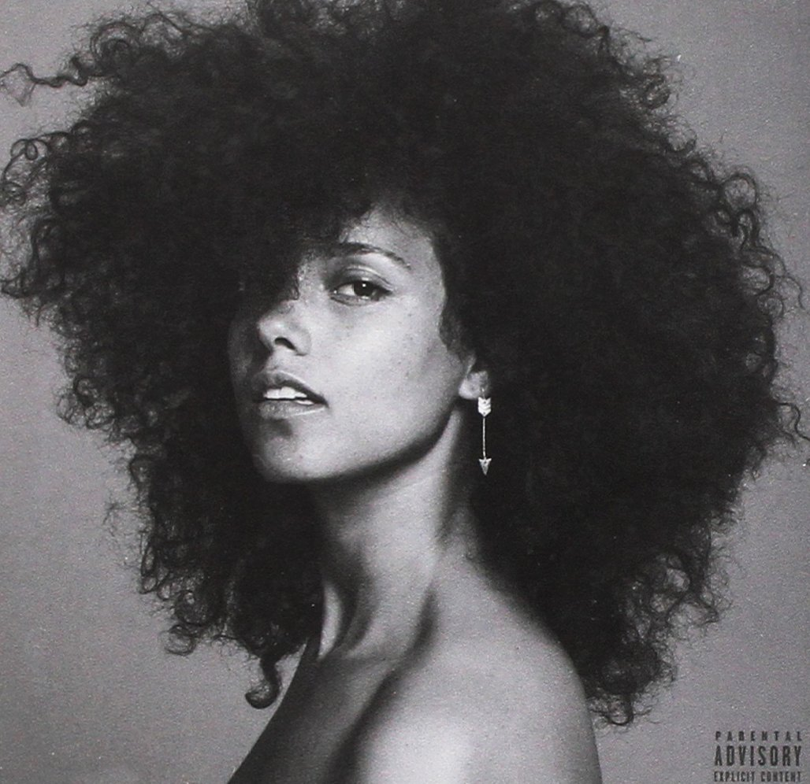

import { Slider, Button } from "carbon-components-react";
import { ArrowUpRight24 } from "@carbon/icons-react";

import SliderJS1 from "../review/slider1";
import SliderJS2 from "../review/slider2";
import SliderJS3 from "../review/slider3";
import SliderJS4 from "../review/slider4";

import { Link } from "gatsby";

import Review1 from "../review/aliciakeys7.mdx";

Album Review

<h1 className="h1--no--margin">{props.pageContext.frontmatter.title}</h1>

  <Link to="/best50/2016/">2016 Black Music Best No.20</Link>

<Row className="image-card-group">
	<Column colMd={"3"} colLg={"4"} noGutterMdLeft="">
    <ImageCard>

</ImageCard>
	</Column>
	<Column colMd={"4"} colLg={"8"} noGutterMdLeft="">
	

	  Alicia Keysの4年振り6作目。旦那のSwizz Beatz含め地元New York出身のProducerをメインに、タイトルもHereということでNew Yorkを意識した、原点回帰的意味もある作品。CDジャケットにノーメイクで登場し、サウンドもバンド中心で、泥臭く、生々しい方向にシフトしている。
     R&B, Jazz, Gospel, Hip-Hop, LatinなどのBlack Musicの様々な要素を適度に組み合わせた構成になっており、飽きさせないし、成熟した印象を受ける。時にしっとりと時に激しく唄いあげるAliciaのVocalも当然、作品のハイライトになりうるが、こちらは発展途上な気もする。
  

  

	  <Button className="button-right-mergin" href="https://amzn.to/2DXj8wP" kind="primary" size="small" renderIcon={ArrowUpRight24}>
      amazon.com
    </Button>
    <Button className="button-right-mergin" href="https://amzn.to/34cutUa" kind="secondary" size="small" renderIcon={ArrowUpRight24}>
      amazon.co.jp
    </Button>
	

	
  </Column>
</Row>
<Row >
  <Column colMd={"4"} colLg={"4"} noGutterMdLeft="">
    

      <h3>Score card</h3>
	    <SliderJS1 value="5" />
      <SliderJS2 value="2" />
	    <SliderJS3 value="1" />
      <SliderJS4 value="9" />
    

  </Column>
  <Column colMd={"4"} colLg={"8"} noGutterMdLeft="">
    

      <h3>Producers</h3>
      

        The Ii'lumunaries(Alicia Keys, Mark Batson & Swizz Beatz)(2,3,6,8,12,14,15)
         Alicia Keys(5)
         Alicia Keys,Swizz Beatz and Tyrone "MusicmanTy" Jhonson(6)
         Alicia Keys and Mark Batson(9)
         Pharrell Williams(10)
         Carlo "Illangelo" Mantagnese and Alicia Keys(16)
      

      <h3>Guests</h3>
      

        A$ap Rocky, Nas, Ali Shaheed Muhammad, Roy Ayers
      

    

  </Column>
</Row>

<h3>Tracks</h3>

| No. | Title                                 | Composers                                                                                                                                                                     | Performer                    | Time  |
| --- | ------------------------------------- | ----------------------------------------------------------------------------------------------------------------------------------------------------------------------------- | ---------------------------- | ----- |
| 1   | The Beginning (Interlude)             |                                                                                                                                                                               | Alicia Keys                  | 01:04 |
| 2   | The Gospel                            | Mark Batson / Kasseem Dean / Robert Diggs / Jason Hunter / Alicia Keys / Shawn Martin / Corey Woods                                                                           | Alicia Keys                  | 03:01 |
| 3   | Pawn It All                           | Mark Batson / Kasseem Dean / Alicia Keys / Harold Lilly                                                                                                                       | Alicia Keys                  | 03:10 |
| 4   | Elaine Brown (Interlude)              |                                                                                                                                                                               | Alicia Keys                  | 00:50 |
| 5   | Kill Your Mama                        | Alicia Keys / Emeli Sand?                                                                                                                                                     | Alicia Keys                  | 02:40 |
| 6   | She Don't Really Care_1 Luv           | William Henry Allen / Roy Ayers / Edwin Birdsong / Walter Booker / Kasseem Dean / Kamaal Fareed / Tyrone Johnson / Ali Shaheed Jones-Muhammad / Alicia Keys / Charles Stepney | Alicia Keys                  | 06:07 |
| 7   | Elevate (Interlude)                   | Mark Batson / Kasseem Dean / Alicia Keys / Harold Lilly                                                                                                                       | Alicia Keys                  | 00:48 |
| 8   | Illusion of Bliss                     |                                                                                                                                                                               | Alicia Keys                  | 05:23 |
| 9   | Blended Family (What You Do for Love) | Brandon Aly / Edie Brickell / John Bush / John Houser / Latisha Hyman / Alicia Keys / Dave Kuncio / Rakim Mayers / Kenneth Withrow                                            | Alicia Keys feat. A$ap Rocky | 03:31 |
| 10  | Work on It                            | Alicia Keys / Pharrell Williams                                                                                                                                               | Alicia Keys                  | 03:34 |
| 11  | Cocoa Butter (Cross & Pic Interlude)  |                                                                                                                                                                               | Alicia Keys                  | 00:59 |
| 12  | Girl Can't Be Herself                 | Mark Batson / Alicia Keys / Harold Lilly / Shawn Martin                                                                                                                       | Alicia Keys                  | 02:39 |
| 13  | You Glow (Interlude)                  |                                                                                                                                                                               | Alicia Keys                  | 00:25 |
| 14  | More Than We Know                     | Mark Batson / Latisha Hyman / Alicia Keys / Harold Lilly / Shawn Martin                                                                                                       | Alicia Keys                  | 04:35 |
| 15  | Where Do We Begin Now                 | Mark Batson / Alicia Keys / Harold Lilly                                                                                                                                      | Alicia Keys                  | 02:47 |
| 16  | Holy War                              | Alicia Keys / Carlo Montagnese / Billy Walsh                                                                                                                                  | Alicia Keys                  | 04:22 |

<h3>Other Reviews</h3>

<Row>
  <Column colMd={3} colLg={3} noGutterMdLeft>
    <Review1 />
  </Column>
</Row>