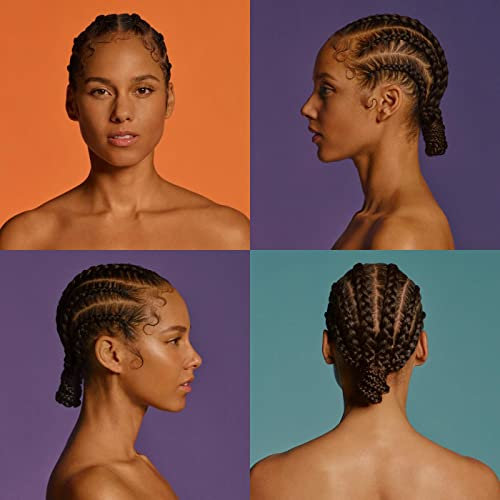

import { Slider, Button } from "carbon-components-react";
import { ArrowUpRight24 } from "@carbon/icons-react";

import SliderJS1 from "../review/slider1";
import SliderJS2 from "../review/slider2";
import SliderJS3 from "../review/slider3";
import SliderJS4 from "../review/slider4";

import { Link } from "gatsby";

Album Review

<h1 className="h1--no--margin">{props.pageContext.frontmatter.title}</h1>

  <Link to="/best50/2020/">2020 Black Music Best No.27</Link>

<Row className="image-card-group">
	<Column colMd={"3"} colLg={"4"} noGutterMdLeft="">
    <ImageCard>

</ImageCard>
	</Column>
	<Column colMd={"4"} colLg={"8"} noGutterMdLeft="">
	

	  Alicia Keysの4年振り7作目。前作に引き続き、原点回帰的な意味合いがCDタイトルに込められてる気もするが、最後の2曲⑭⑮あたりで、そんな志しが垣間見える。
     サウンドはR&Bが軸となり、Latin風味な曲や、Jill Scottがモノローグで参加するJazzyな⑬などが彩りが加えている。また、アップ～ミディアム～スローがバランスよく配され、少し冒険しているTrackもあったりしている。
     Guestはシンガー限定だが、中盤の3人の男性シンガーSampha, Miquel, Khalidとの共演は一つの目玉かもしれないし、声質の似たSnoh Aalegraとの⑫もしっとりと染みてくる。
     唄の表現力については、今更という感じだが、安定の域に達していると思う。

  

	  <Button className="button-right-mergin" href="https://amzn.to/3m42FIE" kind="primary" size="small" renderIcon={ArrowUpRight24}>
      amazon.com
    </Button>
    <Button className="button-right-mergin" href="https://amzn.to/2PEoGBF" kind="secondary" size="small" renderIcon={ArrowUpRight24}>
      amazon.co.jp
    </Button>
    <Button className="button-right-mergin" href="https://apple.co/39uveK6" kind="tertiary" size="small" renderIcon={ArrowUpRight24}>
      apple music
    </Button>
	

	</Column>
</Row>
<Row >
  <Column colMd={"4"} colLg={"4"} noGutterMdLeft="">
    

      <h3>Score card</h3>
	    <SliderJS1 value="5" />
      <SliderJS2 value="1" />
	    <SliderJS3 value="1" />
      <SliderJS4 value="9" />
    

  </Column>
  <Column colMd={"4"} colLg={"8"} noGutterMdLeft="">
    

      <h3>Producers</h3>
      

        Lawrence Dopson and Khyrie Tyler(1)
         Alicia Keys and Rob Knox(2)
         Johnny McDald, Jonny Coffer and Alicia Keys(3)
         P2I(4)
         Johnny McDald and Alicia Keys(5)
         Alicia Keys and Sampha(6)
         C. "Tricky" Stewart(7)
         Allicia Keys and Morgan Matthews(8)
         Ludwig Göransson(9)
         Jimmy Napes and Alicia Keys(10)
         Alicia Keys, Ryan Tedder and Noel Zancanella(11)
         Alicia Keys(12,15)
         Sean C(13)
         Alicia Keys and Sebastian Kole(14)
      

      <h3>Guests</h3>
      

        Diamond Platinumz, Sampha, Tierra Whack, Miguel, Khalid, Snoh Aalegra, Jill Scott, Davide Rossi
      

    

  </Column>
</Row>

<h3>Tracks</h3>

| No. | Title              | Composers                                                                                                          | Performer                           | Time  |
| --- | ------------------ | ------------------------------------------------------------------------------------------------------------------ | ----------------------------------- | ----- |
| 1   | Truth Without Love | Kasseem Dean / Larrance Dopson / Damien Romel Farmer III / Alicia Keys / Terius Nash / Khirye Tyler / Justus West  | Alicia Keys                         | 02:34 |
| 2   | Time Machine       | Alicia Keys / Sebastian Kole / Robin Tadross                                                                       | Alicia Keys                         | 04:26 |
| 3   | Authors of Forever | Jonny Coffer / Alicia Keys / Johnny McDaid                                                                         | Alicia Keys                         | 03:37 |
| 4   | Wasted Energy      | Ariowa Irosogie / Richard Isong / Alicia Keys / Kali McLoughlin / Nathaniel Warner                                 | Alicia Keys feat. Diamond Platinumz | 04:19 |
| 5   | Underdog           | Jonny Coffer / Alicia Keys / Johnny McDaid / Ed Sheeran / Foy Vance / Amy Wadge                                    | Alicia Keys                         | 03:24 |
| 6   | 3 Hour Drive       | Alicia Keys / Jimmy Napes / Sampha Sisay                                                                           | Alicia Keys feat. Sampha            | 04:01 |
| 7   | Me x 7             | Jeremiah Bethea / Alicia Keys / Pierre Medor / Pat Postlewait / Christopher Stewart / Samuel Thomas / Tierra Whack | Alicia Keys featl Tierra Whack      | 03:32 |
| 8   | Show Me Love       | Alicia Keys / Morgan Matthews / Daystar Peterson / Miguel Pimentel                                                 | Alicia Keys feat, Miguel            | 03:08 |
| 9   | So Done            | Ludwig Göransson / Alicia Keys / Khalid Robinson                                                                   | Alicia Keys feat. Khalid            | 03:54 |
| 10  | Gramercy Park      | Alicia Keys / Jimmy Napes / Sam Romans                                                                             | Alicia Keys                         | 03:12 |
| 11  | Love Looks Better  | Christopher Brown / Larrance Dopson / Alicia Keys / Ryan Tedder / Noel Zancanella                                  | Alicia Keys                         | 03:23 |
| 12  | You Save Me        | Alicia Keys / Snoh Nowrozi                                                                                         | Alicia Keys feat. Snoh Aalegra      | 03:41 |
| 13  | Jill Scott         | Kasseem Dean / Alicia Keys / Deleno Matthews / Jill Scott                                                          | Alicia Keys feat. Jill Scott        | 04:05 |
| 14  | Perfect Way to Die | Alicia Keys / Sebastian Kole                                                                                       | Alicia Keys feat: Davide Rossi      | 03:31 |
| 15  | Good Job           | Kasseem Dean / Alicia Keys / Terius Nash                                                                           | Alicia Keys                         | 03:53 |
