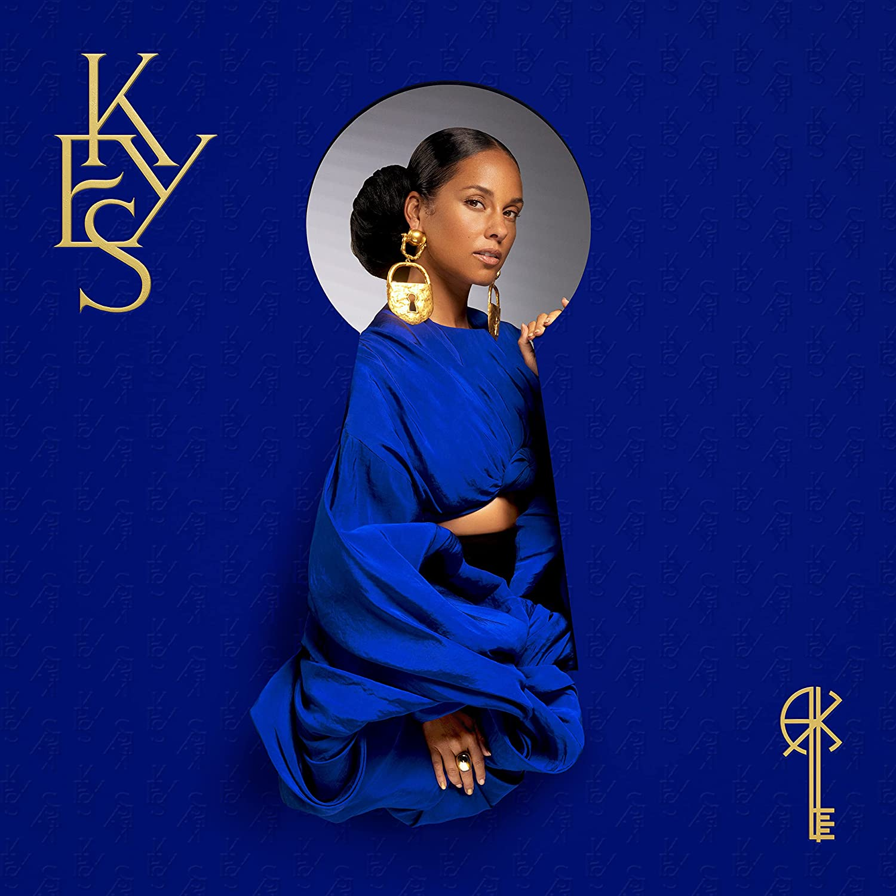

import { Slider, Button } from "carbon-components-react";
import { ArrowUpRight24 } from "@carbon/icons-react";

import SliderJS1 from "../review/slider1";
import SliderJS2 from "../review/slider2";
import SliderJS3 from "../review/slider3";
import SliderJS4 from "../review/slider4";
import AdvJS2 from "../review/adv2";
import AdvJS3 from "../review/adv3";

import { Link } from "gatsby";

import Review1 from "../review/aliciakeys7.mdx";
import Review2 from "../review/aliciakeys6.mdx";

Album Review

<h1 className="h1--no--margin">{props.pageContext.frontmatter.title}</h1>

<Row className="image-card-group">
	<Column colMd={"3"} colLg={"4"} noGutterMdLeft="">
    <ImageCard>

</ImageCard>
	</Column>
	<Column colMd={"4"} colLg={"8"} noGutterMdLeft="">
	

	  Alicia Keysの1年強振り8作目。過去最短のインターバルでのリリースでしかもCDは2枚組となった。1枚目がOriginal Version、2枚目がUnlocked(つまりKey無し) Versionとなっており、一部入れ違いはあるが、同じ曲をそれぞれのVersionでアレンジしている。
     OriginalsはAlicia中心のオーソドックスなTrackとなっており、UnlockedはMike Will Mede-ItとAliciaによる、今風のサウンドのTrackになっていて、はっきりとした違いがあるので、聴き比べると、Producerの工夫やアイデアが明確になって面白い。
     個人的には、どちらも遜色なく良いと思ったが、Originalsのほうはデビュー当時に近いし、Alicia本人としては、こちらを指向しているのではないかと思う。
     それにしても過去の作品を含めて、アルバムタイトルを見ると、ずっと身近な範囲を対象にしている感じで、世の趨勢に囚われず、ぶれが無いところは、ある意味、流石だ。
  

  

	  <Button className="button-right-mergin" href="https://amzn.to/3w3N8Ol" kind="primary" size="small" renderIcon={ArrowUpRight24}>
      amazon.com
    </Button>
    <Button className="button-right-mergin" href="https://amzn.to/3LPSkMD" kind="secondary" size="small" renderIcon={ArrowUpRight24}>
      amazon.co.jp
    </Button>
    <Button className="button-right-mergin" href="https://apple.co/3kJVwNH" kind="tertiary" size="small" renderIcon={ArrowUpRight24}>
      apple music
    </Button>
    <AdvJS2/>
	

	</Column>
</Row>
<Row >
  <Column colMd={"4"} colLg={"4"} noGutterMdLeft="">
    

      <h3>Score card</h3>
	    <SliderJS1 value="5" />
      <SliderJS2 value="1" />
	    <SliderJS3 value="1" />
      <SliderJS4 value="9" />
    

  </Column>
  <Column colMd={"4"} colLg={"8"} noGutterMdLeft="">
    

      <h3>Producers</h3>
      

        Alicia Keys and Swizz Beatz(1,5,7,8,9,10,12,13,14)
         Alicia Keys(2,3
         Fred Bakk and Alicia Keys(4)
         arrabMUSIK(6)
         Alicia Keys and Mike WIll Made-It(11,15,16,17,18,19,20,22,24,25)
         Mike WIll Made-It, Carter Lang, BJ Burton(21)
         Fred Ball, Dean McIntosh(23)
         Suzy Shinn and VRon(26)
      

      <h3>Guests</h3>
      

        Diamond Platinumz, Sampha, Tierra Whack, Miguel, Khalid, Snoh Aalegra, Jill Scott, Davide Rossi
      

    

  </Column>
</Row>

<h3>Tracks</h3>

| No. | Title                                  | Composers                                                                                                | Performer                            | Time  |
| --- | -------------------------------------- | -------------------------------------------------------------------------------------------------------- | ------------------------------------ | ----- |
| 1   | Plentiful (Originals)                  | Alicia Keys, Kasseem Dean, Dwight Grant, Kanye West, Graham Nash                                         | Alicia Keys feat. Pusha T            | 03:01 |
| 2   | Skydive (Originals)                    | Alicia Keys, Raphael Saadiq, Kenton Nix                                                                  | Alicia Keys                          | 03:01 |
| 3   | Best of Me (Originals)                 | Alicia Keys, Raphael Saadiq, Helen Adu, Andrew Hale, Stuart Matthewman                                   | Alicia Keys                          | 03:58 |
| 4   | Dead End Road (Originals)              | Alicia Keys, Fredrik Ball, Dean McIntosh                                                                 | Alicia Keys                          | 03:32 |
| 5   | Is It Insane (Originals)               | Alicia Keys                                                                                              | Alicia Keys                          | 06:21 |
| 6   | Billions (Originals)                   | Alicia Keys, Abraham Orellana                                                                            | Alicia Keys                          | 03:19 |
| 7   | Love When You Call My Name (Originals) | Alicia Keys, Raphael Saadiq                                                                              | Alicia Keys                          | 03:37 |
| 8   | Only You (Originals)                   | Alicia Keys, Raphael Saadiq                                                                              | Alicia Keys                          | 03:15 |
| 9   | Daffodils (Originals)                  | Alicia Keys, Natalie Hemby                                                                               | Alicia Keys                          | 04:33 |
| 10  | Old Memories (Originals)               | Alicia Keys, Natalie Hemby                                                                               | Alicia Keys                          | 03:01 |
| 11  | Nat King Cole (Originals)              | Alicia Keys, Natalie Hemby, Marquel Middlebrooks, Michael Williams II, Bill Withers                      | Alicia Keys                          | 03:39 |
| 12  | Paper Flowers (Originals)              | Alicia Keys, Brandi Carlile                                                                              | Alicia Keys feat. Brandi Carlile     | 03:24 |
| 13  | Like Water (Originals)                 | Alicia Keys, Sia Furler, Mark Batson                                                                     | Alicia Keys                          | 03:57 |
| 14  | Keys                                   | Alicia Keys                                                                                              | Alicia Keys                          | 01:25 |
| 15  | Only You (Unlocked)                    | Alicia Keys, Raphael Saadiq, Michael Williams II, Asheton Hogan, Pierre Slaughter                        | Alicia Keys                          | 03:01 |
| 16  | Skydive (Unlocked)                     | Alicia Keys, Raphael Saadiq, Michael Williams II, Asheton Hogan, Kenton Nix                              | Alicia Keys                          | 03:01 |
| 17  | Best of Me (Unlocked)                  | Alicia Keys, Raphael Saadiq, Michael Williams II, Helen Adu, Andrew Hale, Stuart Matthewman, Barry White | Alicia Keys                          | 03:49 |
| 18  | LALA (Unlocked)                        | Alicia Keys, Khalif Brown, Michael Williams II, Darryl Ellis, Paul Richmond, Ruben Locke                 | Alicia Keys feat. Swae Lee           | 04:26 |
| 19  | Nat King Cole (Unlocked)               | Alicia Keys, Dwayne Carter, Natalie Hemby, Middlebrooks, Michael Williams II, Bill Withers               | Alicia Keys feat. Lil Wayne          | 04:05 |
| 20  | Is It Insane (Unlocked)                | Alicia Keys, Hogan, Michael Williams II                                                                  | Alicia Keys                          | 04:27 |
| 21  | Come For Me (Unlocked)                 | Alicia Keys, Khalid Robinson, David Brown, Jermaine Cole, Michael Williams II, Carter Lang, BJ Burton    | Alicia Keys feat. Khalid, Lucky Daye | 03:29 |
| 22  | Old Memories (Unlocked)                | Alicia Keys, Natalie Hemby, Shondrae Crawford, Michael Williams II                                       | Alicia Keys                          | 03:52 |
| 23  | Dead End Road (Unlocked)               | Alicia Keys, Fredrik Ball, Dean McIntosh                                                                 | Alicia Keys                          | 03:32 |
| 24  | Love When You Call My Name (Unlocked)  | Alicia Keys, Raphael Saadiq, Michael Williams II                                                         | Alicia Keys                          | 03:15 |
| 25  | Daffodils (Unlocked)                   | Alicia Keys, Natalie Hemby, Michael Williams II                                                          | Alicia Keys                          | 03:01 |
| 26  | Billions (Unlocked)                    | Alicia Keys, Abraham Orellana                                                                            | Alicia Keys                          | 03:00 |

<h3>Other Reviews</h3>

<Row>
  <Column colMd={3} colLg={3} noGutterMdLeft>
    <Review1 />
  </Column>
  <Column colMd={3} colLg={3} noGutterMdLeft>
    <Review2 />
  </Column>
</Row>

<AdvJS3 />
