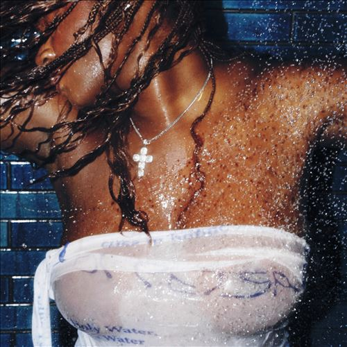

import { Slider, Button } from "@carbon/react";
import { ArrowUpRight } from "@carbon/icons-react";

import SliderJS1 from "../review/slider1";
import SliderJS2 from "../review/slider2";
import SliderJS3 from "../review/slider3";
import SliderJS4 from "../review/slider4";
import AdvJS2 from "../review/adv2";
import AdvJS3 from "../review/adv3";

import { Link } from "gatsby";

Album Review

<h1 className="h1--no--margin">{props.pageContext.frontmatter.title}</h1>

  <Link to="/best50/2023/">2023 Black Music Best No.8</Link>

<Row  className="image-card-group">
	<Column colMd={3} colLg={4} noGutterMdLeft="">
       <ImageCard>

</ImageCard>
	</Column>
	<Column colMd={4} colLg={8} noGutterMdLeft="">
	  

	    Ghana系でNY出身のSinger, Amaaraeの2ndアルバム。矛盾のある表現かもしらないが、都会的なアフロ・ポップという感じで、ただ⑩などは全くそれっぽくはなくて、後半はオルタナロックだし、R&Bや時折Latin, Jazz色も加わった曲もあって、曲調は幅広く、じっくり聴くべき曲も多い。
       メロディアスに聴かせる曲もあり、Lyricでは、全編、恋愛関係を唄っている。既に29歳ということだが、ころころと可愛らしい声と、こういったTrackとの組み合わせは結構斬新だと思う。
       ⑦では、うっすらと日本語のSEが聞こえ、ラストでは"こんな曲、どうでもいいんですけど"と言ってるように聞こえる。
    

    

	    <Button className="button-right-mergin"  href="https://amzn.to/3Qjrtfc" renderIcon={ArrowUpRight} size='sm' kind='primary'>
        amazon.com
      </Button>
      <Button className="button-right-mergin"  href="https://amzn.to/3QBQ7Jx" renderIcon={ArrowUpRight} size='sm' kind='secondary'>
        amazon.co.jp
      </Button>
      <Button className="button-right-mergin"  href="https://apple.co/496SICt" renderIcon={ArrowUpRight} size='sm' kind='tertiary'>
        apple music
      </Button>
	  

	</Column>
  <AdvJS2/>
</Row>
<Row >
  <Column colMd={4} colLg={4} noGutterMdLeft="">
    

      <h3>Score card</h3>
	    <SliderJS1 value="5" />
      <SliderJS2 value="2" />
	    <SliderJS3 value="1" />
      <SliderJS4 value="9" />
    

  </Column>
  <Column colMd={4} colLg={8} noGutterMdLeft="">
    

      <h3>Producers</h3>
      

        Kyu Steed and Leonardo Dessi(1)
         Kyu Steed, Kztheproducer and Cracker Mallo(2)
         Kyu Steed, Kztheproducer, Cadenza and Amaarae(3)
         Tochi Bedford, Kyu Steed and Kztheproducer(4)
         Kztheproducer and Leonardo Dessi(5)
         Kztheproducer, Cadenza, Kyu Steed, Amaarae and Yves Rothman(6)
         Pheelz, Kyu Steed, Amaarae, Yves Rothman, S-Type and Kztheproducer(7)
         Kztheproducer, Kyu Steed and Amaarae(8)
         Kyu Steed, Cracker Mallo and S-Type(9)
         Amaarae, Geo Jordan, Tochi Bedford and Yves Rothman(10)
         Kztheproducer(11)
         Kztheproducer and Yves Rothman(12)
         Kztheproducer, Kyu Steed, Cracker Mallo and Cadenza(13)
         Yves Rothman & Christian Gregory(14)
      

      <h3>Guests</h3>
      

      

    

  </Column>
</Row>

<h3>Tracks</h3>

| No. | Title                   | Composers                                                                                                                        | Performer | Time  |
| --- | ----------------------- | -------------------------------------------------------------------------------------------------------------------------------- | --------- | ----- |
| 1   | All My Love             | Kyu Steed, Leonardo Dessi                                                                                                        | Amaarae   | 00:43 |
| 2   | Angels in Tibet         | Amaarae, Kztheproducer, Kyu Steed, Ayodeji Olowu, Emeka Emele Onouha, Maesu, MixGiant                                            | Amaarae   | 02:22 |
| 3   | Co-Star                 | Amaarae, Kyu Steed, Kztheproducer, Leonardo Dessi, Maesu, Cadenza                                                                | Amaarae   | 02:46 |
| 4   | Princess Going Digital  | Amaarae, Kztheproducer, Kyu Steed, Maesu, Tochi Bedford                                                                          | Amaarae   | 03:09 |
| 5   | Big Steppa              | Amaarae, Kztheproducer, Ed Thomas, Leonardo Dessi, Maesu, Tom Levesque                                                           | Amaarae   | 02:56 |
| 6   | Reckless & Sweet        | Amaarae, Cadenza, Kztheproducer, Maesu                                                                                           | Amaarae   | 02:39 |
| 7   | Wasted Eyes             | Amaarae, Crystal Kay, Kyu Steed, Maesu, Pheelz ,S-Type                                                                           | Amaarae   | 02:28 |
| 8   | Counterfeit             | Amaarae, Kyu Steed, Kztheproducer, Maesu, Olujuwon Prudholme, Yahael Camara-Onono, Pharrell Williams, Pusha T, No Malice         | Amaarae   | 02:36 |
| 9   | Disguise                | Amaarae, Kztheproducer, Maesu, Emeka Emele Onouha, Ayodeji Olowu, Robert James Perman                                            | Amaarae   | 02:49 |
| 10  | Sex, Violence, Suicide  | Amaarae, Geordan Reid Campbell, Maesu, Oloyede “Dara” Oluwadarasimi, Emeka Emele Onouha, Tochi Bedford, Alice Go, Bella Podpadec | Amaarae   | 04:13 |
| 11  | Sociopathic Dance Queen | Amaarae, Kyu Steed, Kztheproducer, Maesu, Leonardo Dessi                                                                         | Amaarae   | 02:19 |
| 12  | Aquamarine Luvs Ecstasy | Amaarae, Kztheproducer, MixGiant, Rayo, Tom Levesque                                                                             | Amaarae   | 04:38 |
| 13  | Water from Wine         | Amaarae, Kyu Steed, Kztheproducer, Maesu, Cadenza, Ayodeji Olowu                                                                 | Amaarae   | 02:36 |
| 14  | Come Home to God        | Amaarae, Maesu                                                                                                                   | Amaarae   | 03:19 |

<AdvJS3 />
