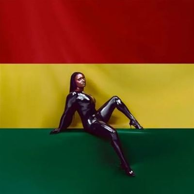

import { Slider, Button } from "@carbon/react";
import { ArrowUpRight } from "@carbon/icons-react";

import SliderJS1 from "../review/slider1";
import SliderJS2 from "../review/slider2";
import SliderJS3 from "../review/slider3";
import SliderJS4 from "../review/slider4";
import AdvJS2 from "../review/adv2";
import AdvJS3 from "../review/adv3";

import { Link } from "gatsby";

import Review1 from "../review/amaarae1.mdx";

Album Review

<h1 className="h1--no--margin">{props.pageContext.frontmatter.title}</h1>

  <Link to="/best50/2025/">2025 Black Music Best No.21</Link>

<Row  className="image-card-group">
	<Column colMd={3} colLg={4} noGutterMdLeft="">
       <ImageCard>

</ImageCard>
	</Column>
	<Column colMd={4} colLg={8} noGutterMdLeft="">
	  

	    Amaaraeの2年ぶりとなる3rdアルバム。アフロポップにバイリファンキやアマピアノ、デトロイトテクノなど世界各地の今のダンスビートを溶け込ませて、独自の世界観を魅せてくれていて、本人はこれをガーナ音楽の進化型と言っている。
       前作にも参加していたKyu Steedが全曲の制作に参加したトラックは、ダンサブルなミディアム〰アップ中心で、メロディを聞かせるものやトライバルなものまで様々。
       その上で、Amaaraeが可愛らしい声で際どいLyricもさらりと唄っている。
    

    

	    <Button className="button-right-mergin"  href="https://amzn.to/49JPplM" renderIcon={ArrowUpRight} size='sm' kind='primary'>
        amazon.com
      </Button>
      <Button className="button-right-mergin"  href="https://amzn.to/4pJJ8wo" renderIcon={ArrowUpRight} size='sm' kind='secondary'>
        amazon.co.jp
      </Button>
      <Button className="button-right-mergin"  href="https://apple.co/4qL0Oct" renderIcon={ArrowUpRight} size='sm' kind='tertiary'>
        apple music
      </Button>
	  

	</Column>
  <AdvJS2/>
</Row>
<Row >
  <Column colMd={4} colLg={4} noGutterMdLeft="">
    

      <h3>Score card</h3>
	    <SliderJS1 value="5" />
      <SliderJS2 value="2" />
	    <SliderJS3 value="1" />
      <SliderJS4 value="9" />
    

  </Column>
  <Column colMd={4} colLg={8} noGutterMdLeft="">
    

      <h3>Producers</h3>
      

        Kyu Steed, MU540 and Maffalda(1)
         El Guincho and Kyu Steed(2)
         Ebony Oshunrinde, Forthenight and Kyu Steed(3)
         Kyu Steed and Leonardo Dessi(4,11)
         Ape Drums and Kyu Steed(5)
         El Guincho, Nuviala and Kyu Steed(6)
         Deekapz, Heavy Mellow, Kyu Steed, Mackson Kennedy and Maffalda(7)
         BNYX® and Kyu Steed(8)
         Ape Drums, BNYX® and Kyu Steed(9)
         Brian Alejandro Lopez, and Kyu Steed(10,12)
         Amaarae, El Guincho and Kyu Steed(13)
      

      <h3>Guests</h3>
      

        Bree Runway, Starkillers, Naomi Campbell, PinkPantheress, Charlie Wilson
      

    

  </Column>
</Row>

<h3>Tracks</h3>

| No. | Title                       | Composers                                                                                                                                                                                                                              | Performer                              | Time  |
| --- | --------------------------- | -------------------------------------------------------------------------------------------------------------------------------------------------------------------------------------------------------------------------------------- | -------------------------------------- | ----- |
| 1   | Stuck Up                    | Ama Serwah Genfi, Jephte “Kyu Steed” Steed Baloki, Mason "Maesu" Tanner                                                                                                                                                                | Amaarae                                | 02:32 |
| 2   | Starkilla                   | Ama Serwah Genfi, Austin Leeds, Bree Runway, Chad Hugo, Howie Hersh, Jephte “Kyu Steed” Steed Baloki, Mason "Maesu" Tanner, Pablo Díaz-Reixa, Pharrell Williams, Tia Texada, Tyshane Thompson, Willem Faber                            | Amaarae feat. Bree Runway, Starkillers | 03:08 |
| 3   | ms60                        | Ama Serwah Genfi, Charles Jr Ocansey, Ebony Oshunrinde, Jephte “Kyu Steed” Steed Baloki, Mason "Maesu" Tanner                                                                                                                          | Amaarae feat. Naomi Campbell           | 02:29 |
| 4   | Kiss Me Thru the Phone pt 2 | Ama Serwah Genfi, Bob Robinson, Desmond Child, Joseph Longo, Jephte “Kyu Steed” Steed Baloki, Mark Andrews, Marquis Collins, PinkPantheress, Rosa Robi, Tim Kelley                                                                     | Amaarae feat. PinkPantheress           | 03:38 |
| 5   | B2B                         | Ama Serwah Genfi, Eric Alberto Lopez, John Smith, Keith Crouch, Jephte “Kyu Steed” Steed Baloki, Mason "Maesu" Tanner, Mechalie Jamison, Samuel Gause, Sarah Aarons, Toni Braxton                                                      | Amaarae                                | 04:17 |
| 6   | She Is My Drug              | Ama Serwah Genfi, Brian Higgins, Gonzalo Nuvialaa Pedruz, Jephte “Kyu Steed” Steed Baloki, Mason Tanner, Pablo Díaz-Reixa, Paul Barry, Sarah Aarons, Steve Torch                                                                       | Amaarae                                | 03:29 |
| 7   | Girlie-Pop!                 | Ama Serwah Genfi, Arthur Pampolin Gomes, Deekapz, Everett Romano, Jephte “Kyu" Steed Baloki, Mackson Kennedy Paiva do Amaral Borge, Mason "Maesu" Tanner, Matheus Henrique Gonçalves dos Santos, Mike Mills, Paulo Vitor Araújo Guedes | Amaarae                                | 02:04 |
| 8   | S.M.O.                      | Ama Serwah Genfi, Benjamin Saint Fort, Jephte “Kyu" Steed Baloki                                                                                                                                                                       | Amaarae                                | 04:30 |
| 9   | Fineshyt                    | Ama Serwah Genfi, Eric Alberto Lopez, Jephte “Kyu Steed” Steed Baloki, Mason "Maesu" Tanner                                                                                                                                            | Amaarae                                | 03:40 |
| 10  | Dove Cameron                | Ama Serwah Genfi, Brian Alejandro Lopez, Jephte “Kyu Steed” Steed Baloki, Mason "Maesu" Tanner                                                                                                                                         | Amaarae                                | 02:33 |
| 11  | Dream Scenario              | Ama Serwah Genfi, Christopher Stewart, Jephte “Kyu Steed” Steed Baloki, Leonardo Dessi, Mason "Maesu" Tanner, Terius Nash                                                                                                              | Amaarae feat. Charlie Wilson           | 04:59 |
| 12  | 100DRUM                     | Ama Serwah Genfi, Arthur Pampolin Gomes, Brian Alejandro Lopez, Jephte “Kyu Steed” Steed Baloki, Mason "Maesu" Tanner, Mike Mills, Zacari Moses Pacaldo                                                                                | Amaarae                                | 03:45 |
| 13  | FREE THE YOUTH              | Ama Serwah Genfi, Edward Osei, Jasper Harris, Jephte “Kyu Steed” Steed Baloki, Mason "Maesu" Tanner, Mike Mills, Pablo Díaz-Reixa, Richard Akyeampong, Zacari Moses Pacaldo                                                            | Amaarae                                | 03:09 |

<h3>Other Reviews</h3>

<Row>
  <Column colMd={3} colLg={3} noGutterMdLeft>
    <Review1 />
  </Column>
</Row>

<AdvJS3 />
